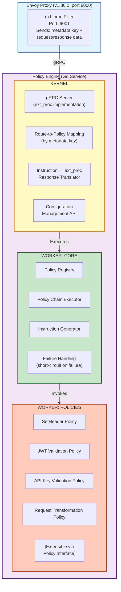
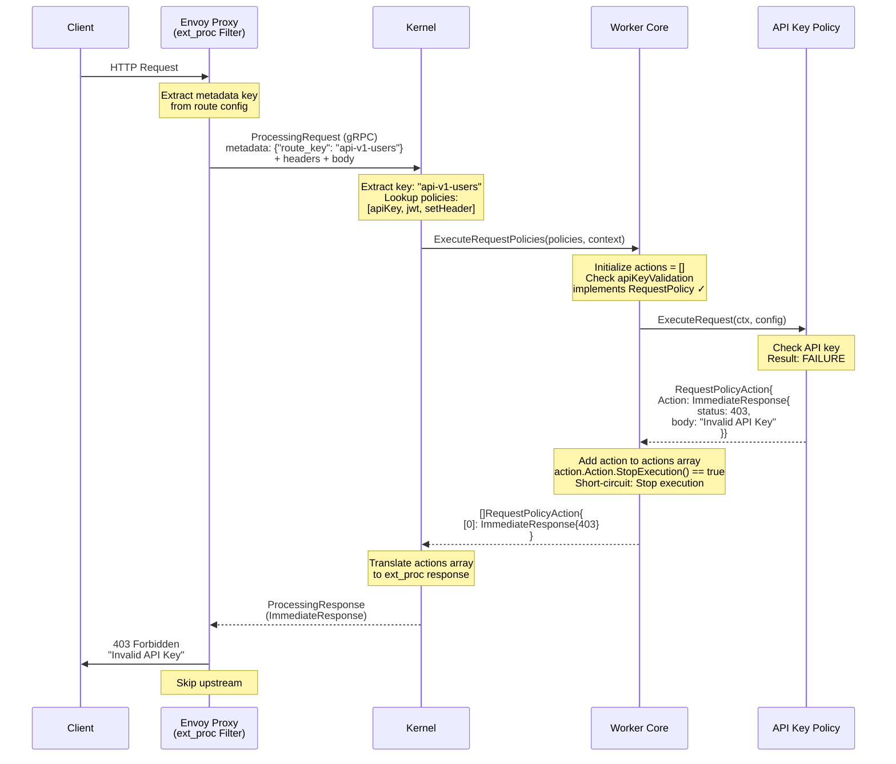
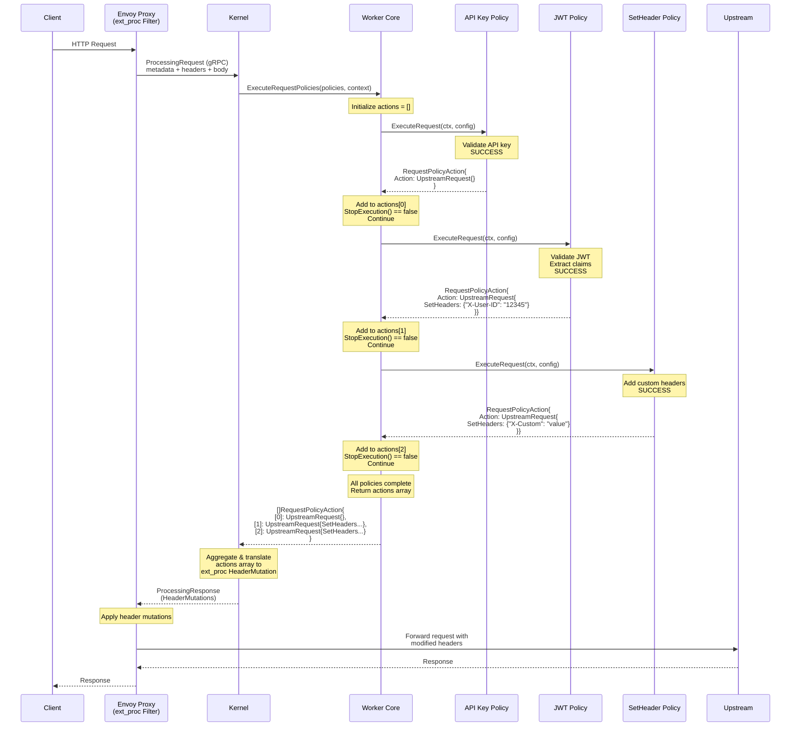

# Envoy Policy Engine - Product Requirements Document

**Version:** 1.0
**Date:** 2025-11-17
**Target Envoy Version:** v1.36.2
**Implementation Language:** Go

---

## 1. Overview

### 1.1 Purpose
The Envoy Policy Engine is an external processor (ext_proc) service for Envoy Proxy that provides a flexible, extensible framework for enforcing policies on HTTP requests and responses. The engine allows dynamic configuration of policy chains per route, enabling capabilities such as authentication, authorization, header manipulation, and request transformation without modifying Envoy configuration.

### 1.2 Goals
- Provide a clean separation between policy logic and proxy infrastructure
- Enable dynamic policy configuration without Envoy restarts
- Support extensible policy framework through Go interfaces
- Achieve low-latency policy evaluation
- Allow policy composition and chaining with failure handling
- Integrate seamlessly with Envoy's ext_proc filter

### 1.3 High-Level Architecture



### 1.4 Deployment Architecture


---

## 2. Architecture Components

### 2.1 Kernel

**Responsibilities:**
- Implement Envoy ext_proc gRPC service (port 9001)
- Maintain route-to-policy mappings (key → request policy list, response policy list)
- Extract metadata key from Envoy requests
- Invoke Worker Core with appropriate policy chain (request or response flow)
- **Translate policy results to ext_proc responses** (Core → Envoy format)
- Expose xDS-based Policy Discovery Service (gRPC streaming, port 9002)

**Key Functions:**
- `ProcessRequest()` - Handle request phase from Envoy (ext_proc)
  - Extract metadata key from request
  - Get request policy list for route
  - Call Core.ExecuteRequestPolicies()
  - Translate `[]RequestPolicyAction` → ext_proc response
- `ProcessResponse()` - Handle response phase from Envoy (ext_proc)
  - Extract metadata key from request
  - Get response policy list for route
  - Call Core.ExecuteResponsePolicies()
  - Translate `[]ResponsePolicyAction` → ext_proc response
- `GetRequestPoliciesForKey(key string)` - Retrieve request policy chain for route
- `GetResponsePoliciesForKey(key string)` - Retrieve response policy chain for route
- `StreamPolicyMappings()` - xDS stream for policy configuration updates
- `TranslatePolicyActions()` - Convert array of policy actions to ext_proc format

**Configuration Storage:**
- In-memory map: `metadata_key → RouteConfig`
- RouteConfig contains:
  - `RequestPolicies []PolicyConfig` - Policies executed during request flow
  - `ResponsePolicies []PolicyConfig` - Policies executed during response flow
- PolicyConfig includes: policy name, parameters, enabled flag
- Version tracking for xDS protocol (resource version strings)

### 2.2 Worker: Core

**Responsibilities:**
- Maintain policy registry (name → Policy implementation)
- Execute policy chains in order
- Implement short-circuit logic (stop when action.Action.StopExecution() returns true)
- Collect policy results into arrays
- Pass arrays of policy results back to Kernel (no aggregation/transformation)

**Key Functions:**
- `ExecuteRequestPolicies(policies []Policy, ctx *RequestContext) []RequestPolicyAction`
  - Iterate through policies
  - Check if policy implements `RequestPolicy` interface
  - Execute policy and collect action
  - Short-circuit if action.Action.StopExecution() returns true
  - Return array of actions to Kernel
- `ExecuteResponsePolicies(policies []Policy, ctx *ResponseContext) []ResponsePolicyAction`
  - Iterate through policies
  - Check if policy implements `ResponsePolicy` interface
  - Execute policy and collect action
  - Short-circuit if action.Action.StopExecution() returns true
  - Return array of actions to Kernel

**Policy Action Types:**

Core uses separate action types for request and response phases. The oneof pattern is enforced using Go interfaces with private marker methods, ensuring type safety and clear semantics.

```go
// ============ Request Phase ============

// RequestPolicyAction is returned by policies during request processing
type RequestPolicyAction struct {
    Action RequestAction  // Contains either UpstreamRequestModifications or ImmediateResponse
}

// RequestAction is a marker interface for the oneof pattern
// Only UpstreamRequestModifications and ImmediateResponse implement this interface
type RequestAction interface {
    isRequestAction()     // private marker method
    StopExecution() bool  // returns true if execution should stop after this action
}

// UpstreamRequestModifications contains all modifications to apply to the request
// before forwarding to upstream
type UpstreamRequestModifications struct {
    // Header modifications
    SetHeaders    map[string]string      // set or replace headers
    RemoveHeaders []string               // headers to remove
    AppendHeaders map[string][]string    // headers to append (can have multiple values)

    // Body modification
    Body          []byte                 // nil = no change, []byte{} = clear, []byte("x") = set

    // Request-specific modifications
    Path          *string                // nil = no change, pointer allows explicit empty string
    Method        *string                // nil = no change (GET, POST, PUT, DELETE, etc.)
}

func (UpstreamRequestModifications) isRequestAction() {}
func (UpstreamRequestModifications) StopExecution() bool { return false }

// ImmediateResponse short-circuits policy execution and returns response immediately
// Only valid during request phase
type ImmediateResponse struct {
    StatusCode int
    Headers    map[string]string
    Body       []byte
}

func (ImmediateResponse) isRequestAction() {}
func (ImmediateResponse) StopExecution() bool { return true }

// ============ Response Phase ============

// ResponsePolicyAction is returned by policies during response processing
type ResponsePolicyAction struct {
    Action ResponseAction  // Contains UpstreamResponseModifications
}

// ResponseAction is a marker interface for the oneof pattern
// Only UpstreamResponseModifications implements this interface
type ResponseAction interface {
    isResponseAction()    // private marker method
    StopExecution() bool  // returns true if execution should stop after this action
}

// UpstreamResponseModifications contains all modifications to apply to the response
// before returning to client
type UpstreamResponseModifications struct {
    // Header modifications
    SetHeaders    map[string]string      // set or replace headers
    RemoveHeaders []string               // headers to remove
    AppendHeaders map[string][]string    // headers to append (can have multiple values)

    // Body modification
    Body          []byte                 // nil = no change, []byte{} = clear, []byte("x") = set

    // Response-specific modifications
    StatusCode    *int                   // nil = no change, pointer allows setting any valid code
}

func (UpstreamResponseModifications) isResponseAction() {}
func (UpstreamResponseModifications) StopExecution() bool { return false }
```

**Design Benefits:**
- **True Oneof Semantics:** Single interface field enforces exactly one action type
- **Type Safety:** Compiler prevents invalid operations (e.g., ImmediateResponse in response phase)
- **No Nil Pointer Checks:** Interface value is never nil, always contains a concrete type
- **Clean Type Switching:** Easy to handle different action types in Kernel
- **Clear Semantics:** Request can fork (upstream or immediate), response can only modify
- **Efficient:** Pointers allow nil = no change, avoiding unnecessary allocations
- **Matches Envoy Model:** Aligns with ext_proc protocol (continue or short-circuit)
- **Simple API:** Policy authors work with plain structs, no complex builders needed
- **Clear Intent:** "Action" clearly indicates what the policy wants to do

**Execution Flow:**
1. Receive policy list and context from Kernel
2. Initialize actions array: `actions := []RequestPolicyAction{}` (or ResponsePolicyAction)
3. For each policy in order:
   - Check if policy implements appropriate interface (RequestPolicy/ResponsePolicy)
   - If not, skip to next policy
   - Execute policy with context and configuration
   - Collect action into actions array
   - Check if action.Action.StopExecution() returns true:
     - If true → short-circuit, return actions
     - If false → continue to next policy
4. Return actions array to Kernel (Core does NOT aggregate or transform)
5. Kernel translates actions array into ext_proc response format

**Execution Flow Diagram:**

```mermaid
flowchart TD
    Start([Receive Policy List<br/>& Context from Kernel]) --> Init["Initialize actions array:<br/>actions = []"]
    Init --> LoadFirst[Load First Policy]
    LoadFirst --> CheckInterface{Implements<br/>RequestPolicy?}

    CheckInterface -->|No| Skip[Skip Policy]
    CheckInterface -->|Yes| Execute[Execute Policy:<br/>action = policy.ExecuteRequest()]

    Execute --> CheckNil{Action<br/>is nil?}

    CheckNil -->|Yes| MorePolicies{More<br/>Policies?}
    CheckNil -->|No| AddAction[Add action to<br/>actions array]

    AddAction --> CheckStop{action.Action.<br/>StopExecution()?}

    CheckStop -->|Yes| ShortCircuit[Short-circuit:<br/>Return actions<br/>to Kernel]
    CheckStop -->|No| MorePolicies

    Skip --> MorePolicies
    MorePolicies -->|Yes| LoadNext[Load Next Policy]
    LoadNext --> CheckInterface
    MorePolicies -->|No| ReturnActions[Return actions array<br/>to Kernel]

    ReturnActions --> KernelTranslate[Kernel translates actions<br/>to ext_proc response]
    KernelTranslate --> End([End])
    ShortCircuit --> KernelTranslate

    style Start fill:#e1f5ff,stroke:#01579b
    style End fill:#e1f5ff,stroke:#01579b
    style ShortCircuit fill:#ffcdd2,stroke:#c62828
    style ReturnActions fill:#c8e6c9,stroke:#2e7d32
    style KernelTranslate fill:#fff9c4,stroke:#f57f17
    style CheckInterface fill:#e1bee7,stroke:#4a148c
    style CheckStop fill:#fff9c4,stroke:#f57f17
    style CheckNil fill:#e1bee7,stroke:#4a148c
```

### 2.3 Worker: Policies

**Policy Interfaces:**

Policies use marker interfaces to declare which processing phases they participate in. A policy can implement `RequestPolicy`, `ResponsePolicy`, or both.

```go
// Policy is the base interface all policies must implement
type Policy interface {
    // Name returns the unique identifier for this policy
    Name() string

    // Validate checks if the policy configuration is valid
    Validate(config map[string]interface{}) error
}

// RequestPolicy processes requests before they reach upstream
type RequestPolicy interface {
    Policy

    // ExecuteRequest runs during request processing
    // Returns nil action to skip (no modifications)
    ExecuteRequest(ctx *RequestContext, config map[string]interface{}) *RequestPolicyAction
}

// ResponsePolicy processes responses before they reach the client
type ResponsePolicy interface {
    Policy

    // ExecuteResponse runs during response processing
    // Returns nil action to skip (no modifications)
    ExecuteResponse(ctx *ResponseContext, config map[string]interface{}) *ResponsePolicyAction
}

// ============ Context Types ============

// RequestContext provides request data to policies during request phase
type RequestContext struct {
    // Request data
    Headers  map[string][]string
    Body     []byte
    Path     string
    Method   string

    // Metadata from Envoy (route key, etc.)
    Metadata map[string]string

    // Additional context
    RequestID string
}

// ResponseContext provides request and response data during response phase
type ResponseContext struct {
    // Original request data
    RequestHeaders map[string][]string
    RequestBody    []byte
    RequestPath    string
    RequestMethod  string

    // Response data
    ResponseHeaders map[string][]string
    ResponseBody    []byte
    ResponseStatus  int

    // Metadata from Envoy
    Metadata map[string]string

    // Additional context
    RequestID string
}
```

**Usage Examples:**

```go
// Example 1: Request-only policy (JWT validation)
type JWTPolicy struct{}

var _ RequestPolicy = (*JWTPolicy)(nil)  // Compile-time interface check

func (p *JWTPolicy) Name() string { return "jwtValidation" }

func (p *JWTPolicy) Validate(config map[string]interface{}) error {
    // Validate configuration
    return nil
}

func (p *JWTPolicy) ExecuteRequest(ctx *RequestContext, config map[string]interface{}) *RequestPolicyAction {
    token := extractToken(ctx.Headers["Authorization"])

    if !isValid(token) {
        return &RequestPolicyAction{
            Action: ImmediateResponse{
                StatusCode: 401,
                Headers:    map[string]string{"WWW-Authenticate": "Bearer"},
                Body:       []byte("Unauthorized"),
            },
        }
    }

    // JWT is valid, add user ID header
    return &RequestPolicyAction{
        Action: UpstreamRequestModifications{
            SetHeaders: map[string]string{
                "X-User-ID": token.Claims.Subject,
                "X-User-Email": token.Claims.Email,
            },
        },
    }
}

// Example 2: Response-only policy (add security headers)
type SecurityHeadersPolicy struct{}

var _ ResponsePolicy = (*SecurityHeadersPolicy)(nil)

func (p *SecurityHeadersPolicy) Name() string { return "securityHeaders" }

func (p *SecurityHeadersPolicy) Validate(config map[string]interface{}) error {
    return nil
}

func (p *SecurityHeadersPolicy) ExecuteResponse(ctx *ResponseContext, config map[string]interface{}) *ResponsePolicyAction {
    return &ResponsePolicyAction{
        Action: UpstreamResponseModifications{
            SetHeaders: map[string]string{
                "X-Content-Type-Options": "nosniff",
                "X-Frame-Options":        "DENY",
                "X-XSS-Protection":       "1; mode=block",
            },
        },
    }
}

// Example 3: Both phases (logging policy)
type LoggingPolicy struct{}

var _ RequestPolicy = (*LoggingPolicy)(nil)
var _ ResponsePolicy = (*LoggingPolicy)(nil)

func (p *LoggingPolicy) Name() string { return "logging" }

func (p *LoggingPolicy) Validate(config map[string]interface{}) error {
    return nil
}

func (p *LoggingPolicy) ExecuteRequest(ctx *RequestContext, config map[string]interface{}) *RequestPolicyAction {
    log.Info("Request: %s %s", ctx.Method, ctx.Path)
    return nil  // No modifications, just logging
}

func (p *LoggingPolicy) ExecuteResponse(ctx *ResponseContext, config map[string]interface{}) *ResponsePolicyAction {
    log.Info("Response: %d for %s %s", ctx.ResponseStatus, ctx.RequestMethod, ctx.RequestPath)
    return nil  // No modifications, just logging
}
```

**Core Executor Integration:**

```go
// Core executes request policies and returns array of actions
func (c *Core) ExecuteRequestPolicies(policies []Policy, ctx *RequestContext) []RequestPolicyAction {
    actions := make([]RequestPolicyAction, 0, len(policies))

    for _, policy := range policies {
        // Check if policy handles request phase
        rp, ok := policy.(RequestPolicy)
        if !ok {
            continue  // Skip policies that don't implement RequestPolicy
        }

        action := rp.ExecuteRequest(ctx, c.getConfig(policy))

        // Add action to array (even if nil)
        if action != nil {
            actions = append(actions, *action)

            // Check if action requests stop execution
            if action.Action.StopExecution() {
                return actions  // Short-circuit: return collected actions
            }
        }
    }

    // Return all collected actions to Kernel
    return actions
}

// Core executes response policies and returns array of actions
func (c *Core) ExecuteResponsePolicies(policies []Policy, ctx *ResponseContext) []ResponsePolicyAction {
    actions := make([]ResponsePolicyAction, 0, len(policies))

    for _, policy := range policies {
        // Check if policy handles response phase
        rp, ok := policy.(ResponsePolicy)
        if !ok {
            continue  // Skip policies that don't implement ResponsePolicy
        }

        action := rp.ExecuteResponse(ctx, c.getConfig(policy))

        // Add action to array (even if nil)
        if action != nil {
            actions = append(actions, *action)

            // Check if action requests stop execution
            if action.Action.StopExecution() {
                return actions  // Short-circuit: return collected actions
            }
        }
    }

    // Return all collected actions to Kernel
    return actions
}
```

**Kernel Translation Example:**

```go
// Kernel translates policy actions to ext_proc response
func (k *Kernel) TranslateRequestActions(actions []RequestPolicyAction) *extproc.ProcessingResponse {
    // Check for immediate response (short-circuit)
    for _, action := range actions {
        switch a := action.Action.(type) {
        case ImmediateResponse:
            return &extproc.ProcessingResponse{
                Response: &extproc.ProcessingResponse_ImmediateResponse{
                    ImmediateResponse: &extproc.ImmediateResponse{
                        Status: &extproc.HttpStatus{Code: uint32(a.StatusCode)},
                        Headers: convertHeaders(a.Headers),
                        Body: string(a.Body),
                    },
                },
            }
        }
    }

    // Aggregate upstream modifications from all actions
    var allSetHeaders = make(map[string]string)
    var allRemoveHeaders []string
    var allAppendHeaders = make(map[string][]string)
    var finalBody []byte
    var finalPath *string
    var finalMethod *string

    for _, action := range actions {
        switch a := action.Action.(type) {
        case UpstreamRequestModifications:
            // Merge headers
            for k, v := range a.SetHeaders {
                allSetHeaders[k] = v
            }
            allRemoveHeaders = append(allRemoveHeaders, a.RemoveHeaders...)
            for k, v := range a.AppendHeaders {
                allAppendHeaders[k] = append(allAppendHeaders[k], v...)
            }

            // Last non-nil body wins
            if a.Body != nil {
                finalBody = a.Body
            }

            // Last non-nil path/method wins
            if a.Path != nil {
                finalPath = a.Path
            }
            if a.Method != nil {
                finalMethod = a.Method
            }
        }
    }

    // Build ext_proc response with header mutations
    return &extproc.ProcessingResponse{
        Response: &extproc.ProcessingResponse_RequestHeaders{
            RequestHeaders: &extproc.HeadersResponse{
                Response: buildHeaderMutations(allSetHeaders, allRemoveHeaders, allAppendHeaders),
            },
        },
    }
}
```

**Design Benefits:**
- **No Boilerplate:** Policies only implement phases they need
- **Self-Documenting:** Interface type declares policy capabilities
- **Type Safety:** Compiler ensures correct return types per phase
- **Flexible:** Policies can implement one or both phases
- **Extensible:** New policy types can be added without breaking existing code
- **Clean Type Switching:** Kernel easily handles different result types with type switches

---

## 3. Initial Policy Implementations

### 3.1 SetHeader Policy

**Purpose:** Add, modify, or delete HTTP headers

**Configuration:**
```yaml
name: setHeader
parameters:
  headers:
    - name: "X-Custom-Header"
      value: "custom-value"
      action: "SET"  # SET, DELETE, APPEND
    - name: "X-Forwarded-For"
      action: "DELETE"
```

**Behavior:**
- Read header operations from configuration
- Generate instructions for each header operation
- Never fails (non-critical)

### 3.2 JWT Validation Policy

**Purpose:** Validate JWT tokens in Authorization header

**Configuration:**
```yaml
name: jwtValidation
parameters:
  header: "Authorization"        # Header containing JWT
  prefix: "Bearer "              # Optional prefix to strip
  jwksUrl: "https://example.com/.well-known/jwks.json"
  issuer: "https://example.com"
  audience: "my-api"
  requiredClaims:
    - "sub"
    - "email"
```

**Behavior:**
- Extract JWT from specified header
- Validate signature using JWKS
- Validate issuer, audience, expiration
- Verify required claims exist
- On success: continue, optionally inject claims as headers
- On failure: return 401 Unauthorized (short-circuit)

### 3.3 API Key Validation Policy

**Purpose:** Validate API keys against configured store

**Configuration:**
```yaml
name: apiKeyValidation
parameters:
  header: "X-API-Key"           # Header containing API key
  validKeys:                     # Static list (or external lookup)
    - "key-12345"
    - "key-67890"
  errorMessage: "Invalid API Key"
```

**Behavior:**
- Extract API key from header
- Check against valid key list (or call external service)
- On success: continue, optionally set user context headers
- On failure: return 403 Forbidden (short-circuit)

### 3.4 Request Transformation Policy

**Purpose:** Transform request body and/or path

**Configuration:**
```yaml
name: requestTransformation
parameters:
  bodyTransform:
    type: "jsonPath"            # jsonPath, template, etc.
    mappings:
      - from: "$.oldField"
        to: "$.newField"
  pathRewrite:
    pattern: "^/v1/(.*)$"
    replacement: "/v2/$1"
```

**Behavior:**
- Apply JSON transformations to request body
- Rewrite request path using regex
- Generate SET_BODY and/or SET_HEADER instructions
- Non-critical (logs errors but continues)

---

## 4. Data Flow

### 4.1 Request Processing Flow

#### 4.1.1 Failure Path (Short-Circuit)



#### 4.1.2 Success Path (All Policies Pass)



---

## 5. API Specifications

### 5.1 Policy Discovery Service (xDS-based)

**Protocol:** xDS State of the World (SotW) over gRPC
**Port:** 9002
**Transport:** Bidirectional gRPC streaming

The Policy Discovery Service (PDS) follows Envoy's xDS protocol patterns to enable dynamic policy configuration updates. Using the State of the World approach, clients subscribe to policy mappings and receive complete configuration snapshots on every update.

**xDS Flow Overview:**


#### 5.1.1 Protocol Buffers Definition

```protobuf
syntax = "proto3";

package policyengine.config.v1;

import "google/protobuf/any.proto";
import "google/protobuf/struct.proto";

// Policy Discovery Service (xDS-style)
service PolicyDiscoveryService {
  // Stream policy mappings using State of the World (SotW) protocol
  rpc StreamPolicyMappings(stream DiscoveryRequest) returns (stream DiscoveryResponse);
}

// Discovery request following xDS pattern
message DiscoveryRequest {
  // Version info from the previous DiscoveryResponse (ACK/NACK)
  // Empty for initial request
  string version_info = 1;

  // The node making the request (optional, for multi-tenant scenarios)
  string node_id = 2;

  // List of resource names to subscribe to
  // Use ["*"] for wildcard subscription (all policy mappings)
  repeated string resource_names = 3;

  // Type URL for the requested resource type
  // e.g., "type.googleapis.com/policyengine.config.v1.PolicyMapping"
  string type_url = 4;

  // Nonce from the previous DiscoveryResponse
  // Used to correlate request-response pairs
  string response_nonce = 5;

  // Error details if NACK (rejecting the configuration)
  google.rpc.Status error_detail = 6;
}

// Discovery response following xDS pattern
message DiscoveryResponse {
  // Version of the configuration snapshot
  string version_info = 1;

  // The policy mapping resources
  repeated google.protobuf.Any resources = 2;

  // Type URL for the resources
  // "type.googleapis.com/policyengine.config.v1.PolicyMapping"
  string type_url = 3;

  // Nonce for this response
  // Client must echo this in the next DiscoveryRequest
  string nonce = 4;
}

// PolicyMapping resource
message PolicyMapping {
  // Route key (metadata key from Envoy)
  string route_key = 1;

  // Policies to execute during request flow
  repeated PolicyConfig request_policies = 2;

  // Policies to execute during response flow
  repeated PolicyConfig response_policies = 3;

  // Resource metadata
  ResourceMetadata metadata = 4;
}

// Individual policy configuration
message PolicyConfig {
  // Policy name (must match registered policy)
  string name = 1;

  // Whether this policy is enabled
  bool enabled = 2;

  // Policy-specific configuration as JSON
  google.protobuf.Struct config = 3;
}

// Resource metadata for tracking
message ResourceMetadata {
  // When this resource was created
  int64 created_at = 1;

  // When this resource was last updated
  int64 updated_at = 2;

  // Resource version for optimistic locking
  int64 resource_version = 3;
}
```

#### 5.1.2 xDS Protocol Behavior

**State of the World (SotW):**
- Client subscribes to resources by sending a `DiscoveryRequest`
- Server responds with complete state of all subscribed resources
- Every update sends the full resource set (not deltas)
- Client ACKs by echoing `version_info` and `response_nonce`
- Client NACKs by sending previous `version_info` with `error_detail`

**Resource Subscription:**
- Wildcard: `resource_names: ["*"]` - Subscribe to all policy mappings
- Specific: `resource_names: ["api-v1-users", "api-v2-posts"]` - Subscribe to specific routes

**Version Tracking:**
- Each configuration snapshot has a monotonically increasing version
- Versions can be timestamps, UUIDs, or semantic versions (e.g., "v1", "v2")
- Client tracks accepted version for recovery after disconnect

**Nonce Handling:**
- Server generates unique nonce for each `DiscoveryResponse`
- Client echoes nonce in subsequent `DiscoveryRequest`
- Prevents race conditions in ACK/NACK processing

#### 5.1.3 Example: Policy Mapping Resource

```json
{
  "route_key": "api-v1-users",
  "request_policies": [
    {
      "name": "apiKeyValidation",
      "enabled": true,
      "config": {
        "header": "X-API-Key",
        "validKeys": ["key-123", "key-456"]
      }
    },
    {
      "name": "jwtValidation",
      "enabled": true,
      "config": {
        "header": "Authorization",
        "prefix": "Bearer ",
        "jwksUrl": "https://example.com/.well-known/jwks.json",
        "issuer": "https://example.com",
        "audience": "my-api"
      }
    },
    {
      "name": "setHeader",
      "enabled": true,
      "config": {
        "headers": [
          {
            "name": "X-Custom-Header",
            "value": "custom-value",
            "action": "SET"
          }
        ]
      }
    }
  ],
  "response_policies": [
    {
      "name": "securityHeaders",
      "enabled": true,
      "config": {
        "headers": [
          {
            "name": "X-Content-Type-Options",
            "value": "nosniff",
            "action": "SET"
          },
          {
            "name": "X-Frame-Options",
            "value": "DENY",
            "action": "SET"
          }
        ]
      }
    }
  ],
  "metadata": {
    "created_at": 1700000000,
    "updated_at": 1700000100,
    "resource_version": 5
  }
}
```

#### 5.1.4 Configuration Management

**Updating Policy Mappings:**

The control plane client (admin tool, CI/CD, or management UI) connects to the PDS and:
1. Opens a bidirectional gRPC stream
2. Sends initial `DiscoveryRequest` to receive current state
3. Receives `DiscoveryResponse` with all policy mappings
4. Makes changes to policy configurations (via separate admin API or config files)
5. Receives updated `DiscoveryResponse` automatically when changes occur
6. ACKs the new configuration

**Management Interface:**

A separate admin gRPC service can be provided for imperative updates:

```protobuf
service PolicyAdminService {
  rpc CreatePolicyMapping(CreatePolicyMappingRequest) returns (PolicyMapping);
  rpc UpdatePolicyMapping(UpdatePolicyMappingRequest) returns (PolicyMapping);
  rpc DeletePolicyMapping(DeletePolicyMappingRequest) returns (google.protobuf.Empty);
  rpc GetPolicyMapping(GetPolicyMappingRequest) returns (PolicyMapping);
  rpc ListPolicyMappings(ListPolicyMappingsRequest) returns (ListPolicyMappingsResponse);
}
```

This admin service triggers xDS updates to all connected clients via the PDS stream.

---

## 6. Technical Requirements

### 6.1 Go Interfaces

**Main Package Structure:**
```
policy-engine/
├── main.go                    # Entry point
├── kernel/
│   ├── extproc.go            # gRPC ext_proc server
│   ├── xds.go                # xDS Policy Discovery Service server
│   ├── mapper.go             # Route-to-policy mapping storage
│   ├── translator.go         # Instruction translator
│   └── admin.go              # Optional admin gRPC service
├── worker/
│   ├── core/
│   │   ├── executor.go       # Policy chain executor
│   │   ├── registry.go       # Policy registry
│   │   └── instruction.go    # Instruction types
│   └── policies/
│       ├── interface.go      # Policy interface
│       ├── setheader.go      # SetHeader policy
│       ├── jwt.go            # JWT validation policy
│       ├── apikey.go         # API Key validation policy
│       └── transform.go      # Request transformation policy
├── proto/
│   ├── envoy/                # Envoy ext_proc proto (from go-control-plane)
│   └── policyengine/         # Policy Discovery Service protos
│       └── config/
│           └── v1/
│               ├── pds.proto           # PolicyDiscoveryService definition
│               ├── policy_mapping.proto # PolicyMapping resource
│               └── admin.proto         # Optional admin service
├── pkg/
│   └── xds/
│       ├── cache.go          # xDS snapshot cache
│       └── server.go         # xDS server helpers
├── config/
│   └── config.go             # Configuration structures
└── go.mod
```

### 6.2 Dependencies

- **Envoy go-control-plane:** `github.com/envoyproxy/go-control-plane` - For ext_proc proto definitions and xDS types
- **gRPC:** `google.golang.org/grpc` - For both ext_proc and xDS gRPC services
- **Protocol Buffers:** `google.golang.org/protobuf` - For proto message handling
- **JWT:** `github.com/golang-jwt/jwt/v5` - For JWT validation policy
- **Testing:** Standard library `testing` + `github.com/stretchr/testify`

### 6.3 Configuration

**Policy Engine Configuration File (config.yaml):**
```yaml
kernel:
  grpcPort: 9001              # ext_proc server port
  xdsPort: 9002               # xDS Policy Discovery Service port

worker:
  maxPoliciesPerChain: 20
  policyTimeout: 5s

policies:
  pluginDir: "/opt/policy-engine/plugins"

logging:
  level: "info"
  format: "json"
```

---

## 7. Non-Functional Requirements

### 7.1 Performance

- **Latency Target:** < 10ms p95 for policy evaluation (excluding external calls)
- **Throughput:** Handle 10,000+ requests/second per instance
- **Memory:** < 500MB memory footprint under normal load

### 7.2 Reliability

- **Availability:** 99.9% uptime
- **Error Handling:** Graceful degradation on policy failures
- **Failure Mode:** Configurable (fail-open vs fail-closed)

### 7.3 Security

- **TLS:** Support mutual TLS for gRPC connection with Envoy
- **API Authentication:** API key or JWT authentication for Configuration API
- **Secret Management:** Integration with secret stores (env vars, HashiCorp Vault)

### 7.4 Scalability

- **Horizontal Scaling:** Stateless design for horizontal scaling
- **Resource Limits:** CPU and memory limits configurable
- **Connection Pooling:** Efficient connection management for external services

---

## 8. Future Considerations

### 8.1 Phase 2 Policies

- Rate Limiting (token bucket, leaky bucket)
- OAuth2 introspection
- RBAC (Role-Based Access Control)
- Request/Response logging
- WAF (Web Application Firewall) rules
- GeoIP filtering

### 8.2 Enhanced Features

- **Policy Composition:** Support policy groups and sub-chains
- **Conditional Execution:** Execute policies based on conditions (if-then-else)
- **Policy Versioning:** Support multiple versions of same policy
- **A/B Testing:** Route percentage of traffic to different policy chains
- **Caching:** Cache policy results for idempotent operations

### 8.3 Integration & Extensibility

- **Plugin System:** Dynamic loading of policies via Go plugins or WASM
- **External Policy Servers:** Delegate policy evaluation to external services (OPA, etc.)
- **Policy Language:** DSL for defining policies without code

### 8.4 Operations

- **Hot Reload:** Reload policy configurations without restart
- **Admin UI:** Web dashboard for policy management
- **Policy Testing:** Test framework for validating policies
- **Policy Simulation:** Dry-run mode to test policies without enforcement

---

## 9. Success Criteria

### 9.1 Functional Success

- ✅ Kernel successfully handles ext_proc requests from Envoy
- ✅ Dynamic policy configuration via API works without restarts
- ✅ All four initial policies implemented and tested
- ✅ Short-circuit behavior works correctly on policy failures
- ✅ Metadata-based routing maps to correct policy chains

### 9.2 Technical Success

- ✅ < 10ms p95 latency for policy evaluation
- ✅ 100% unit test coverage for Core and Policies
- ✅ Integration tests with Envoy v1.36.2
- ✅ Zero memory leaks under load testing
- ✅ Documentation complete (API docs, architecture, deployment guide)

### 9.3 Operational Success

- ✅ Deployed successfully with Docker Compose
- ✅ Successfully processes production-like traffic
- ✅ Policy configuration can be updated via API

---

## 10. Timeline & Milestones


### Phase 1: Core Infrastructure (Week 1-2)
- Implement Kernel with ext_proc gRPC server
- Implement Worker Core with policy registry and executor
- Define Policy interface
- Basic instruction translation

### Phase 2: Initial Policies (Week 3)
- SetHeader policy
- API Key validation policy
- JWT validation policy
- Request transformation policy

### Phase 3: Configuration API (Week 4)
- REST API for policy mappings
- In-memory storage
- API documentation

### Phase 4: Testing & Polish (Week 5)
- Unit tests for all components
- Integration tests with Envoy
- Load testing
- Error handling improvements
- Deployment guide

---

## 11. Appendix

### 11.1 Envoy ext_proc Integration

**Envoy Configuration (envoy.yaml):**
```yaml
http_filters:
  - name: envoy.filters.http.ext_proc
    typed_config:
      "@type": type.googleapis.com/envoy.extensions.filters.http.ext_proc.v3.ExternalProcessor
      grpc_service:
        envoy_grpc:
          cluster_name: policy_engine
        timeout: 5s
      processing_mode:
        request_header_mode: SEND
        response_header_mode: SEND
        request_body_mode: BUFFERED
        response_body_mode: BUFFERED
      metadata_options:
        forwarding_namespaces:
          - envoy.filters.http.ext_proc

clusters:
  - name: policy_engine
    connect_timeout: 1s
    type: STRICT_DNS
    lb_policy: ROUND_ROBIN
    http2_protocol_options: {}
    load_assignment:
      cluster_name: policy_engine
      endpoints:
        - lb_endpoints:
            - endpoint:
                address:
                  socket_address:
                    address: 127.0.0.1
                    port_value: 9001
```

**Route Configuration with Metadata:**
```yaml
routes:
  - match:
      prefix: "/api/v1/users"
    route:
      cluster: backend
    metadata:
      filter_metadata:
        envoy.filters.http.ext_proc:
          route_key: "api-v1-users"
```

### 11.2 Glossary

- **ext_proc:** Envoy External Processor filter
- **Kernel:** The gRPC server component that interfaces with Envoy
- **Worker Core:** The policy execution engine
- **Policy:** A discrete unit of request/response processing logic
- **Instruction:** A directive from Core to Kernel on how to modify the request/response
- **Short-circuit:** Stopping policy chain execution upon first failure
- **Route Key:** Metadata key used to identify which policy chain to execute

---

**End of Document**