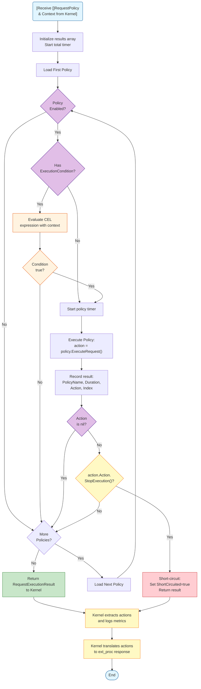

# Envoy Policy Engine - Product Requirements Document

**Version:** 1.0
**Date:** 2025-11-17
**Target Envoy Version:** v1.36.2
**Implementation Language:** Go

---

## 1. Overview

### 1.1 Purpose
The Envoy Policy Engine is an external processor (ext_proc) service for Envoy Proxy that provides a flexible, extensible framework for processing HTTP requests and responses through configurable policies. The engine allows dynamic configuration of policy chains per route, enabling capabilities such as authentication, authorization, header manipulation, and request transformation without modifying Envoy configuration.

### 1.2 Goals
- Provide a clean separation between policy logic and proxy infrastructure
- Enable dynamic policy configuration without restarting Envoy or the policy engine
- Support extensible policy framework through Go interfaces
- Achieve low-latency policy evaluation
- Allow policy composition and chaining with failure handling
- Integrate seamlessly with Envoy's ext_proc filter

### 1.3 High-Level Architecture


### 1.4 Deployment Architecture


---

## 2. Architecture Components

### 2.1 Kernel

**Responsibilities:**
- Implement Envoy ext_proc gRPC service (port 9001)
- Maintain route-to-policy mappings (key → request policy list, response policy list)
- Extract metadata key from Envoy requests
- Determine ext_proc processing mode based on policy body requirements
  - If any policy in chain requires request/response body → configure BUFFERED body mode
  - If no policy requires body → configure SKIP body mode (headers only, optimal performance)
- Invoke Worker Core with appropriate policy chain (request or response flow)
- Translate policy results to ext_proc responses (Core → Envoy format)
- Expose xDS-based Policy Discovery Service (gRPC streaming, port 9002)

**Key Functions:**
- `ProcessRequest()` - Handle request phase from Envoy (ext_proc)
  - Extract metadata key from request
  - Get PolicyChain for route
  - Initialize fresh shared metadata for request
  - Build initial RequestContext from Envoy data
  - Call Core.ExecuteRequestPolicies()
  - Store context and chain for response phase
  - Translate `RequestExecutionResult` → ext_proc response
- `ProcessResponse()` - Handle response phase from Envoy (ext_proc)
  - Extract request ID from response
  - Retrieve stored RequestContext and PolicyChain from request phase
  - Build ResponseContext with request data + response data
  - Metadata is shared from request phase
  - Call Core.ExecuteResponsePolicies()
  - Translate `ResponseExecutionResult` → ext_proc response
- `GetPolicyChainForKey(key string)` - Retrieve PolicyChain (request + response policies) for route
- `storeContextForResponse(requestID, ctx, chain)` - Store context between request and response phases
- `getStoredContext(requestID)` - Retrieve stored context and chain for response phase
- `StreamPolicyMappings()` - xDS stream for policy configuration updates
- `TranslateRequestActions(result)` - Convert request execution results to ext_proc format by applying all actions in order
- `TranslateResponseActions(result)` - Convert response execution results to ext_proc format by applying all actions in order

**Configuration Storage:**
- In-memory map: `metadata_key → PolicyChain`
- PolicyChain contains:
  - `RequestPolicies []RequestPolicy` - Policies executed during request flow (type-safe)
  - `ResponsePolicies []ResponsePolicy` - Policies executed during response flow (type-safe)
  - `Metadata map[string]interface{}` - Shared metadata initialized fresh for each request
  - `RequiresRequestBody bool` - Computed flag: true if any RequestPolicy needs request body
  - `RequiresResponseBody bool` - Computed flag: true if any ResponsePolicy needs response body
- PolicySpec includes: policy name, version, validated parameters, enabled flag
- Version tracking for xDS protocol (resource version strings)
- Policies are filtered by interface type when loaded into PolicyChain
- Body requirement flags are computed by checking all policies' RequiresRequestBody/RequiresResponseBody from PolicyDefinition
- Context storage: In-memory map `request_id → (RequestContext, PolicyChain)` for preserving state between request and response phases

**Body Processing Mode Optimization:**

The Kernel dynamically determines ext_proc processing mode based on policy body requirements to optimize performance:

**Processing Modes:**
- **SKIP Mode (Headers Only):** When no policy requires body access
  - Envoy sends only headers to ext_proc
  - Minimal latency overhead (~1-2ms)
  - Body is streamed directly to upstream without buffering
  - Ideal for authentication, header manipulation, routing policies

- **BUFFERED Mode (Headers + Body):** When any policy requires body access
  - Envoy buffers complete request/response body before sending to ext_proc
  - Higher latency overhead (~5-10ms depending on body size)
  - Required for body transformation, content inspection, WAF policies
  - Body size limits apply (configurable in Envoy, typically 1-10MB)

**Mode Selection Logic:**
```go
// Kernel builds PolicyChain and computes body requirements
func (k *Kernel) BuildPolicyChain(routeKey string, policySpecs []PolicySpec) *PolicyChain {
    chain := &PolicyChain{
        Metadata: make(map[string]interface{}),
    }

    // Load policies and check body requirements
    for _, spec := range policySpecs {
        policy := k.registry.GetPolicy(spec.Name, spec.Version)
        definition := k.registry.GetDefinition(spec.Name, spec.Version)

        // Add to appropriate phase
        if reqPolicy, ok := policy.(RequestPolicy); ok {
            chain.RequestPolicies = append(chain.RequestPolicies, reqPolicy)

            // Check if this policy requires request body
            if definition.RequiresRequestBody {
                chain.RequiresRequestBody = true
            }
        }

        if respPolicy, ok := policy.(ResponsePolicy); ok {
            chain.ResponsePolicies = append(chain.ResponsePolicies, respPolicy)

            // Check if this policy requires response body
            if definition.RequiresResponseBody {
                chain.RequiresResponseBody = true
            }
        }
    }

    return chain
}

// Kernel uses chain flags to determine processing mode in ext_proc response
func (k *Kernel) ProcessRequest(req *extproc.ProcessingRequest) *extproc.ProcessingResponse {
    routeKey := k.extractMetadataKey(req)
    chain := k.GetPolicyChainForKey(routeKey)

    // Determine body processing mode for this request
    bodyMode := extproc.ProcessingMode_SKIP
    if chain.RequiresRequestBody {
        bodyMode = extproc.ProcessingMode_BUFFERED
    }

    // Execute policy chain...
    execResult := k.core.ExecuteRequestPolicies(chain.RequestPolicies, ctx)

    // Include mode_override in response to configure body processing
    response := k.TranslateRequestActions(execResult)
    response.ModeOverride = &extproc.ProcessingMode{
        RequestBodyMode:  bodyMode,
        ResponseBodyMode: determineResponseBodyMode(chain),
    }

    return response
}
```

**Performance Impact:**

| Policy Combination | Body Mode | Latency (p95) | Throughput |
|-------------------|-----------|---------------|------------|
| JWT + APIKey + SetHeader | SKIP | < 5ms | 15,000 rps |
| JWT + APIKey + RequestTransform | BUFFERED | 10-20ms | 5,000 rps |
| SetHeader only | SKIP | < 2ms | 20,000 rps |

**Example Policy Chains:**

```yaml
# Example 1: Headers-only chain (optimal performance)
# All policies work with headers only → SKIP mode
route_key: "api-auth-only"
request_policies:
  - name: jwtValidation        # requiresRequestBody: false
  - name: apiKeyValidation     # requiresRequestBody: false
  - name: setHeader            # requiresRequestBody: false
# Result: request_body_mode = SKIP, response_body_mode = SKIP

# Example 2: Body-requiring chain (buffered mode)
# One policy needs body → BUFFERED mode
route_key: "api-with-transform"
request_policies:
  - name: jwtValidation           # requiresRequestBody: false
  - name: requestTransformation   # requiresRequestBody: true ← triggers BUFFERED
  - name: setHeader               # requiresRequestBody: false
# Result: request_body_mode = BUFFERED, response_body_mode = SKIP

# Example 3: Mixed chain with response body
route_key: "api-with-response-transform"
request_policies:
  - name: jwtValidation           # requiresRequestBody: false
response_policies:
  - name: responseTransformation  # requiresResponseBody: true ← triggers BUFFERED
  - name: securityHeaders         # requiresResponseBody: false
# Result: request_body_mode = SKIP, response_body_mode = BUFFERED
```

**Benefits:**
- ✅ **Performance:** Headers-only policies run with minimal latency
- ✅ **Resource Efficiency:** No unnecessary memory buffering
- ✅ **Declarative:** Policy authors declare requirements, Kernel optimizes automatically
- ✅ **Transparency:** Operators can audit body requirements via policy definitions
- ✅ **Flexibility:** Mix headers-only and body-requiring policies in same deployment

### 2.1.1 Policy Configuration Schema

Following industry standards (Kubernetes CRDs, OpenAPI v3, Protobuf validation), the engine uses a robust parameter typing and validation system.

**Core Configuration Types:**

```go
// PolicySpec defines a policy instance with version and validated parameters
type PolicySpec struct {
    // Policy identifier (e.g., "jwtValidation", "rateLimiting")
    Name string

    // Semantic version of the policy implementation (e.g., "v1.0.0", "v2.1.0")
    // Enables backward compatibility and gradual rollouts
    Version string

    // Static enable/disable toggle
    // If false, policy never executes regardless of ExecutionCondition
    Enabled bool

    // Typed and validated configuration parameters
    Parameters PolicyParameters

    // Optional: CEL expression for dynamic conditional execution
    // If nil, policy always executes (when Enabled=true)
    // If not nil, policy only executes when expression evaluates to true
    // Expression evaluated with RequestContext (request phase) or ResponseContext (response phase)
    //
    // Available context variables:
    //   Request Phase (RequestContext):
    //     - request.Path       (string)
    //     - request.Method     (string)
    //     - request.Headers    (map[string][]string)
    //     - request.Body       ([]byte)
    //     - request.Metadata   (map[string]string)
    //
    //   Response Phase (ResponseContext):
    //     - request.Path, request.Method, request.Headers (original request)
    //     - response.Status    (int)
    //     - response.Headers   (map[string][]string)
    //     - response.Body      ([]byte)
    //     - metadata           (map[string]string)
    //
    // Example expressions:
    //   - `request.Path.startsWith("/api/v1")`
    //   - `request.Method in ["POST", "PUT", "PATCH"]`
    //   - `has(request.Headers["content-type"]) && request.Headers["content-type"][0].contains("application/json")`
    //   - `request.Metadata["environment"] == "production"`
    //   - `response.Status >= 500`  (response phase)
    ExecutionCondition *string
}

// PolicyParameters holds the configuration with type-safe access
type PolicyParameters struct {
    // Raw parameter values as JSON (from xDS config)
    Raw map[string]interface{}

    // Validated parameters matching the policy's schema
    // Validated at configuration time, not execution time
    Validated map[string]TypedValue
}

// TypedValue represents a validated parameter value with its type information
type TypedValue struct {
    Type  ParameterType
    Value interface{}  // Actual value after validation
}
```

**Parameter Type System:**

```go
// ParameterType defines supported parameter types
type ParameterType string

const (
    // Scalar Types
    ParameterTypeString     ParameterType = "string"
    ParameterTypeInt        ParameterType = "int"        // int64
    ParameterTypeFloat      ParameterType = "float"      // float64
    ParameterTypeBool       ParameterType = "bool"
    ParameterTypePercentage ParameterType = "percentage" // float64 [0.0-100.0]
    ParameterTypeDuration   ParameterType = "duration"   // time.Duration

    // Complex Types
    ParameterTypeStringArray ParameterType = "string_array"
    ParameterTypeIntArray    ParameterType = "int_array"
    ParameterTypeMap         ParameterType = "map"        // map[string]interface{}
    ParameterTypeObject      ParameterType = "object"     // nested structure

    // Format-Specific Types (strings with validation)
    ParameterTypeEmail      ParameterType = "email"       // RFC 5322 email
    ParameterTypeURI        ParameterType = "uri"         // RFC 3986 URI
    ParameterTypeHostname   ParameterType = "hostname"    // RFC 1123 hostname
    ParameterTypeIPv4       ParameterType = "ipv4"        // IPv4 address
    ParameterTypeIPv6       ParameterType = "ipv6"        // IPv6 address
    ParameterTypeUUID       ParameterType = "uuid"        // RFC 4122 UUID
    ParameterTypeJSONPath   ParameterType = "jsonpath"    // JSONPath expression
    ParameterTypeRegex      ParameterType = "regex"       // Valid regex pattern
)
```

**Validation Schema:**

```go
// ParameterSchema defines the validation rules for a policy parameter
// Follows OpenAPI v3 / JSON Schema conventions
type ParameterSchema struct {
    // Parameter name (e.g., "jwksUrl", "maxRequests", "allowedOrigins")
    Name string

    // Parameter type
    Type ParameterType

    // Human-readable description
    Description string

    // Whether this parameter is required
    Required bool

    // Default value if not provided (must match Type)
    Default interface{}

    // Validation rules based on type
    Validation ValidationRules
}

// ValidationRules contains type-specific validation constraints
type ValidationRules struct {
    // String validations
    MinLength *int    // Minimum string length
    MaxLength *int    // Maximum string length
    Pattern   *string // Regex pattern (Go regexp syntax)
    Format    *string // Predefined format (email, uri, hostname, etc.)
    Enum      []string // Allowed values

    // Numeric validations (int, float, percentage)
    Minimum          *float64 // Minimum value (inclusive)
    Maximum          *float64 // Maximum value (inclusive)
    ExclusiveMinimum *float64 // Minimum value (exclusive)
    ExclusiveMaximum *float64 // Maximum value (exclusive)
    MultipleOf       *float64 // Value must be multiple of this

    // Array validations
    MinItems *int  // Minimum array length
    MaxItems *int  // Maximum array length
    UniqueItems bool // All items must be unique

    // Duration validations
    MinDuration *time.Duration // Minimum duration
    MaxDuration *time.Duration // Maximum duration

    // Object/Map validations
    MinProperties *int // Minimum number of properties
    MaxProperties *int // Maximum number of properties

    // Custom validation using CEL (Common Expression Language)
    // Example: "this.maxRequests > 0 && this.maxRequests <= 10000"
    CELExpression *string
}
```

**Policy Definition & Versioning:**

Policy definitions are specified in **YAML files** alongside the policy implementation. This approach provides:
- ✅ Separation of schema from code (no recompilation needed for schema changes)
- ✅ Language-agnostic schema definition (supports Go plugins, WASM, external processors)
- ✅ Auto-discovery at startup (scan policies directory)
- ✅ Easy version management (directory-based versioning)
- ✅ Tooling support (validation, documentation generation, UI forms)

**Go Type Definitions (Internal Representation):**

```go
// PolicyDefinition describes a specific version of a policy
// Loaded from YAML at startup or defined in Go for built-in policies
type PolicyDefinition struct {
    // Policy name (e.g., "jwtValidation", "rateLimiting")
    Name string

    // Semantic version of THIS definition (e.g., "v1.0.0", "v2.0.0")
    // Each version gets its own PolicyDefinition
    Version string

    // Description of what this policy version does
    Description string

    // Which phases this policy version supports
    SupportsRequestPhase  bool
    SupportsResponsePhase bool

    // Body processing requirements
    // If true, policy needs access to request body during request phase
    // Kernel will configure ext_proc in BUFFERED body mode if any policy requires body
    RequiresRequestBody  bool

    // If true, policy needs access to response body during response phase
    // Kernel will configure ext_proc in BUFFERED body mode if any policy requires body
    RequiresResponseBody bool

    // Parameter schemas for THIS version
    ParameterSchemas []ParameterSchema

    // Examples of valid configurations for THIS version
    Examples []PolicyExample
}

// PolicyExample provides a documented example configuration
type PolicyExample struct {
    Description string
    Config      map[string]interface{}
}

// PolicyRegistry stores policy definitions by composite key
type PolicyRegistry struct {
    // Key format: "policyName:version" (e.g., "jwtValidation:v1.0.0")
    definitions map[string]*PolicyDefinition

    // Alternative nested structure for easier version lookup:
    // map[policyName]map[version]*PolicyDefinition
}

// LoadPolicyDefinitionFromYAML loads a policy schema from YAML file
func LoadPolicyDefinitionFromYAML(schemaPath string) (*PolicyDefinition, error) {
    data, err := os.ReadFile(schemaPath)
    if err != nil {
        return nil, err
    }

    var def PolicyDefinition
    if err := yaml.Unmarshal(data, &def); err != nil {
        return nil, err
    }

    // Validate the schema definition itself
    if err := validateSchemaDefinition(&def); err != nil {
        return nil, fmt.Errorf("invalid schema: %w", err)
    }

    return &def, nil
}

// RegisterFromDirectory auto-discovers and registers all policies in a directory
func (r *PolicyRegistry) RegisterFromDirectory(policiesDir string) error {
    return filepath.Walk(policiesDir, func(path string, info os.FileInfo, err error) error {
        if filepath.Base(path) == "policy.yaml" {
            def, err := LoadPolicyDefinitionFromYAML(path)
            if err != nil {
                return fmt.Errorf("failed to load %s: %w", path, err)
            }

            key := fmt.Sprintf("%s:%s", def.Name, def.Version)
            r.definitions[key] = def
            log.Info("Registered policy", "name", def.Name, "version", def.Version)
        }
        return nil
    })
}
```

**Policy Directory Structure:**

```
policies/
├── jwt-validation/
│   ├── v1.0.0/
│   │   ├── policy.yaml          # Schema definition (required)
│   │   ├── jwt.go               # Go implementation
│   │   └── README.md            # Developer documentation
│   └── v2.0.0/
│       ├── policy.yaml          # Different schema for v2
│       ├── jwt.go               # Enhanced implementation
│       └── README.md
├── rate-limiting/
│   └── v1.0.0/
│       ├── policy.yaml
│       ├── ratelimit.go
│       └── examples/
│           ├── basic.yaml       # Example configurations
│           └── advanced.yaml
└── api-key-validation/
    └── v1.0.0/
        ├── policy.yaml
        └── apikey.go
```

**Example Policy Definitions (YAML Format):**

**JWT Validation v1.0.0** (`policies/jwt-validation/v1.0.0/policy.yaml`):

```yaml
name: jwtValidation
version: v1.0.0
description: Validates JWT tokens using JWKS
supportsRequestPhase: true
supportsResponsePhase: false
requiresRequestBody: false
requiresResponseBody: false

parameters:
  - name: headerName
    type: string
    description: HTTP header containing the JWT
    required: true
    default: "Authorization"
    validation:
      minLength: 1
      maxLength: 256
      pattern: "^[A-Za-z0-9-]+$"

  - name: tokenPrefix
    type: string
    description: "Prefix to strip from header value (e.g., 'Bearer ')"
    required: false
    default: "Bearer "

  - name: jwksUrl
    type: uri
    description: URL to fetch JSON Web Key Set
    required: true
    validation:
      pattern: "^https://.*"

  - name: issuer
    type: string
    description: Expected JWT issuer claim
    required: true
    validation:
      minLength: 1
      maxLength: 256

  - name: audiences
    type: string_array
    description: Accepted audience values
    required: true
    validation:
      minItems: 1
      maxItems: 10

  - name: clockSkew
    type: duration
    description: Allowed clock skew for exp/nbf validation
    required: false
    default: "30s"
    validation:
      minDuration: "0s"
      maxDuration: "5m"

examples:
  - description: Basic JWT validation with Auth0
    config:
      headerName: "Authorization"
      tokenPrefix: "Bearer "
      jwksUrl: "https://your-tenant.auth0.com/.well-known/jwks.json"
      issuer: "https://your-tenant.auth0.com/"
      audiences:
        - "https://api.example.com"
      clockSkew: "30s"
```

**JWT Validation v2.0.0** (`policies/jwt-validation/v2.0.0/policy.yaml`):

```yaml
name: jwtValidation
version: v2.0.0
description: Validates JWT tokens with advanced caching and claim extraction
supportsRequestPhase: true
supportsResponsePhase: false
requiresRequestBody: false
requiresResponseBody: false

parameters:
  # All v1.0.0 parameters (maintained for backward compatibility)
  - name: headerName
    type: string
    description: HTTP header containing the JWT
    required: true
    default: "Authorization"

  - name: tokenPrefix
    type: string
    description: "Prefix to strip from header value"
    required: false
    default: "Bearer "

  - name: jwksUrl
    type: uri
    description: URL to fetch JSON Web Key Set
    required: true
    validation:
      pattern: "^https://.*"

  - name: issuer
    type: string
    description: Expected JWT issuer claim
    required: true

  - name: audiences
    type: string_array
    description: Accepted audience values
    required: true
    validation:
      minItems: 1
      maxItems: 10

  - name: clockSkew
    type: duration
    description: Allowed clock skew for exp/nbf validation
    required: false
    default: "30s"

  # New parameters in v2.0.0
  - name: cacheTTL
    type: duration
    description: How long to cache JWKS keys
    required: false
    default: "1h"
    validation:
      minDuration: "1m"
      maxDuration: "24h"

  - name: extractClaims
    type: string_array
    description: JWT claims to extract and inject as headers
    required: false
    validation:
      maxItems: 20

  - name: claimHeaderPrefix
    type: string
    description: Prefix for injected claim headers
    required: false
    default: "X-JWT-"

examples:
  - description: JWT validation with claim extraction
    config:
      jwksUrl: "https://auth.example.com/.well-known/jwks.json"
      issuer: "https://auth.example.com/"
      audiences: ["https://api.example.com"]
      cacheTTL: "2h"
      extractClaims: ["sub", "email", "roles"]
      claimHeaderPrefix: "X-JWT-"
```

**Rate Limiting v1.0.0** (`policies/rate-limiting/v1.0.0/policy.yaml`):

```yaml
name: rateLimiting
version: v1.0.0
description: Token bucket rate limiting per identifier
supportsRequestPhase: true
supportsResponsePhase: false
requiresRequestBody: false
requiresResponseBody: false

parameters:
  - name: requestsPerSecond
    type: float
    description: Maximum requests per second
    required: true
    validation:
      minimum: 0.1
      maximum: 1000000.0
      multipleOf: 0.1

  - name: burstSize
    type: int
    description: Maximum burst size (tokens in bucket)
    required: true
    validation:
      minimum: 1
      maximum: 10000

  - name: identifierSource
    type: string
    description: How to identify the client
    required: true
    validation:
      enum:
        - ip
        - header
        - jwt_claim

  - name: identifierKey
    type: string
    description: Header name or JWT claim name for identification
    required: false
    validation:
      minLength: 1
      maxLength: 256

  - name: rejectStatusCode
    type: int
    description: HTTP status code when rate limit exceeded
    required: false
    default: 429
    validation:
      minimum: 400
      maximum: 599

  - name: enableRetryAfterHeader
    type: bool
    description: Include Retry-After header in response
    required: false
    default: true

examples:
  - description: Basic rate limiting by IP
    config:
      requestsPerSecond: 100
      burstSize: 20
      identifierSource: ip
      rejectStatusCode: 429
      enableRetryAfterHeader: true

  - description: Rate limiting by API key header
    config:
      requestsPerSecond: 1000
      burstSize: 50
      identifierSource: header
      identifierKey: X-API-Key
```

**Validation Flow:**

1. **Startup Time** (policy engine initialization):
   - Scan policies directory (e.g., `/opt/policy-engine/policies`)
   - For each `policy.yaml` file found:
     - Load and parse YAML into PolicyDefinition struct
     - Validate the schema definition itself (required fields, valid types, etc.)
     - Register in PolicyRegistry with key "name:version"
     - Log successful registration
   - Load corresponding policy implementations (Go code, plugins, or WASM modules)

2. **Configuration Time** (when xDS config is received):
   - Kernel receives PolicySpec from xDS with name, version, and raw parameters
   - Looks up PolicyDefinition from registry using "name:version" key
   - If version not found → reject configuration with clear error message
   - Validates each parameter against ParameterSchema from loaded YAML:
     - Type checking (string, int, duration, etc.)
     - Format validation (email, URI, regex, etc.)
     - Constraint validation (min/max, pattern, enum, etc.)
     - CEL expression evaluation (if specified)
   - If ExecutionCondition specified → validate CEL syntax
   - Converts validated parameters to TypedValue
   - Stores validated PolicySpec in RouteConfig

2. **Execution Time**:
   - Check if policy.Enabled == false → skip policy
   - Evaluate ExecutionCondition (if specified) with context → skip if false
   - Execute policy with pre-validated parameters
   - No validation overhead - parameters already validated
   - Policies access pre-validated TypedValue from Parameters.Validated
   - Type-safe access with guaranteed constraints

**Conditional Execution Examples:**

```yaml
# Example 1: JWT validation only for /api/* paths
name: jwtValidation
version: v1.0.0
enabled: true
executionCondition: 'request.Path.startsWith("/api/")'
parameters:
  jwksUrl: "https://auth.example.com/.well-known/jwks.json"
  issuer: "https://auth.example.com/"
  audiences: ["https://api.example.com"]

# Example 2: Rate limiting only for write operations
name: rateLimiting
version: v1.0.0
enabled: true
executionCondition: 'request.Method in ["POST", "PUT", "DELETE", "PATCH"]'
parameters:
  requestsPerSecond: 100
  burstSize: 20

# Example 3: CORS only when Origin header present
name: corsPolicy
version: v1.0.0
enabled: true
executionCondition: 'has(request.Headers["origin"])'
parameters:
  allowedOrigins: ["https://app.example.com"]

# Example 4: Content transformation only for JSON
name: requestTransformation
version: v1.0.0
enabled: true
executionCondition: |
  has(request.Headers["content-type"]) &&
  request.Headers["content-type"][0].contains("application/json")
parameters:
  transformRules: [...]

# Example 5: Error logging only for server errors (response phase)
name: errorLogging
version: v1.0.0
enabled: true
executionCondition: 'response.Status >= 500'
parameters:
  logLevel: "error"
  includeBody: true

# Example 6: Environment-specific policy
name: debugHeaders
version: v1.0.0
enabled: true
executionCondition: 'request.Metadata["environment"] in ["dev", "staging"]'
parameters:
  headers:
    - name: "X-Debug-Mode"
      value: "true"
```

**Policy Chain Structure:**

Policies are encapsulated in a PolicyChain that holds both request and response policies, along with shared metadata for inter-policy communication across the entire request → response lifecycle.

```go
// PolicyChain encapsulates both request and response policies
// with shared metadata across the entire request → response lifecycle
type PolicyChain struct {
    RequestPolicies  []RequestPolicy
    ResponsePolicies []ResponsePolicy

    // Shared metadata across entire request → response flow
    // Policies can store/read data here for inter-policy communication
    // Initialized fresh for each request, persists through response phase
    Metadata map[string]interface{}

    // Body processing requirements (computed at chain construction)
    // These flags determine ext_proc processing mode
    RequiresRequestBody  bool  // true if any RequestPolicy requires request body
    RequiresResponseBody bool  // true if any ResponsePolicy requires response body
}
```

**Core Execution Flow with Conditions and Context Updates:**

```go
// Core executes request policies with condition evaluation
// Context is updated in-place as each policy executes, so later policies
// see modifications made by earlier policies (pipeline pattern)
func (c *Core) ExecuteRequestPolicies(policies []RequestPolicy, ctx *RequestContext) RequestExecutionResult {
    startTime := time.Now()
    results := make([]RequestPolicyResult, 0, len(policies))
    shortCircuited := false

    for i, policy := range policies {
        policyStart := time.Now()

        // Check if policy is enabled
        spec := policy.GetSpec()
        if !spec.Enabled {
            continue  // Policy disabled, skip
        }

        // Evaluate execution condition with CURRENT context values (if specified)
        // Conditions see the updated state from previous policies
        if spec.ExecutionCondition != nil {
            conditionMet := c.celEvaluator.EvaluateWithRequestContext(*spec.ExecutionCondition, ctx)
            if !conditionMet {
                continue  // Condition not met, skip policy
            }
        }

        // Execute policy with current context
        // Policy can read/write ctx.Metadata for inter-policy communication
        action := policy.ExecuteRequest(ctx, c.getConfig(policy))

        // Record result with metrics
        result := RequestPolicyResult{
            Action:     action,
            PolicyName: policy.Name(),
            Duration:   time.Since(policyStart),
            Index:      i,
        }
        results = append(results, result)

        // Apply modifications to context for next policy
        if action != nil {
            switch a := action.Action.(type) {
            case UpstreamRequestModifications:
                applyRequestModifications(ctx, a)
            case ImmediateResponse:
                shortCircuited = true
                break
            }
        }

        // Check for short-circuit
        if shortCircuited {
            break
        }
    }

    return RequestExecutionResult{
        PolicyResults:  results,
        TotalDuration:  time.Since(startTime),
        ShortCircuited: shortCircuited,
    }
}

// applyRequestModifications updates context with action's modifications
func applyRequestModifications(ctx *RequestContext, mods UpstreamRequestModifications) {
    // Apply SetHeaders (replace values)
    for k, v := range mods.SetHeaders {
        ctx.Headers[k] = []string{v}
    }

    // Apply RemoveHeaders (delete from map)
    for _, k := range mods.RemoveHeaders {
        delete(ctx.Headers, k)
    }

    // Apply AppendHeaders (add to existing values)
    for k, values := range mods.AppendHeaders {
        ctx.Headers[k] = append(ctx.Headers[k], values...)
    }

    // Update body if specified
    if mods.Body != nil {
        ctx.Body = mods.Body
    }

    // Update path if specified
    if mods.Path != nil {
        ctx.Path = *mods.Path
    }

    // Update method if specified
    if mods.Method != nil {
        ctx.Method = *mods.Method
    }
}
```

**CEL Evaluation Context:**

The Core provides a CEL evaluator that has access to the full RequestContext or ResponseContext, including the current (possibly modified) state and shared metadata:

```go
// CEL Evaluator interface
type CELEvaluator interface {
    // Evaluate CEL expression with RequestContext
    // Expression sees CURRENT values (after previous policies executed)
    EvaluateWithRequestContext(expression string, ctx *RequestContext) bool

    // Evaluate CEL expression with ResponseContext
    // Expression sees CURRENT values (after previous policies executed)
    EvaluateWithResponseContext(expression string, ctx *ResponseContext) bool
}

// Available context variables in CEL expressions:

// Request Phase (RequestContext):
//   - request.Path       (string) - Current path (possibly modified by previous policies)
//   - request.Method     (string) - Current method (possibly modified)
//   - request.Headers    (map[string][]string) - Current headers (possibly modified)
//   - request.Body       ([]byte) - Current body (possibly modified)
//   - metadata           (map[string]interface{}) - Shared metadata for inter-policy communication

// Response Phase (ResponseContext):
//   - request.Path, request.Method, request.Headers (from request phase, immutable)
//   - response.Status    (int) - Current status (possibly modified by previous policies)
//   - response.Headers   (map[string][]string) - Current headers (possibly modified)
//   - response.Body      ([]byte) - Current body (possibly modified)
//   - metadata           (map[string]interface{}) - Same metadata from request phase

// Example CEL expressions and their evaluation:

// Expression: `request.Path.startsWith("/api/")`
// Context: RequestContext{Path: "/api/users"}
// Result: true

// Expression: `request.Method in ["POST", "PUT"]`
// Context: RequestContext{Method: "GET"}
// Result: false

// Expression: `has(request.Headers["authorization"])`
// Context: RequestContext{Headers: {"content-type": ["application/json"]}}
// Result: false

// Expression: `has(metadata["authenticated"]) && metadata["authenticated"] == true`
// Context: RequestContext{Metadata: {"authenticated": true}}
// Result: true (execute only if previous policy set authenticated flag)

// Expression: `has(request.Headers["x-user-id"])`
// Context: RequestContext{Headers: {"x-user-id": ["123"]}} (set by previous JWT policy)
// Result: true (execute only if JWT policy added user ID header)

// Expression: `response.Status >= 500 && has(metadata["user_id"])`
// Context: ResponseContext{ResponseStatus: 503, Metadata: {"user_id": "123"}}
// Result: true (log server errors only for authenticated users)
```

**Design Benefits:**

- ✅ **Type Safety**: Strong typing with Go type system
- ✅ **YAML-Based Schemas**: Policy definitions in YAML for easy authoring and tooling support
- ✅ **Separation of Concerns**: Schema definition (YAML) separate from implementation (Go code)
- ✅ **Auto-Discovery**: Policies automatically loaded from directory at startup
- ✅ **Version Independence**: Each policy version has its own complete definition and directory
- ✅ **Validation at Config Time**: Fail fast with clear errors, not during request processing
- ✅ **Industry Standard**: Follows OpenAPI v3 / JSON Schema / Kubernetes CRD patterns
- ✅ **Self-Documenting**: YAML schemas serve as living documentation
- ✅ **Backward Compatibility**: Multiple versions can coexist, gradual migration
- ✅ **Extensible**: Easy to add new types and validation rules
- ✅ **CEL Support**: Custom validation expressions for complex constraints and conditional execution
- ✅ **Conditional Execution**: Dynamic runtime policy execution based on current request/response context
- ✅ **Pipeline Pattern**: Each policy sees modifications from previous policies (middleware-style)
- ✅ **Shared Metadata**: Policies can communicate across request → response lifecycle
- ✅ **Developer Experience**: Clear, actionable error messages during configuration
- ✅ **Performance**: Zero runtime validation overhead, efficient CEL evaluation
- ✅ **Format Validation**: Built-in validators for email, URI, IP, UUID, etc.
- ✅ **Protobuf Compatible**: Can be mapped to protobuf messages for xDS
- ✅ **Flexible Policies**: Same policy can behave differently based on path, method, headers, environment, or previous policy actions
- ✅ **Cost Efficiency**: Skip expensive policies when conditions not met (e.g., skip JWT validation for public endpoints)
- ✅ **Inter-Policy Communication**: Policies coordinate via shared metadata without tight coupling
- ✅ **Observability**: Track request lifecycle metrics from request through response
- ✅ **Tooling Friendly**: YAML schemas enable UI generation, CLI tools, and IDE support
- ✅ **Language Agnostic**: Schema format supports future plugin systems (WASM, external processors)
- ✅ **Body Processing Optimization**: Policies declare body requirements, Kernel automatically optimizes ext_proc mode (SKIP vs BUFFERED) for minimal latency

### 2.2 Worker: Core

**Responsibilities:**
- Maintain policy registry (name → Policy implementation)
- Execute policy chains in order
- Evaluate ExecutionCondition (CEL expressions) for each policy
- Implement short-circuit logic (stop when action.Action.StopExecution() returns true)
- Collect policy results with execution metrics
- Pass execution results back to Kernel (includes actions and timing data)

**Key Functions:**
- `ExecuteRequestPolicies(policies []RequestPolicy, ctx *RequestContext) RequestExecutionResult`
  - Iterate through request policies (type-safe, no runtime type checking needed)
  - Check if policy is enabled
  - Evaluate ExecutionCondition with current RequestContext values (skip if condition not met)
  - Execute each policy and collect action with timing metrics
  - Apply action modifications to context in-place (so next policy sees updated state)
  - Short-circuit if action.Action.StopExecution() returns true
  - Return execution result with actions and metrics to Kernel
- `ExecuteResponsePolicies(policies []ResponsePolicy, ctx *ResponseContext) ResponseExecutionResult`
  - Iterate through response policies (type-safe, no runtime type checking needed)
  - Check if policy is enabled
  - Evaluate ExecutionCondition with current ResponseContext values (skip if condition not met)
  - Execute each policy and collect action with timing metrics
  - Apply action modifications to context in-place (so next policy sees updated state)
  - Short-circuit if action.Action.StopExecution() returns true
  - Return execution result with actions and metrics to Kernel

**Policy Action Types:**

Core uses separate action types for request and response phases. The oneof pattern is enforced using Go interfaces with private marker methods, ensuring type safety and clear semantics.

```go
// ============ Request Phase ============

// RequestPolicyAction is returned by policies during request processing
type RequestPolicyAction struct {
    Action RequestAction  // Contains either UpstreamRequestModifications or ImmediateResponse
}

// RequestAction is a marker interface for the oneof pattern
// Only UpstreamRequestModifications and ImmediateResponse implement this interface
type RequestAction interface {
    isRequestAction()     // private marker method
    StopExecution() bool  // returns true if execution should stop after this action
}

// UpstreamRequestModifications contains all modifications to apply to the request
// before forwarding to upstream
type UpstreamRequestModifications struct {
    // Header modifications
    SetHeaders    map[string]string      // set or replace headers
    RemoveHeaders []string               // headers to remove
    AppendHeaders map[string][]string    // headers to append (can have multiple values)

    // Body modification
    Body          []byte                 // nil = no change, []byte{} = clear, []byte("x") = set

    // Request-specific modifications
    Path          *string                // nil = no change, pointer allows explicit empty string
    Method        *string                // nil = no change (GET, POST, PUT, DELETE, etc.)
}

func (UpstreamRequestModifications) isRequestAction() {}
func (UpstreamRequestModifications) StopExecution() bool { return false }

// ImmediateResponse short-circuits policy execution and returns response immediately
// Only valid during request phase
type ImmediateResponse struct {
    StatusCode int
    Headers    map[string]string
    Body       []byte
}

func (ImmediateResponse) isRequestAction() {}
func (ImmediateResponse) StopExecution() bool { return true }

// ============ Response Phase ============

// ResponsePolicyAction is returned by policies during response processing
type ResponsePolicyAction struct {
    Action ResponseAction  // Contains UpstreamResponseModifications
}

// ResponseAction is a marker interface for the oneof pattern
// Only UpstreamResponseModifications implements this interface
type ResponseAction interface {
    isResponseAction()    // private marker method
    StopExecution() bool  // returns true if execution should stop after this action
}

// UpstreamResponseModifications contains all modifications to apply to the response
// before returning to client
type UpstreamResponseModifications struct {
    // Header modifications
    SetHeaders    map[string]string      // set or replace headers
    RemoveHeaders []string               // headers to remove
    AppendHeaders map[string][]string    // headers to append (can have multiple values)

    // Body modification
    Body          []byte                 // nil = no change, []byte{} = clear, []byte("x") = set

    // Response-specific modifications
    StatusCode    *int                   // nil = no change, pointer allows setting any valid code
}

func (UpstreamResponseModifications) isResponseAction() {}
func (UpstreamResponseModifications) StopExecution() bool { return false }

// ============ Execution Results (with Metrics) ============

// RequestExecutionResult encapsulates all policy execution results for request phase
// Includes both actions and timing metrics for observability
type RequestExecutionResult struct {
    PolicyResults  []RequestPolicyResult  // One result per policy executed
    TotalDuration  time.Duration          // Total time for entire chain
    ShortCircuited bool                   // True if execution stopped early
}

// RequestPolicyResult contains the action and metrics for a single policy execution
type RequestPolicyResult struct {
    Action       *RequestPolicyAction  // nil if policy returned nil
    PolicyName   string                // Name of the policy
    Duration     time.Duration         // Time taken to execute this policy
    Index        int                   // Execution order (0-based)
}

// ResponseExecutionResult encapsulates all policy execution results for response phase
type ResponseExecutionResult struct {
    PolicyResults  []ResponsePolicyResult
    TotalDuration  time.Duration
    ShortCircuited bool
}

// ResponsePolicyResult contains the action and metrics for a single policy execution
type ResponsePolicyResult struct {
    Action       *ResponsePolicyAction
    PolicyName   string
    Duration     time.Duration
    Index        int
}
```

**Design Benefits:**
- **True Oneof Semantics:** Single interface field enforces exactly one action type
- **Type Safety:** Compiler prevents invalid operations (e.g., ImmediateResponse in response phase)
- **No Nil Pointer Checks:** Interface value is never nil, always contains a concrete type
- **Clean Type Switching:** Easy to handle different action types in Kernel
- **Clear Semantics:** Request can fork (upstream or immediate), response can only modify
- **Efficient:** Pointers allow nil = no change, avoiding unnecessary allocations
- **Matches Envoy Model:** Aligns with ext_proc protocol (continue or short-circuit)
- **Simple API:** Policy authors work with plain structs, no complex builders needed
- **Clear Intent:** "Action" clearly indicates what the policy wants to do
- **Observability:** Execution results include timing metrics for each policy and total chain
- **1:1 Mapping:** Each action is paired with its execution metadata
- **Type-Safe Execution:** Core receives []RequestPolicy or []ResponsePolicy, eliminating runtime type checks

**Execution Flow:**
1. Receive type-safe policy list ([]RequestPolicy or []ResponsePolicy) and context from Kernel
2. Initialize results array and start total timer
3. For each policy in order:
   - Check if policy.Enabled == false → skip to next policy
   - Evaluate ExecutionCondition with context (if specified) → skip if false
   - Start policy timer
   - Execute policy with context and configuration
   - Record policy name, duration, and action in result
   - Check if action.Action.StopExecution() returns true:
     - If true → short-circuit, mark ShortCircuited=true, return results
     - If false → continue to next policy
4. Return execution result to Kernel (includes all actions with timing metrics)
5. Kernel extracts actions and translates into ext_proc response format
6. Kernel can log/export metrics from execution result

**Execution Flow Diagram:**



### 2.3 Worker: Policies

**Policy Interfaces:**

Policies use marker interfaces to declare which processing phases they participate in. A policy can implement `RequestPolicy`, `ResponsePolicy`, or both.

```go
// Policy is the base interface all policies must implement
type Policy interface {
    // Name returns the unique identifier for this policy
    Name() string

    // Validate checks if the policy configuration is valid
    Validate(config map[string]interface{}) error
}

// RequestPolicy processes requests before they reach upstream
type RequestPolicy interface {
    Policy

    // ExecuteRequest runs during request processing
    // Returns nil action to skip (no modifications)
    ExecuteRequest(ctx *RequestContext, config map[string]interface{}) *RequestPolicyAction
}

// ResponsePolicy processes responses before they reach the client
type ResponsePolicy interface {
    Policy

    // ExecuteResponse runs during response processing
    // Returns nil action to skip (no modifications)
    ExecuteResponse(ctx *ResponseContext, config map[string]interface{}) *ResponsePolicyAction
}

// ============ Context Types ============

// RequestContext holds the current request state during request phase
// This context is MUTABLE - it gets updated as each policy executes
// Later policies see modifications made by earlier policies (pipeline pattern)
type RequestContext struct {
    // Current request state (mutable, updated by each policy)
    Headers  map[string][]string
    Body     []byte
    Path     string
    Method   string

    // Request identifier
    RequestID string

    // Shared metadata for inter-policy communication
    // Policies can read/write this map to coordinate behavior
    // This same metadata map persists from request phase to response phase
    // References PolicyChain.Metadata
    Metadata map[string]interface{}
}

// ResponseContext holds request and response state during response phase
// Response data is MUTABLE - it gets updated as each policy executes
// Request data is immutable (preserved from request phase)
type ResponseContext struct {
    // Original request data (immutable, from request phase)
    RequestHeaders map[string][]string
    RequestBody    []byte
    RequestPath    string
    RequestMethod  string

    // Current response state (mutable, updated by each policy)
    ResponseHeaders map[string][]string
    ResponseBody    []byte
    ResponseStatus  int

    // Request identifier
    RequestID string

    // Shared metadata from request phase (same reference as RequestContext.Metadata)
    // Policies can read data stored by request phase policies
    // References PolicyChain.Metadata
    Metadata map[string]interface{}
}
```

**Usage Examples:**

```go
// Example 1: Request-only policy (JWT validation)
// Stores user info in metadata for use by later policies
type JWTPolicy struct{}

var _ RequestPolicy = (*JWTPolicy)(nil)  // Compile-time interface check

func (p *JWTPolicy) Name() string { return "jwtValidation" }

func (p *JWTPolicy) Validate(config map[string]interface{}) error {
    // Validate configuration
    return nil
}

func (p *JWTPolicy) ExecuteRequest(ctx *RequestContext, config map[string]interface{}) *RequestPolicyAction {
    token := extractToken(ctx.Headers["Authorization"])

    if !isValid(token) {
        return &RequestPolicyAction{
            Action: ImmediateResponse{
                StatusCode: 401,
                Headers:    map[string]string{"WWW-Authenticate": "Bearer"},
                Body:       []byte("Unauthorized"),
            },
        }
    }

    // Store user info in shared metadata for later policies
    ctx.Metadata["user_id"] = token.Claims.Subject
    ctx.Metadata["user_email"] = token.Claims.Email
    ctx.Metadata["user_roles"] = token.Claims.Roles
    ctx.Metadata["authenticated"] = true

    // JWT is valid, add user ID header
    return &RequestPolicyAction{
        Action: UpstreamRequestModifications{
            SetHeaders: map[string]string{
                "X-User-ID": token.Claims.Subject,
                "X-User-Email": token.Claims.Email,
            },
        },
    }
}

// Example 2: Response-only policy (add security headers)
// Reads metadata from request phase to customize response
type SecurityHeadersPolicy struct{}

var _ ResponsePolicy = (*SecurityHeadersPolicy)(nil)

func (p *SecurityHeadersPolicy) Name() string { return "securityHeaders" }

func (p *SecurityHeadersPolicy) Validate(config map[string]interface{}) error {
    return nil
}

func (p *SecurityHeadersPolicy) ExecuteResponse(ctx *ResponseContext, config map[string]interface{}) *ResponsePolicyAction {
    headers := map[string]string{
        "X-Content-Type-Options": "nosniff",
        "X-Frame-Options":        "DENY",
        "X-XSS-Protection":       "1; mode=block",
    }

    // Add user context header if authenticated (from request phase metadata)
    if authenticated, ok := ctx.Metadata["authenticated"].(bool); ok && authenticated {
        if userID, ok := ctx.Metadata["user_id"].(string); ok {
            headers["X-Authenticated-User"] = userID
        }
    }

    return &ResponsePolicyAction{
        Action: UpstreamResponseModifications{
            SetHeaders: headers,
        },
    }
}

// Example 3: Both phases (logging policy)
// Demonstrates using metadata to correlate request and response
type LoggingPolicy struct{}

var _ RequestPolicy = (*LoggingPolicy)(nil)
var _ ResponsePolicy = (*LoggingPolicy)(nil)

func (p *LoggingPolicy) Name() string { return "logging" }

func (p *LoggingPolicy) Validate(config map[string]interface{}) error {
    return nil
}

func (p *LoggingPolicy) ExecuteRequest(ctx *RequestContext, config map[string]interface{}) *RequestPolicyAction {
    // Store request timestamp in metadata
    ctx.Metadata["request_start_time"] = time.Now()

    log.Info("Request: %s %s", ctx.Method, ctx.Path)
    return nil  // No modifications, just logging
}

func (p *LoggingPolicy) ExecuteResponse(ctx *ResponseContext, config map[string]interface{}) *ResponsePolicyAction {
    // Calculate request duration using metadata from request phase
    var duration time.Duration
    if startTime, ok := ctx.Metadata["request_start_time"].(time.Time); ok {
        duration = time.Since(startTime)
    }

    // Access user info from metadata (if JWT policy ran)
    userID := "anonymous"
    if uid, ok := ctx.Metadata["user_id"].(string); ok {
        userID = uid
    }

    log.Info("Response: %d for %s %s (user: %s, duration: %v)",
        ctx.ResponseStatus, ctx.RequestMethod, ctx.RequestPath, userID, duration)
    return nil  // No modifications, just logging
}

// Example 4: Conditional policy using metadata
// Only executes if previous policy set metadata flag
type ConditionalTransformPolicy struct{}

var _ RequestPolicy = (*ConditionalTransformPolicy)(nil)

func (p *ConditionalTransformPolicy) Name() string { return "conditionalTransform" }

func (p *ConditionalTransformPolicy) Validate(config map[string]interface{}) error {
    return nil
}

func (p *ConditionalTransformPolicy) ExecuteRequest(ctx *RequestContext, config map[string]interface{}) *RequestPolicyAction {
    // Check if previous policy (e.g., feature flag policy) set a flag
    if enableTransform, ok := ctx.Metadata["enable_transform"].(bool); !ok || !enableTransform {
        return nil  // Skip transformation
    }

    // Previous policy enabled transform, proceed
    transformedBody := transformRequest(ctx.Body)

    return &RequestPolicyAction{
        Action: UpstreamRequestModifications{
            Body: transformedBody,
            SetHeaders: map[string]string{
                "Content-Type": "application/json",
            },
        },
    }
}
```

**Core Executor Integration:**

```go
// Core executes request policies and returns execution result with metrics
// Context is updated in-place as policies execute
func (c *Core) ExecuteRequestPolicies(policies []RequestPolicy, ctx *RequestContext) RequestExecutionResult {
    startTime := time.Now()
    results := make([]RequestPolicyResult, 0, len(policies))
    shortCircuited := false

    for i, policy := range policies {
        policyStart := time.Now()

        // Check if policy is enabled
        spec := policy.GetSpec()
        if !spec.Enabled {
            continue
        }

        // Evaluate ExecutionCondition with current context (if specified)
        if spec.ExecutionCondition != nil {
            conditionMet := c.celEvaluator.EvaluateWithRequestContext(*spec.ExecutionCondition, ctx)
            if !conditionMet {
                continue
            }
        }

        // Execute policy with current context
        action := policy.ExecuteRequest(ctx, c.getConfig(policy))

        // Record result with metrics
        result := RequestPolicyResult{
            Action:     action,
            PolicyName: policy.Name(),
            Duration:   time.Since(policyStart),
            Index:      i,
        }
        results = append(results, result)

        // Apply modifications to context for next policy
        if action != nil {
            switch a := action.Action.(type) {
            case UpstreamRequestModifications:
                applyRequestModifications(ctx, a)
            case ImmediateResponse:
                shortCircuited = true
                break
            }
        }

        // Check for short-circuit
        if shortCircuited {
            break
        }
    }

    return RequestExecutionResult{
        PolicyResults:  results,
        TotalDuration:  time.Since(startTime),
        ShortCircuited: shortCircuited,
    }
}

// Core executes response policies and returns execution result with metrics
// Context is updated in-place as policies execute
func (c *Core) ExecuteResponsePolicies(policies []ResponsePolicy, ctx *ResponseContext) ResponseExecutionResult {
    startTime := time.Now()
    results := make([]ResponsePolicyResult, 0, len(policies))
    shortCircuited := false

    for i, policy := range policies {
        policyStart := time.Now()

        // Check if policy is enabled
        spec := policy.GetSpec()
        if !spec.Enabled {
            continue
        }

        // Evaluate ExecutionCondition with current context (if specified)
        if spec.ExecutionCondition != nil {
            conditionMet := c.celEvaluator.EvaluateWithResponseContext(*spec.ExecutionCondition, ctx)
            if !conditionMet {
                continue
            }
        }

        // Execute policy with current context
        action := policy.ExecuteResponse(ctx, c.getConfig(policy))

        // Record result with metrics
        result := ResponsePolicyResult{
            Action:     action,
            PolicyName: policy.Name(),
            Duration:   time.Since(policyStart),
            Index:      i,
        }
        results = append(results, result)

        // Apply modifications to context for next policy
        if action != nil {
            switch a := action.Action.(type) {
            case UpstreamResponseModifications:
                applyResponseModifications(ctx, a)
            }
        }

        // Check for short-circuit (response phase doesn't support ImmediateResponse)
        if action != nil && action.Action.StopExecution() {
            shortCircuited = true
            break
        }
    }

    return ResponseExecutionResult{
        PolicyResults:  results,
        TotalDuration:  time.Since(startTime),
        ShortCircuited: shortCircuited,
    }
}

// applyResponseModifications updates response context with action's modifications
func applyResponseModifications(ctx *ResponseContext, mods UpstreamResponseModifications) {
    // Apply SetHeaders (replace values)
    for k, v := range mods.SetHeaders {
        ctx.ResponseHeaders[k] = []string{v}
    }

    // Apply RemoveHeaders (delete from map)
    for _, k := range mods.RemoveHeaders {
        delete(ctx.ResponseHeaders, k)
    }

    // Apply AppendHeaders (add to existing values)
    for k, values := range mods.AppendHeaders {
        ctx.ResponseHeaders[k] = append(ctx.ResponseHeaders[k], values...)
    }

    // Update body if specified
    if mods.Body != nil {
        ctx.ResponseBody = mods.Body
    }

    // Update status code if specified
    if mods.StatusCode != nil {
        ctx.ResponseStatus = *mods.StatusCode
    }
}
```

**Kernel Integration Example:**

```go
// Kernel processes request and translates to ext_proc response
func (k *Kernel) ProcessRequest(req *extproc.ProcessingRequest) *extproc.ProcessingResponse {
    // Extract route key from Envoy metadata
    routeKey := k.extractMetadataKey(req)

    // Get PolicyChain for this route
    chain := k.GetPolicyChainForKey(routeKey)

    // Initialize fresh shared metadata for this request
    chain.Metadata = make(map[string]interface{})

    // Build initial request context from Envoy data
    ctx := &RequestContext{
        Headers:   extractHeaders(req),
        Body:      extractBody(req),
        Path:      extractPath(req),
        Method:    extractMethod(req),
        RequestID: generateRequestID(),
        Metadata:  chain.Metadata,  // Reference to shared metadata
    }

    // Execute request policies (context updated in-place)
    execResult := k.core.ExecuteRequestPolicies(chain.RequestPolicies, ctx)

    // Store context and chain for response phase
    // This preserves the metadata for response policies
    k.storeContextForResponse(ctx.RequestID, ctx, chain)

    // Log execution metrics
    k.logger.Info("Request policy chain executed",
        "route_key", routeKey,
        "total_duration", execResult.TotalDuration,
        "num_policies", len(execResult.PolicyResults),
        "short_circuited", execResult.ShortCircuited,
    )

    // Log individual policy metrics
    for _, pr := range execResult.PolicyResults {
        k.logger.Debug("Policy executed",
            "name", pr.PolicyName,
            "duration", pr.Duration,
            "index", pr.Index,
            "has_action", pr.Action != nil,
        )

        // Export metrics to monitoring system
        k.metrics.RecordPolicyDuration(pr.PolicyName, pr.Duration)
    }

    // Translate execution results to ext_proc response
    return k.TranslateRequestActions(execResult)
}

// Kernel processes response phase
func (k *Kernel) ProcessResponse(resp *extproc.ProcessingResponse) *extproc.ProcessingResponse {
    requestID := extractRequestID(resp)

    // Retrieve stored context and chain from request phase
    reqCtx, chain := k.getStoredContext(requestID)

    // Build response context with request data + response data
    // Metadata is shared with request phase
    respCtx := &ResponseContext{
        // Request data (from request phase, immutable)
        RequestHeaders: reqCtx.Headers,
        RequestBody:    reqCtx.Body,
        RequestPath:    reqCtx.Path,
        RequestMethod:  reqCtx.Method,

        // Response data (from Envoy, mutable)
        ResponseHeaders: extractResponseHeaders(resp),
        ResponseBody:    extractResponseBody(resp),
        ResponseStatus:  extractStatus(resp),

        RequestID: reqCtx.RequestID,
        Metadata:  chain.Metadata,  // Same metadata from request phase!
    }

    // Execute response policies (can read metadata from request phase)
    execResult := k.core.ExecuteResponsePolicies(chain.ResponsePolicies, respCtx)

    // Clean up stored context
    k.removeStoredContext(requestID)

    // Log execution metrics
    k.logger.Info("Response policy chain executed",
        "request_id", requestID,
        "total_duration", execResult.TotalDuration,
        "num_policies", len(execResult.PolicyResults),
    )

    // Translate execution results to ext_proc response
    return k.TranslateResponseActions(execResult)
}

// Kernel translates execution result to ext_proc response
// Applies all actions in order to compute final state
func (k *Kernel) TranslateRequestActions(result RequestExecutionResult) *extproc.ProcessingResponse {
    // Check for immediate response (short-circuit)
    for _, pr := range result.PolicyResults {
        if pr.Action != nil {
            if ir, ok := pr.Action.Action.(ImmediateResponse); ok {
                return &extproc.ProcessingResponse{
                    Response: &extproc.ProcessingResponse_ImmediateResponse{
                        ImmediateResponse: &extproc.ImmediateResponse{
                            Status: &extproc.HttpStatus{Code: uint32(ir.StatusCode)},
                            Headers: convertHeaders(ir.Headers),
                            Body: string(ir.Body),
                        },
                    },
                }
            }
        }
    }

    // Apply all UpstreamRequestModifications in order to compute final state
    finalHeaders := make(map[string][]string)
    var finalBody []byte
    var finalPath *string
    var finalMethod *string

    for _, pr := range result.PolicyResults {
        if pr.Action != nil {
            if mods, ok := pr.Action.Action.(UpstreamRequestModifications); ok {
                // Apply SetHeaders (replace values)
                for k, v := range mods.SetHeaders {
                    finalHeaders[k] = []string{v}
                }

                // Apply RemoveHeaders (delete from map)
                for _, k := range mods.RemoveHeaders {
                    delete(finalHeaders, k)
                }

                // Apply AppendHeaders (add to existing values)
                for k, values := range mods.AppendHeaders {
                    finalHeaders[k] = append(finalHeaders[k], values...)
                }

                // Last non-nil body/path/method wins
                if mods.Body != nil {
                    finalBody = mods.Body
                }
                if mods.Path != nil {
                    finalPath = mods.Path
                }
                if mods.Method != nil {
                    finalMethod = mods.Method
                }
            }
        }
    }

    // Build ext_proc response with computed modifications
    return &extproc.ProcessingResponse{
        Response: &extproc.ProcessingResponse_RequestHeaders{
            RequestHeaders: &extproc.HeadersResponse{
                Response: buildHeaderMutations(finalHeaders, finalBody, finalPath, finalMethod),
            },
        },
    }
}

// Kernel translates response execution result to ext_proc response
func (k *Kernel) TranslateResponseActions(result ResponseExecutionResult) *extproc.ProcessingResponse {
    // Apply all UpstreamResponseModifications in order to compute final state
    finalHeaders := make(map[string][]string)
    var finalBody []byte
    var finalStatus *int

    for _, pr := range result.PolicyResults {
        if pr.Action != nil {
            if mods, ok := pr.Action.Action.(UpstreamResponseModifications); ok {
                // Apply SetHeaders (replace values)
                for k, v := range mods.SetHeaders {
                    finalHeaders[k] = []string{v}
                }

                // Apply RemoveHeaders (delete from map)
                for _, k := range mods.RemoveHeaders {
                    delete(finalHeaders, k)
                }

                // Apply AppendHeaders (add to existing values)
                for k, values := range mods.AppendHeaders {
                    finalHeaders[k] = append(finalHeaders[k], values...)
                }

                // Last non-nil body/status wins
                if mods.Body != nil {
                    finalBody = mods.Body
                }
                if mods.StatusCode != nil {
                    finalStatus = mods.StatusCode
                }
            }
        }
    }

    // Build ext_proc response with computed modifications
    return &extproc.ProcessingResponse{
        Response: &extproc.ProcessingResponse_ResponseHeaders{
            ResponseHeaders: &extproc.HeadersResponse{
                Response: buildResponseMutations(finalHeaders, finalBody, finalStatus),
            },
        },
    }
}
```

**Design Benefits:**
- **No Boilerplate:** Policies only implement phases they need
- **Self-Documenting:** Interface type declares policy capabilities
- **Type Safety:** Compiler ensures correct return types per phase
- **Flexible:** Policies can implement one or both phases
- **Extensible:** New policy types can be added without breaking existing code
- **Clean Type Switching:** Kernel easily handles different result types with type switches
- **No Runtime Type Checks:** Core receives type-safe []RequestPolicy or []ResponsePolicy slices
- **Built-in Observability:** Execution timing automatically collected for all policies

---

## 3. Initial Policy Implementations

### 3.1 SetHeader Policy

**Purpose:** Add, modify, or delete HTTP headers

**Configuration:**
```yaml
name: setHeader
parameters:
  headers:
    - name: "X-Custom-Header"
      value: "custom-value"
      action: "SET"  # SET, DELETE, APPEND
    - name: "X-Forwarded-For"
      action: "DELETE"
```

**Behavior:**
- Read header operations from configuration
- Return action with header modifications
- Never fails (non-critical)

### 3.2 JWT Validation Policy

**Purpose:** Validate JWT tokens in Authorization header

**Configuration:**
```yaml
name: jwtValidation
parameters:
  header: "Authorization"        # Header containing JWT
  prefix: "Bearer "              # Optional prefix to strip
  jwksUrl: "https://example.com/.well-known/jwks.json"
  issuer: "https://example.com"
  audience: "my-api"
  requiredClaims:
    - "sub"
    - "email"
```

**Behavior:**
- Extract JWT from specified header
- Validate signature using JWKS
- Validate issuer, audience, expiration
- Verify required claims exist
- On success: continue, optionally inject claims as headers
- On failure: return 401 Unauthorized (short-circuit)

### 3.3 API Key Validation Policy

**Purpose:** Validate API keys against configured store

**Configuration:**
```yaml
name: apiKeyValidation
parameters:
  header: "X-API-Key"           # Header containing API key
  validKeys:                     # Static list (or external lookup)
    - "key-12345"
    - "key-67890"
  errorMessage: "Invalid API Key"
```

**Behavior:**
- Extract API key from header
- Check against valid key list (or call external service)
- On success: continue, optionally set user context headers
- On failure: return 403 Forbidden (short-circuit)

### 3.4 Request Transformation Policy

**Purpose:** Transform request body and/or path

**Policy Definition** (`policies/request-transformation/v1.0.0/policy.yaml`):
```yaml
name: requestTransformation
version: v1.0.0
description: Transform request body and path before sending to upstream
supportsRequestPhase: true
supportsResponsePhase: false
requiresRequestBody: true    # REQUIRES body access for JSON transformation
requiresResponseBody: false

parameters:
  - name: bodyTransform
    type: object
    description: JSON body transformation rules
    required: false

  - name: pathRewrite
    type: object
    description: Path rewrite configuration
    required: false
```

**Configuration Example:**
```yaml
name: requestTransformation
parameters:
  bodyTransform:
    type: "jsonPath"            # jsonPath, template, etc.
    mappings:
      - from: "$.oldField"
        to: "$.newField"
  pathRewrite:
    pattern: "^/v1/(.*)$"
    replacement: "/v2/$1"
```

**Behavior:**
- Apply JSON transformations to request body (requires body buffering)
- Rewrite request path using regex
- Return action with body and/or header modifications
- Non-critical (logs errors but continues)

---

## 4. Data Flow

### 4.1 Request Processing Flow

#### 4.1.1 Early Termination Path (Short-Circuit)


#### 4.1.2 Success Path (All Policies Pass)


---

## 5. API Specifications

### 5.1 Policy Discovery Service (xDS-based)

**Protocol:** xDS State of the World (SotW) over gRPC
**Port:** 9002
**Transport:** Bidirectional gRPC streaming

The Policy Discovery Service (PDS) follows Envoy's xDS protocol patterns to enable dynamic policy configuration updates. Using the State of the World approach, clients subscribe to policy mappings and receive complete configuration snapshots on every update.

**xDS Flow Overview:**


#### 5.1.1 Protocol Buffers Definition

```protobuf
syntax = "proto3";

package policyengine.config.v1;

import "google/protobuf/any.proto";
import "google/protobuf/struct.proto";

// Policy Discovery Service (xDS-style)
service PolicyDiscoveryService {
  // Stream policy mappings using State of the World (SotW) protocol
  rpc StreamPolicyMappings(stream DiscoveryRequest) returns (stream DiscoveryResponse);
}

// Discovery request following xDS pattern
message DiscoveryRequest {
  // Version info from the previous DiscoveryResponse (ACK/NACK)
  // Empty for initial request
  string version_info = 1;

  // The node making the request (optional, for multi-tenant scenarios)
  string node_id = 2;

  // List of resource names to subscribe to
  // Use ["*"] for wildcard subscription (all policy mappings)
  repeated string resource_names = 3;

  // Type URL for the requested resource type
  // e.g., "type.googleapis.com/policyengine.config.v1.PolicyMapping"
  string type_url = 4;

  // Nonce from the previous DiscoveryResponse
  // Used to correlate request-response pairs
  string response_nonce = 5;

  // Error details if NACK (rejecting the configuration)
  google.rpc.Status error_detail = 6;
}

// Discovery response following xDS pattern
message DiscoveryResponse {
  // Version of the configuration snapshot
  string version_info = 1;

  // The policy mapping resources
  repeated google.protobuf.Any resources = 2;

  // Type URL for the resources
  // "type.googleapis.com/policyengine.config.v1.PolicyMapping"
  string type_url = 3;

  // Nonce for this response
  // Client must echo this in the next DiscoveryRequest
  string nonce = 4;
}

// PolicyMapping resource
message PolicyMapping {
  // Route key (metadata key from Envoy)
  string route_key = 1;

  // Policies to execute during request flow
  repeated PolicyConfig request_policies = 2;

  // Policies to execute during response flow
  repeated PolicyConfig response_policies = 3;

  // Resource metadata
  ResourceMetadata metadata = 4;
}

// Individual policy configuration
message PolicyConfig {
  // Policy name (must match registered policy)
  string name = 1;

  // Whether this policy is enabled
  bool enabled = 2;

  // Policy-specific configuration as JSON
  google.protobuf.Struct config = 3;
}

// Resource metadata for tracking
message ResourceMetadata {
  // When this resource was created
  int64 created_at = 1;

  // When this resource was last updated
  int64 updated_at = 2;

  // Resource version for optimistic locking
  int64 resource_version = 3;
}
```

#### 5.1.2 xDS Protocol Behavior

**State of the World (SotW):**
- Client subscribes to resources by sending a `DiscoveryRequest`
- Server responds with complete state of all subscribed resources
- Every update sends the full resource set (not deltas)
- Client ACKs by echoing `version_info` and `response_nonce`
- Client NACKs by sending previous `version_info` with `error_detail`

**Resource Subscription:**
- Wildcard: `resource_names: ["*"]` - Subscribe to all policy mappings
- Specific: `resource_names: ["api-v1-users", "api-v2-posts"]` - Subscribe to specific routes

**Version Tracking:**
- Each configuration snapshot has a monotonically increasing version
- Versions can be timestamps, UUIDs, or semantic versions (e.g., "v1", "v2")
- Client tracks accepted version for recovery after disconnect

**Nonce Handling:**
- Server generates unique nonce for each `DiscoveryResponse`
- Client echoes nonce in subsequent `DiscoveryRequest`
- Prevents race conditions in ACK/NACK processing

#### 5.1.3 Example: Policy Mapping Resource

```json
{
  "route_key": "api-v1-users",
  "request_policies": [
    {
      "name": "apiKeyValidation",
      "enabled": true,
      "config": {
        "header": "X-API-Key",
        "validKeys": ["key-123", "key-456"]
      }
    },
    {
      "name": "jwtValidation",
      "enabled": true,
      "config": {
        "header": "Authorization",
        "prefix": "Bearer ",
        "jwksUrl": "https://example.com/.well-known/jwks.json",
        "issuer": "https://example.com",
        "audience": "my-api"
      }
    },
    {
      "name": "setHeader",
      "enabled": true,
      "config": {
        "headers": [
          {
            "name": "X-Custom-Header",
            "value": "custom-value",
            "action": "SET"
          }
        ]
      }
    }
  ],
  "response_policies": [
    {
      "name": "securityHeaders",
      "enabled": true,
      "config": {
        "headers": [
          {
            "name": "X-Content-Type-Options",
            "value": "nosniff",
            "action": "SET"
          },
          {
            "name": "X-Frame-Options",
            "value": "DENY",
            "action": "SET"
          }
        ]
      }
    }
  ],
  "metadata": {
    "created_at": 1700000000,
    "updated_at": 1700000100,
    "resource_version": 5
  }
}
```

#### 5.1.4 Configuration Management

**Updating Policy Mappings:**

The control plane client (admin tool, CI/CD, or management UI) connects to the PDS and:
1. Opens a bidirectional gRPC stream
2. Sends initial `DiscoveryRequest` to receive current state
3. Receives `DiscoveryResponse` with all policy mappings
4. Makes changes to policy configurations (via separate admin API or config files)
5. Receives updated `DiscoveryResponse` automatically when changes occur
6. ACKs the new configuration

**Management Interface:**

A separate admin gRPC service can be provided for imperative updates:

```protobuf
service PolicyAdminService {
  rpc CreatePolicyMapping(CreatePolicyMappingRequest) returns (PolicyMapping);
  rpc UpdatePolicyMapping(UpdatePolicyMappingRequest) returns (PolicyMapping);
  rpc DeletePolicyMapping(DeletePolicyMappingRequest) returns (google.protobuf.Empty);
  rpc GetPolicyMapping(GetPolicyMappingRequest) returns (PolicyMapping);
  rpc ListPolicyMappings(ListPolicyMappingsRequest) returns (ListPolicyMappingsResponse);
}
```

This admin service triggers xDS updates to all connected clients via the PDS stream.

---

## 6. Technical Requirements

### 6.1 Go Interfaces

**Main Package Structure:**
```
policy-engine/
├── main.go                    # Entry point
├── kernel/
│   ├── extproc.go            # gRPC ext_proc server
│   ├── xds.go                # xDS Policy Discovery Service server
│   ├── mapper.go             # Route-to-policy mapping storage
│   ├── translator.go         # Action translator
│   └── admin.go              # Optional admin gRPC service
├── worker/
│   ├── core/
│   │   ├── executor.go       # Policy chain executor
│   │   ├── registry.go       # Policy registry (loads from YAML)
│   │   ├── loader.go         # YAML schema loader
│   │   └── action.go         # Action types
│   └── policies/
│       ├── interface.go      # Policy interface
│       ├── setheader/
│       │   ├── v1.0.0/
│       │   │   ├── policy.yaml       # Schema definition
│       │   │   └── setheader.go      # Implementation
│       ├── jwt-validation/
│       │   ├── v1.0.0/
│       │   │   ├── policy.yaml       # Schema definition
│       │   │   └── jwt.go            # Implementation
│       │   └── v2.0.0/
│       │       ├── policy.yaml       # Enhanced schema
│       │       └── jwt.go            # Enhanced implementation
│       ├── api-key-validation/
│       │   └── v1.0.0/
│       │       ├── policy.yaml
│       │       └── apikey.go
│       └── request-transformation/
│           └── v1.0.0/
│               ├── policy.yaml
│               └── transform.go
├── proto/
│   ├── envoy/                # Envoy ext_proc proto (from go-control-plane)
│   └── policyengine/         # Policy Discovery Service protos
│       └── config/
│           └── v1/
│               ├── pds.proto           # PolicyDiscoveryService definition
│               ├── policy_mapping.proto # PolicyMapping resource
│               └── admin.proto         # Optional admin service
├── pkg/
│   ├── xds/
│   │   ├── cache.go          # xDS snapshot cache
│   │   └── server.go         # xDS server helpers
│   └── validation/
│       ├── schema.go         # Schema validation logic
│       └── cel.go            # CEL expression evaluator
├── config/
│   └── config.go             # Configuration structures
└── go.mod
```

### 6.2 Dependencies

- **Envoy go-control-plane:** `github.com/envoyproxy/go-control-plane` - For ext_proc proto definitions and xDS types
- **gRPC:** `google.golang.org/grpc` - For both ext_proc and xDS gRPC services
- **Protocol Buffers:** `google.golang.org/protobuf` - For proto message handling
- **YAML:** `gopkg.in/yaml.v3` - For parsing policy.yaml schema files
- **JWT:** `github.com/golang-jwt/jwt/v5` - For JWT validation policy
- **CEL:** `github.com/google/cel-go` - For CEL expression evaluation (ExecutionCondition, custom validations)
- **Testing:** Standard library `testing` + `github.com/stretchr/testify`

### 6.3 Configuration

**Policy Engine Configuration File (config.yaml):**
```yaml
kernel:
  grpcPort: 9001              # ext_proc server port
  xdsPort: 9002               # xDS Policy Discovery Service port

worker:
  maxPoliciesPerChain: 20
  policyTimeout: 5s

policies:
  # Directory containing policy definitions and implementations
  # Each policy should be in <policiesDir>/<policy-name>/<version>/
  # with a policy.yaml schema file and implementation
  policiesDir: "/opt/policy-engine/policies"

  # Auto-reload policy schemas when YAML files change (development mode)
  autoReload: false

  # Watch interval for auto-reload (if enabled)
  watchInterval: 5s

logging:
  level: "info"
  format: "json"
```

---

## 7. Non-Functional Requirements

### 7.1 Performance

- **Latency Target:** < 10ms p95 for policy evaluation (excluding external calls)
- **Throughput:** Handle 10,000+ requests/second per instance
- **Memory:** < 500MB memory footprint under normal load

### 7.2 Reliability

- **Availability:** 99.9% uptime
- **Error Handling:** Graceful degradation on policy failures
- **Failure Mode:** Configurable (fail-open vs fail-closed)

### 7.3 Security

- **TLS:** Support mutual TLS for gRPC connection with Envoy
- **API Authentication:** API key or JWT authentication for Configuration API
- **Secret Management:** Integration with secret stores (env vars, HashiCorp Vault)

### 7.4 Scalability

- **Horizontal Scaling:** Stateless design for horizontal scaling
- **Resource Limits:** CPU and memory limits configurable
- **Connection Pooling:** Efficient connection management for external services

---

## 8. Future Considerations

### 8.1 Phase 2 Policies

- Rate Limiting (token bucket, leaky bucket)
- OAuth2 introspection
- RBAC (Role-Based Access Control)
- Request/Response logging
- WAF (Web Application Firewall) rules
- GeoIP filtering

### 8.2 Enhanced Features

- **Policy Composition:** Support policy groups and sub-chains
- **A/B Testing:** Route percentage of traffic to different policy chains
- **Caching:** Cache policy results for idempotent operations
- **Policy Templates:** Reusable parameter templates for common configurations

### 8.3 Integration & Extensibility

- **Plugin System:** Dynamic loading of policies via Go plugins or WASM modules
- **External Policy Servers:** Delegate policy evaluation to external services (OPA, etc.)
- **Custom Validators:** Allow policy authors to define custom validation functions
- **Schema Extensions:** Support for custom parameter types beyond built-in types

### 8.4 Operations

- **Hot Reload:** Watch YAML files and reload policy schemas without restart (partially implemented with `autoReload` config)
- **Admin UI:** Web dashboard for policy management with form generation from YAML schemas
- **Policy Testing:** Test framework for validating policies with example configurations
- **Policy Simulation:** Dry-run mode to test policies without enforcement
- **Schema Validation CLI:** Command-line tool to validate policy.yaml files before deployment
- **Documentation Generator:** Auto-generate policy documentation from YAML schemas

---

## 9. Success Criteria

### 9.1 Functional Success

- ✅ Kernel successfully handles ext_proc requests from Envoy
- ✅ Dynamic policy configuration via API works without restarts
- ✅ All four initial policies implemented and tested
- ✅ Short-circuit behavior works correctly when action.StopExecution() returns true
- ✅ Metadata-based routing maps to correct policy chains

### 9.2 Technical Success

- ✅ < 10ms p95 latency for policy evaluation
- ✅ 100% unit test coverage for Core and Policies
- ✅ Integration tests with Envoy v1.36.2
- ✅ Zero memory leaks under load testing
- ✅ Documentation complete (API docs, architecture, deployment guide)

### 9.3 Operational Success

- ✅ Deployed successfully with Docker Compose
- ✅ Successfully processes production-like traffic
- ✅ Policy configuration can be updated via API

---

## 10. Timeline & Milestones


### Phase 1: Core Infrastructure (Week 1-2)
- Implement Kernel with ext_proc gRPC server
- Implement Worker Core with policy registry and executor
- Define Policy interface
- Basic action translation

### Phase 2: Initial Policies (Week 3)
- SetHeader policy
- API Key validation policy
- JWT validation policy
- Request transformation policy

### Phase 3: Configuration API (Week 4)
- REST API for policy mappings
- In-memory storage
- API documentation

### Phase 4: Testing & Polish (Week 5)
- Unit tests for all components
- Integration tests with Envoy
- Load testing
- Error handling improvements
- Deployment guide

---

## 11. Appendix

### 11.1 Envoy ext_proc Integration

**Envoy Configuration (envoy.yaml):**
```yaml
http_filters:
  - name: envoy.filters.http.ext_proc
    typed_config:
      "@type": type.googleapis.com/envoy.extensions.filters.http.ext_proc.v3.ExternalProcessor
      grpc_service:
        envoy_grpc:
          cluster_name: policy_engine
        timeout: 5s
      processing_mode:
        request_header_mode: SEND
        response_header_mode: SEND
        # Default body modes (can be overridden per-request by policy engine)
        # Policy engine dynamically sets these based on policy body requirements
        request_body_mode: BUFFERED
        response_body_mode: BUFFERED
      metadata_options:
        forwarding_namespaces:
          - envoy.filters.http.ext_proc

clusters:
  - name: policy_engine
    connect_timeout: 1s
    type: STRICT_DNS
    lb_policy: ROUND_ROBIN
    http2_protocol_options: {}
    load_assignment:
      cluster_name: policy_engine
      endpoints:
        - lb_endpoints:
            - endpoint:
                address:
                  socket_address:
                    address: 127.0.0.1
                    port_value: 9001
```

**Route Configuration with Metadata:**
```yaml
routes:
  - match:
      prefix: "/api/v1/users"
    route:
      cluster: backend
    metadata:
      filter_metadata:
        envoy.filters.http.ext_proc:
          route_key: "api-v1-users"
```

**Dynamic Body Processing Mode:**

The Policy Engine dynamically overrides Envoy's default `processing_mode` based on policy requirements for each request:

- **Headers-only policies:** Policy Engine returns `mode_override` with `request_body_mode: SKIP` and `response_body_mode: SKIP`
  - Envoy streams body directly to upstream without buffering
  - Minimal latency overhead
  - Example: JWT validation, API key validation, header manipulation

- **Body-requiring policies:** Policy Engine returns `mode_override` with `request_body_mode: BUFFERED` and/or `response_body_mode: BUFFERED`
  - Envoy buffers complete body before sending to Policy Engine
  - Higher latency but enables body transformation, inspection, WAF
  - Example: Request transformation, content validation, body encryption

This dynamic mode selection is automatic based on policy definitions (see section 2.1 "Body Processing Mode Optimization" for details).

### 11.2 Glossary

- **ext_proc:** Envoy External Processor filter
- **Kernel:** The gRPC server component that interfaces with Envoy
- **Worker Core:** The policy execution engine
- **Policy:** A discrete unit of request/response processing logic
- **Action:** The result returned by a policy indicating how to modify the request/response or whether to short-circuit execution
- **Short-circuit:** Stopping policy chain execution when a policy returns an action with StopExecution() = true
- **Route Key:** Metadata key used to identify which policy chain to execute
- **Body Processing Mode:** Envoy ext_proc configuration that determines whether request/response bodies are buffered and sent to the policy engine (BUFFERED) or streamed directly to upstream (SKIP). Dynamically controlled per-request by the policy engine based on policy body requirements.

---

**End of Document**