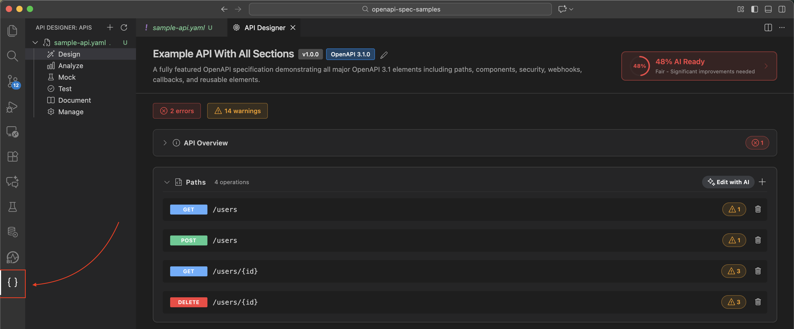
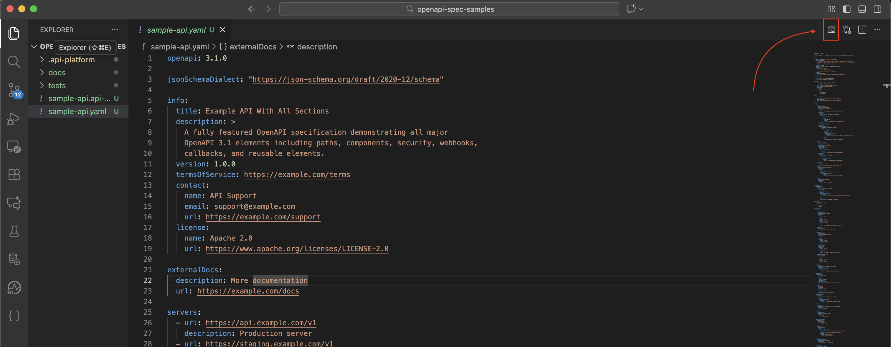

# API Designer - Installation Guide

This guide will help you install and use the API Designer extension using a VSIX file.

## Prerequisites

- Download the VSIX file for the API Designer extension from [here](resources/).

## Installation

### Step 1: Install from VSIX File

1. Open Visual Studio Code
2. Open the Command Palette:
   - **macOS**: Press `Cmd + Shift + P`
   - **Windows/Linux**: Press `Ctrl + Shift + P`
3. Type `Extensions: Install from VSIX...` and select it
4. Navigate to the location of your VSIX file
5. Select the VSIX file and click **Open**
6. Wait for the installation to complete
7. You may be prompted to reload VS Code - click **Reload** if prompted

### Alternative: Command Line Installation

You can also install the VSIX file using the command line:

```bash
code --install-extension <path-to-vsix-file>
```

Replace `<path-to-vsix-file>` with the actual path to your VSIX file.

## Verification

After installation, verify the extension is installed:

1. Open the Extensions view:
   - Click the Extensions icon in the Activity Bar (left sidebar)
   - Or press `Cmd/Ctrl + Shift + X`
2. Search for "API Designer"
3. You should see the extension listed as installed

## Getting Started

### Option A: Using the Activity Bar



1. In the activity bar, there is an icon for API Designer.
2. Click the **"API Designer"** icon that appears in the bar (left sidebar).
3. This opens the full activity bar which lists the APIs available in the workspace folder.
4. View Your APIs: The "APIs" view shows all OpenAPI files in your workspace.
5. Select a View: Click on any OpenAPI file to see available views:
   - **Design**: Visual editor with integrated preview
   - **Analyze**: Governance and validation
   - **Mock**: Mock API endpoints
   - **Test**: Test API endpoints
   - **Document**: Manage documentation
   - **Manage**: Project configuration and deployment


### Option B: Directly from the openapi file



1. Open an OpenAPI file
2. Look for the preview icon in the editor toolbar (top right of the editor)
3. Click the API Designer icon to open the design view.
