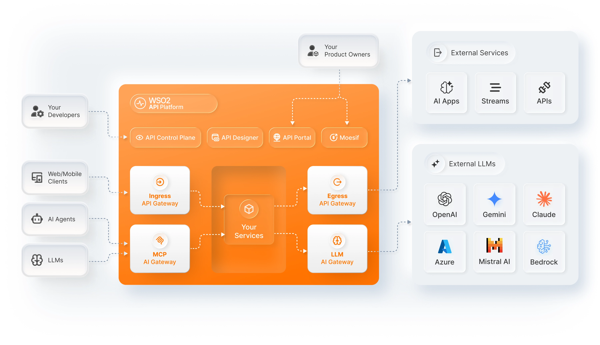

# WSO2 API Platform Documentation

AI-ready, GitOps-driven API platform for full lifecycle management across cloud, hybrid, and on-premises deployments.

## Overview

The WSO2 API Platform is a complete platform that helps organizations build AI-ready APIs with comprehensive lifecycle management capabilities. The platform supports deployment on the cloud, fully on-premises, or in hybrid mode.

### Core Principles

Full API lifecycle coverage — from design and deployment to governance, analytics, and monetization.

- **Developer-first**: Optimized UX for all users across cloud, hybrid, and on-premises
- **GitOps-ready**: Configuration as code with separation of spec and execution
- **Minimal footprint**: Independent components, no hard dependencies
- **AI-ready**: MCP-enabled servers for AI agent integration
- **Policy-first gateway**: Envoy-based, everything beyond proxying is a policy

## Architecture

## Components

### API Gateway
Envoy-based API gateway for securing and routing API traffic.

- Built on Envoy Proxy
- Policy-first architecture (auth, rate limiting, analytics)
- Runs on VMs, containers, Kubernetes
- Single-tenant mode
- Optimized for AI/agentic flows

### Management Portal *(coming soon)*
Central control plane for managing gateways, APIs, policies, and governance.

### API Developer Portal *(coming soon)*
Developer portal for API discovery, subscription, and consumption.

### API Designer *(coming soon)*
Standalone design tool for REST, GraphQL, and AsyncAPI specifications.

## Documentation

- [Gateway](gateway/README.md) — API gateway setup, configuration, and policy management
- [Gateway Quick Start Guide](gateway/quick-start-guide.md) — Download, run, and test the API gateway
- [AI Gateway](ai-gateway/README.md) — Managing and securing AI traffic including LLM APIs and MCP servers
- [AI Gateway LLM Quick Start Guide](ai-gateway/llm/quick-start-guide.md) — Download and run the AI Gateway, then route traffic to LLM providers like OpenAI
- [AI Gateway MCP Quick Start Guide](ai-gateway/mcp/quick-start-guide.md) — Download and run the AI Gateway, then route traffic to MCP servers
- [CLI](cli/README.md) — Command-line tool for managing the API Platform Gateway Controller
- [REST APIs](rest-apis/) — REST API references for platform components
- [Policies and Guardrails](https://github.com/wso2/gateway-controllers/blob/main/docs/README.md) — Gateway policies and guardrails for API traffic control
- [Performance](performance/README.md) — Gateway performance benchmarks and results
