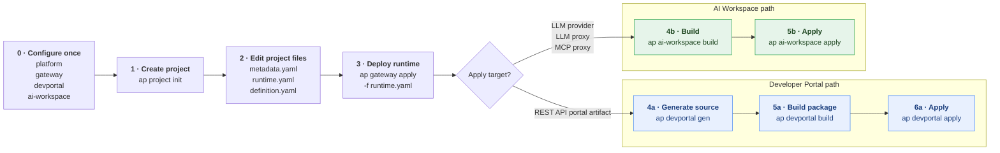

# End-to-End CI/CD Workflow

This guide explains the full lifecycle of an API project with the `ap` CLI. The same project files are used across gateway deployment, Developer Portal publishing, and AI Workspace publishing.

The common CI/CD model is:

1. Create or update the API project.
2. Edit the project files.
3. Validate or build the target artifact.
4. Apply the artifact to the selected destination.

All destinations now follow a consistent **build → apply** model.

## Project as the source of truth

A single API project is the source of truth for all destinations.

| File                        | Purpose                                                                                                                                                               |
| --------------------------- | --------------------------------------------------------------------------------------------------------------------------------------------------------------------- |
| `metadata.yaml`             | Defines artifact identity and display metadata. For Developer Portal, it also carries the gateway API reference. For AI Workspace, it can carry `associatedGateways`. |
| `runtime.yaml`              | Defines the runtime behavior. The gateway deploys this file. AI Workspace also uses it when building LLM proxy, LLM provider, or MCP proxy payloads.                  |
| `definition.yaml`           | Defines the API, LLM, or MCP definition that is used when building portal or AI Workspace artifacts.                                                                  |
| `.api-platform/config.yaml` | Stores project-level CLI configuration, including generated artifact locations and selected project targets.                                                          |

Destination usage:

- **Gateway** uses `runtime.yaml`.
- **Developer Portal** uses `metadata.yaml` and `definition.yaml`, then packages the generated `./devportal` source.
- **AI Workspace** uses `metadata.yaml`, `runtime.yaml`, and `definition.yaml`.

## Flow



## 0. Configure connections

Register and select the servers the CLI talks to. Each connection belongs to the active platform.

```shell
ap platform add -n <name> --control-plane <url>   # optional, if platforms are used

ap gateway add \
  -n <gw> \
  --server <gw-url>

ap gateway use -n <gw>

ap devportal add \
  -n <dp> \
  --server <dp-url> \
  --auth api-key

ap devportal use -n <dp>

ap ai-workspace add \
  -n <aiws> \
  --server <aiws-url> \
  --auth api-key

ap ai-workspace use -n <aiws>
```

Commands resolve the active gateway, Developer Portal, or AI Workspace under the active platform unless `-n` and `--platform` are provided.

See the references for [Gateway](gateway/README.md), [DevPortal](devportal/README.md), and [AI Workspace](ai-workspace/README.md).

## 1. Create the project

```shell
ap project init \
  -n echo-api \
  --type rest \
  --version v2.0 \
  --context /ping

cd echo-api
```

This creates the project structure:

```text
echo-api/
├── metadata.yaml
├── runtime.yaml
├── definition.yaml
├── docs/
├── tests/
└── .api-platform/
    └── config.yaml
```

See the [API Project reference](apiproject/README.md).

## 2. Edit the project files

Update the files according to the target you want to deploy.

For a REST API gateway deployment:

- Update `runtime.yaml` with the upstream, policies, operations, and runtime settings.
- Keep `metadata.yaml` aligned with the display name, version, and project metadata.
- Keep `definition.yaml` aligned with the OpenAPI definition.

For Developer Portal publishing:

- Use the gateway API ID from the gateway deployment as the portal reference.
- Set `spec.referenceID` in `metadata.yaml` to that gateway API ID.
- Generate the Developer Portal source with `ap devportal gen`.
- Edit `./devportal/devportal.yaml`, docs, and content before building.

For AI Workspace publishing:

- Keep `metadata.yaml`, `runtime.yaml`, and `definition.yaml` aligned.
- Ensure the metadata kind and runtime kind match logically. For example, `LlmProxyMetadata` in `metadata.yaml` should match `LlmProxy` in `runtime.yaml`.
- Add `spec.associatedGateways` in `metadata.yaml` when the AI Workspace artifact must be associated with gateways.

## 3. Deploy to the gateway

Deploy the runtime file to the active gateway.

```shell
ap gateway apply -f runtime.yaml
```

The command creates or updates the gateway artifact based on the artifact identity. The response includes the gateway-assigned API ID.

You can read the API ID later with:

```shell
ap gateway rest-api get \
  -n "<Display Name>" \
  --version <version>
```

Use this API ID as `spec.referenceID` in `metadata.yaml` before applying the REST API to Developer Portal.

## 4a. Build and apply to Developer Portal

Developer Portal now follows the same build and apply model.

```shell
ap devportal gen
ap devportal build
ap devportal apply -f build/devportal.zip --org <org-id>
```

What each command does:

| Command              | Purpose                                                                                                                      |
| -------------------- | ---------------------------------------------------------------------------------------------------------------------------- |
| `ap devportal gen`   | Generates the editable Developer Portal artifact source under `./devportal` and registers it in `.api-platform/config.yaml`. |
| `ap devportal build` | Packages the generated source into `build/devportal.zip`.                                                                    |
| `ap devportal apply` | Applies the built package to Developer Portal (create or update).                                                            |

The apply command creates or updates the artifact based on its identity.

After applying, related follow-up commands include:

```shell
ap devportal sub-plan apply
ap devportal api-key generate
ap devportal subscription create
```

## 4b. Build and apply to AI Workspace

AI Workspace follows a build and apply model.

```shell
ap ai-workspace build
ap ai-workspace apply --project-id <project-id>
```

`ap ai-workspace build` validates the project artifact. It checks that the required files are present, the metadata and runtime kinds match, and the artifact name is consistent.

`ap ai-workspace apply` runs the same validation, builds the request payload from the project files, and creates or updates the artifact on the server.

The apply command chooses the endpoint from the runtime kind.

| Kind          | Endpoint         |
| ------------- | ---------------- |
| `LlmProvider` | `/llm-providers` |
| `LlmProxy`    | `/llm-proxies`   |
| `Mcp`         | `/mcp-proxies`   |

Create and update use the same command:

- If the artifact does not exist, `apply` creates it.
- If the artifact already exists, `apply` updates it.
- The lookup is based on `metadata.name`.
- The organization is taken from the auth token, so no `--org` flag is required.

`--project-id` is required for LLM proxy and MCP proxy artifacts. It is not required for LLM provider artifacts.

## CI/CD pipeline shape

A pipeline should use the same flow a developer uses locally. The main difference is that the pipeline should receive target names, project IDs, organization IDs, and environment-specific values from pipeline variables.

### REST API to gateway and Developer Portal

```shell
# Select target connections
ap gateway use -n "$GATEWAY_NAME"
ap devportal use -n "$DEVPORTAL_NAME"

# Deploy or update the runtime artifact
ap gateway apply -f runtime.yaml

# Ensure metadata.yaml has the gateway API ID as spec.referenceID
# This can be committed per environment, templated, or updated during the pipeline.

# Generate and build the Developer Portal artifact
ap devportal gen
ap devportal build

# Apply the built artifact
ap devportal apply \
  -f build/devportal.zip \
  --org "$ORG_ID"
```

### AI Workspace artifact

```shell
# Select target connection
ap ai-workspace use -n "$AI_WORKSPACE_NAME"

# Validate the project artifact
ap ai-workspace build

# Create or update the server-side artifact
ap ai-workspace apply --project-id "$PROJECT_ID"
```

## Recommended repository usage

Store the API project in source control.

```text
repo/
└── echo-api/
    ├── metadata.yaml
    ├── runtime.yaml
    ├── definition.yaml
    ├── docs/
    ├── tests/
    └── .api-platform/
        └── config.yaml
```

For CI/CD:

- Commit the project files.
- Review changes through pull requests.
- Run build or validation commands in the pipeline.
- Apply only after review and approval.
- Keep secrets out of the project files.
- Use environment-specific pipeline variables for server URLs, project IDs, organization IDs, and credentials.

## Notes

- Gateway deployment is done with `ap gateway apply -f runtime.yaml`.
- All destinations now follow a consistent build and apply lifecycle.
- Add `--insecure` to portal, gateway, or AI Workspace commands when connecting to a local or self-signed HTTPS endpoint.
