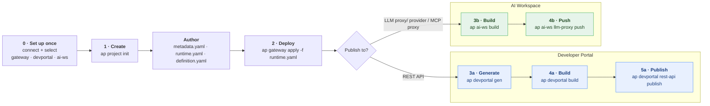

# End-to-End Workflow

This guide shows the full lifecycle with the `ap` CLI: create an API **project**, **deploy** it to a gateway, then **build** a portal artifact and **publish** it — either to the **Developer Portal** or to an **AI Workspace**.

A single API project is the source of truth for all destinations:

- `runtime.yaml` → deployed to the **gateway** (where the API is served).
- `metadata.yaml` + `definition.yaml` → used to generate the default Developer Portal artifact.
- `metadata.yaml` + `runtime.yaml` + `definition.yaml` → bundled into the **AI Workspace** artifact.

## Flow



## Steps

### 0. Configure connections (one-time)

Register and select the servers the CLI talks to. Each connection lives under the active platform.

```shell
ap platform add --display-name <name> --control-plane <url>   # optional; if you use platforms
ap gateway   add --display-name <gw>   --server <gw-url>      && ap gateway   use --display-name <gw>
ap devportal add --display-name <dp>   --server <dp-url> --auth api-key  && ap devportal use --display-name <dp>
ap ai-ws     add --display-name <aiws> --server <aiws-url> --auth api-key && ap ai-ws use --display-name <aiws>
```

Commands resolve the **active** gateway / devportal / ai-workspace of the active platform unless you pass `--display-name` (and `--platform`). See [Gateway](gateway/README.md), [DevPortal](devportal/README.md), and [AI-Workspace](ai-workspace/README.md) references.

### 1. Create the project

```shell
ap project init --display-name echo-api --type rest --version v2.0 --context /ping
cd echo-api
```

Scaffolds `metadata.yaml`, `runtime.yaml`, `definition.yaml`, `docs/`, `tests/`, and `.api-platform/config.yaml`. See the [API Project reference](apiproject/README.md).

### 2. Deploy to the gateway

Edit `runtime.yaml` (real upstream, policies, operations), then deploy:

```shell
ap gateway apply -f runtime.yaml
```

The response includes the gateway-assigned **API ID**. Re-read it any time with
`ap gateway rest-api get --display-name "<Display Name>" --version <version>`.

### 3+. Build the portal artifact and publish

Pick the destination for the deployed API.

#### Developer Portal

```shell
# Set spec.referenceID in metadata.yaml to the gateway API ID from step 2, then:
ap devportal gen                                                    # generate ./devportal (devportal.yaml, definition, docs, content)
ap devportal build                                                  # package ./devportal → build/devportal.zip
ap devportal rest-api publish -f build/devportal.zip --org <org-id>
```

`gen` generates the devportal artifact source and registers it in the project config; edit `./devportal/devportal.yaml` to customize before `build`. `build` only packages the generated folder (run `gen` first). Follow-ups once published: `ap devportal sub-plan publish`, `ap devportal api-key generate`, `ap devportal subscription create`.

#### AI Workspace

```shell
ap ai-ws build                                                      # → build/<workspace>.json
ap ai-ws llm-proxy push -f build/<workspace>.json --project-id <project-id>
# the same pattern applies to:  ap ai-ws llm-provider push  /  ap ai-ws mcp-proxy push
# (the organization comes from the auth token — no --org flag)
```

`ap ai-ws build` reads each ai-workspace entry in `.api-platform/config.yaml` and generates a creation payload (JSON), folding the OpenAPI spec from `definition.yaml` into the payload.

## Notes

- `ap devportal gen`, `ap devportal build`, and `ap ai-ws build` all operate on an API project (they require `.api-platform/config.yaml`).
- Developer Portal is two stages: `gen` **generates** the editable artifact source under `./devportal`, then `build` **packages** it into `build/devportal.zip`. AI Workspace's `build` generates the JSON payload directly (no separate `gen`).
- Both `build` commands write into the project's `build/` directory, one artifact per configured portal entry.
- `--org` on the publish/push commands is the target organization in the Developer Portal / AI Workspace.
- Add `--insecure` to any portal/gateway command when talking to a local or self-signed HTTPS endpoint.
