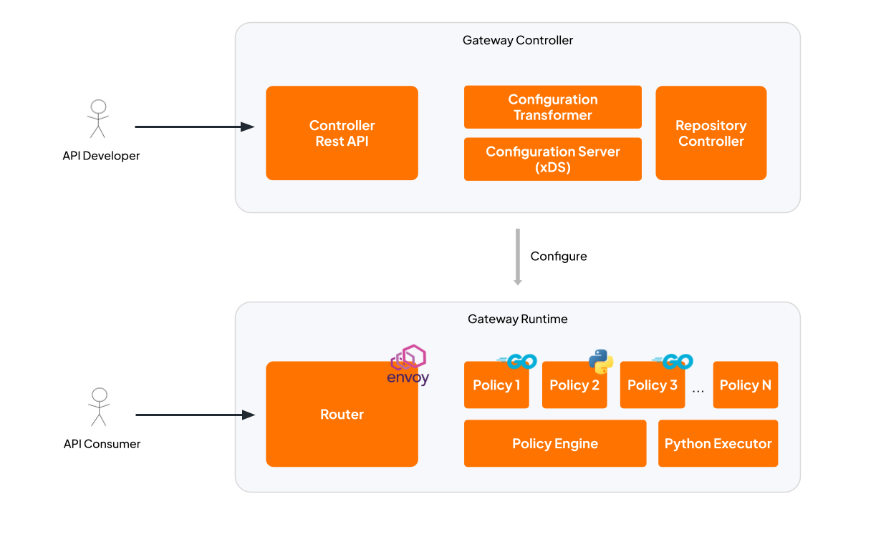
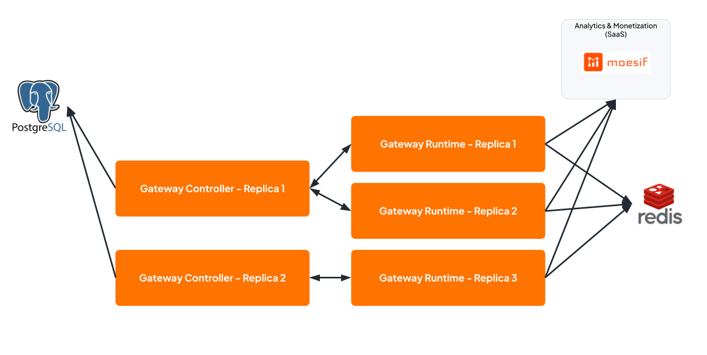

# Gateway Architecture

## Overview

The API Gateway consists of two main components: **Gateway Controller** and **Gateway Runtime**.

- **Gateway Controller** is the control plane that manages API configurations and pushes them to the Gateway Runtime via the xDS protocol.
- **Gateway Runtime** is the data plane that processes API traffic. It contains three sub-components:
  - **Router** (Envoy proxy) — handles traffic routing, load balancing, and TLS termination.
  - **Policy Engine** — an ext_proc filter that executes request/response policies. **Go-based** policies are compiled into the Policy Engine binary at image build time by the Gateway Builder.
  - **Python Executor** — a dedicated runtime component that dynamically evaluates Python-based policies, allowing developers to leverage the extensive Python ecosystem for custom logic.

The Gateway Controller configures the Gateway Runtime by pushing API and route configurations through xDS. When a request arrives, the Router forwards it to the Policy Engine for policy evaluation, then routes it to the upstream backend.

## Gateway Architecture


<!-- image source: https://docs.google.com/drawings/d/1pgADdQNpNcvLrLVvV1fx2hxQOb3syoU0DEBhJd2N6Aw/edit?usp=sharing -->

### Policy Development

The Gateway offers a flexible, dual-language approach to policy development, empowering teams to build custom API logic tailored to their performance and ecosystem needs:

- **Go:** Compiled directly into the Policy Engine binary, Go provides maximum execution performance, strict type safety, and minimal latency for critical path operations.
- **Python:** Executed dynamically by the integrated Python Executor, Python is particularly ideal for AI/ML use cases and complex data transformations due to its extensive ecosystem support and specialized libraries.

## High Availability Setup

In a production HA deployment:

- **Gateway Controller** instances connect to a shared **PostgreSQL** database for persistent storage of API configurations, subscriptions, and other metadata.
- **Gateway Runtime** instances connect to a shared **Redis** instance used for distributed rate limiting, ensuring rate limit counters are synchronized across all runtime instances.


<!-- image source: https://docs.google.com/drawings/d/1CIH3V8Uc2YxCWEGS7yUz3qyBfSpdLK1VpWK0NgmP4OQ/edit?usp=sharing -->

## Configuration

### PostgreSQL (Gateway Controller)

To use PostgreSQL as the storage backend for the Gateway Controller, update the `config.toml`:

```toml
[controller.storage]
type = "postgres"

[controller.storage.postgres]
host = "postgres.example.com"
port = 5432
database = "gateway"
user = "gateway"
password = "your-postgres-password"
```

For the full list of PostgreSQL configuration options, refer to the [config template](../../gateway/configs/config-template.toml).

### Redis (Gateway Runtime — Distributed Rate Limiting)

To enable distributed rate limiting across multiple Gateway Runtime instances, configure the rate limiting policy to use Redis as the backend in `config.toml`:

```toml
[policy_configurations.ratelimit_v1]
algorithm = "fixed-window"
backend = "redis"

[policy_configurations.ratelimit_v1.redis]
host = "redis.example.com"
port = 6379
password = "your-redis-password"
```

For the full list of Redis configuration options, refer to the [Advanced Rate Limiting documentation](https://github.com/wso2/gateway-controllers/blob/main/docs/advanced-ratelimit/v1.0/docs/advanced-ratelimit.md).
