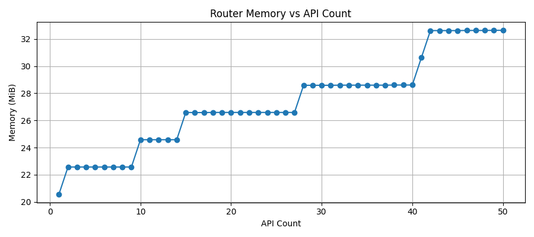
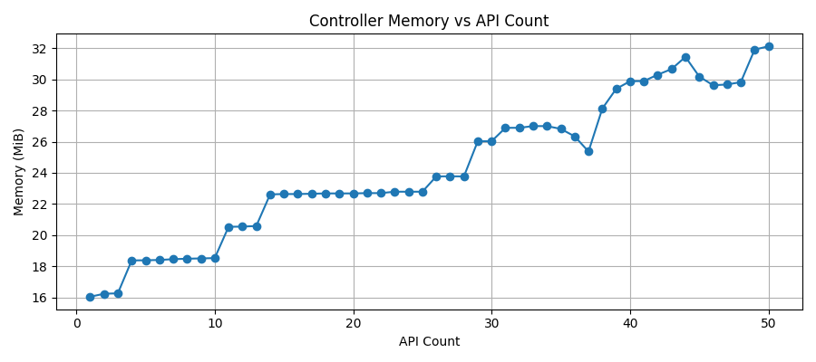
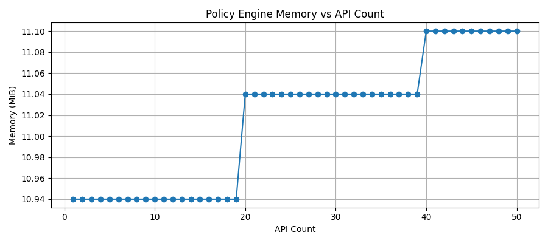
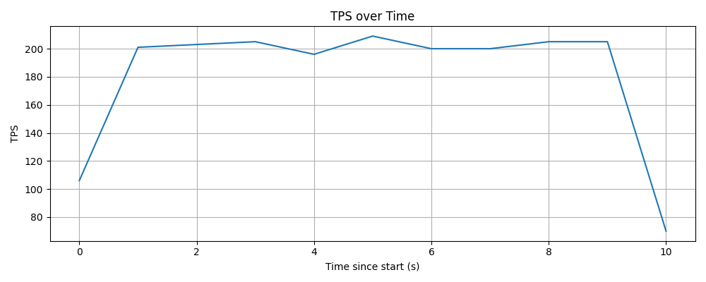

# Gateway Performance Results

This document captures performance characteristics of the API Platform Gateway
under incremental API scale and runtime traffic.

## Test Environment

- Deployment: Docker Compose (GitHub Actions runner)
- Gateway version: `0.5.0`
- Backend: Netty HTTP Echo Service
- Test tool: Apache JMeter
- Traffic pattern: Random API invocation across deployed APIs

---

## Router Memory vs API Count

---

## Controller Memory vs API Count

---

## Policy Engine Memory vs API Count

---

## Throughput Over Time (TPS)

---

## Observations

- Router memory grows gradually with API count
- Controller and policy-engine memory remain relatively stable
- TPS stabilizes after initial ramp-up
- No errors observed during steady-state traffic

> These results are intended for **trend analysis**, not absolute benchmarking.
