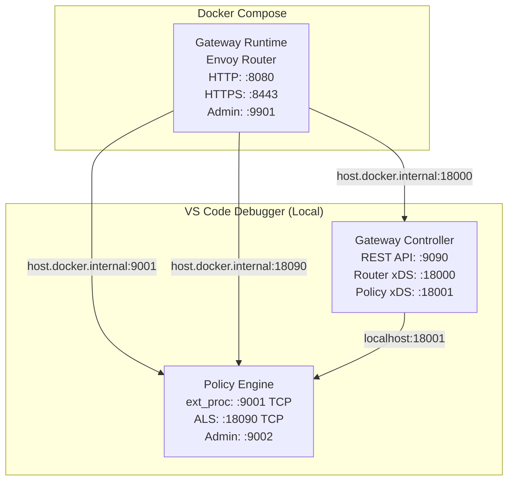
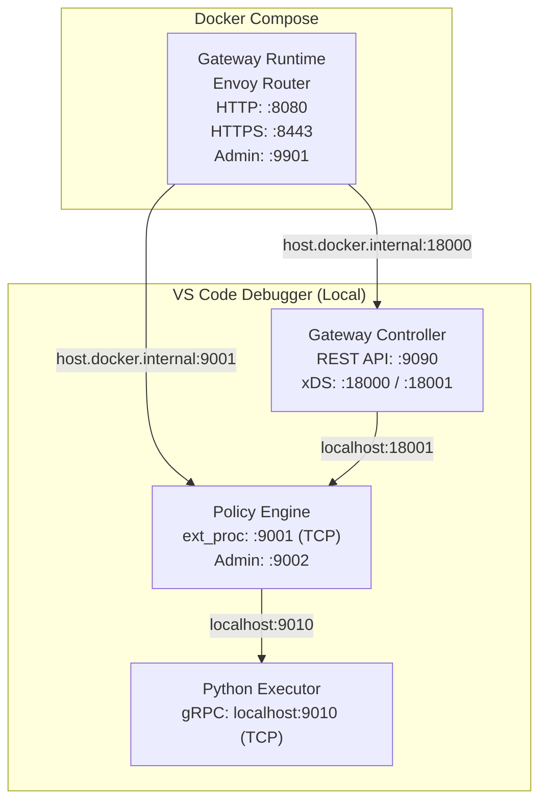

# Gateway Debug Guide

Three debug options are available:

| Option | What runs locally | Best for |
|--------|------------------|----------|
| **[Option 1 — Remote Debug](#option-1-recommended-remote-debug--all-components-in-docker)** *(recommended)* | Nothing — everything runs in Docker, VS Code attaches via dlv | Production-like debugging, Go policies only |
| **[Option 2A — Local Process (Go only)](#option-2a-local-process-debug--controller--policy-engine-in-vs-code)** | Controller + Policy Engine | Go policy development and iteration |
| **[Option 2B — Local Process (Go + Python)](#option-2b-local-process-debug--controller--policy-engine--python-executor-in-vs-code)** | Controller + Policy Engine + Python Executor | Python policy development and debugging |

> [!TIP]
> **Choose Option 2B** if you are developing or debugging a Python policy and need breakpoints, print statements, or rapid iteration without rebuilding Docker images. It extends Option 2A with the Python Executor running on the host.

---

## Option 1 (Recommended): Remote Debug — All Components in Docker

Gateway Controller and Policy Engine run inside Docker containers with dlv in server mode. VS Code attaches remotely.

### Step 1: Build Debug Images

```bash
cd gateway
make build-debug
```

This builds both `gateway-controller-debug:latest` and `gateway-runtime-debug:latest`.

### Step 2: Start the Full Stack

```bash
cd gateway
docker compose -f docker-compose.debug.yaml up
```

Wait until you see both containers are ready. The policy engine waits up to 1 minute for dlv startup before the socket becomes available.

### Step 3: Set Breakpoints

Open the relevant source files in VS Code and set breakpoints:

- **Gateway Controller**: files under `gateway/gateway-controller/`
- **Policy Engine**: files under `gateway/gateway-runtime/policy-engine/`

### Step 4: Attach VS Code Debugger

In the VS Code **Run & Debug** panel, launch:

- **"Gateway Controller (Remote)"** — attaches to `localhost:2345`
- **"Policy Engine (Remote)"** — attaches to `localhost:2346`

Both can be attached simultaneously. Source path substitution is configured automatically in `.vscode/launch.json`:

| Component | Local path | Container path |
|---|---|---|
| Gateway Controller | `gateway/gateway-controller` | `/build` |
| All others (policy-engine, common, system-policies) | `${workspaceFolder}` | `/api-platform` |
| SDK | `sdk` | `/go/pkg/mod/github.com/wso2/api-platform/sdk@v0.3.9` |

The repo root maps to `/api-platform` in the container, so `policy-engine`, `common`, and `system-policies` are all covered by a single substitutePath entry.

### Debugging SDK / Common / Policy Source Code

#### `common` and system policies

No extra steps required. Both are covered by the root `substitutePath` entry in `.vscode/launch.json`.

#### `sdk`

No extra steps required. Covered by the `sdk` substitutePath entry.

> **Note**: The `sdk` entry includes its version (`@v0.3.9`). If you update the sdk version in `policy-engine/go.mod`, update the matching entry in `.vscode/launch.json` accordingly.

#### Gateway-controller policy source

By default `build.yaml` uses `gomodule:` entries — policies compile from the Go module cache at a path like `/go/pkg/mod/...@vX.Y.Z/` inside the container. Add a `substitutePath` entry in `.vscode/launch.json` to map your local policy checkout to that path — no `build.yaml` changes or image rebuild needed.

1. **Find the exact version compiled into the image:** look up the policy in `gateway/build-manifest.yaml`. The `version` field is the resolved version and the `gomodule` field gives the module path:
   ```yaml
   - name: api-key-auth
     version: v1.8.0
     gomodule: github.com/wso2/gateway-controllers/policies/api-key-auth@v0
   ```

2. **Add an entry to the `substitutePath` array** in the `"Policy Engine (Remote)"` config — construct the `to` path from the `gomodule` module path and the `version`:
   ```json
   {
       "from": "/path/to/your/local/gateway-controllers/policies/api-key-auth",
       "to": "/go/pkg/mod/github.com/wso2/gateway-controllers/policies/api-key-auth@v0.8.0"
   }
   ```
   Repeat for each policy you want to step into.

3. Set breakpoints in your local policy source files and attach the debugger.

---

### Step 5: Deploy an API and Trigger Breakpoints

```bash
# Deploy a test API
curl -X POST http://localhost:9090/api/management/v0.9/rest-apis \
  -H "Content-Type: application/yaml" \
  --data-binary @path/to/api.yaml

# Send a request through the router
curl http://localhost:8080/petstore/v1/pets
```

### Notes

- dlv runs with `--accept-multiclient` — you can detach and re-attach without restarting containers.
- Containers run as root (required by dlv for ptrace); resource limits are removed for debug headroom.
- Policy Engine socket wait timeout is 60s (vs 10s in production) to account for dlv startup overhead.
- All ports remain accessible: `9090` (Controller REST), `8080`/`8443` (Router), `9002` (PE admin), `18000`/`18001` (xDS).

---

## Option 2A: Local Process Debug — Controller + Policy Engine in VS Code

Gateway Controller and Policy Engine run as local VS Code processes. Only the Envoy Router runs in Docker Compose.

> [!WARNING]
> Processes run directly on the host, so Go resolves modules via `go.work`. Local versions of `sdk` and other workspace modules are used instead of the published Go module versions — including any uncommitted or untagged changes. Behavior may differ from a production build.

### Architecture



### Prerequisites

- VS Code with Go extension installed
- Docker and Docker Compose
- Control plane host and registration token (optional, for gateway registration)

### Step 1: Configure Control Plane Connection

Update `.vscode/launch.json` in the **Gateway Controller** configuration with your control plane details:

```json
{
    "name": "Gateway Controller",
    "env": {
        "APIP_GW_CONTROLPLANE_HOST": "<your-control-plane-host>",
        "APIP_GW_GATEWAY_REGISTRATION_TOKEN": "<your-registration-token>",
        // ... other env vars
    }
}
```

> **Note:** Leave these empty (`""`) if you want to run in standalone mode without control plane connection.

### Step 2: Update Docker Compose Configuration

In `gateway/docker-compose.yaml`, make two changes to the `gateway-runtime` service:

1. Set `GATEWAY_CONTROLLER_HOST` to `host.docker.internal` so the runtime reaches the locally-running controller:

```yaml
services:
  gateway-runtime:
    environment:
      - GATEWAY_CONTROLLER_HOST=host.docker.internal
```

2. Comment out the **Policy Engine** port block:

```yaml
services:
  gateway-runtime:
    ports:
      # Router (Envoy) - keep these
      - "8080:8080"   # HTTP ingress
      - "8443:8443"   # HTTPS ingress
      - "8081:8081"   # xDS-managed API listener
      - "8082:8082"   # WebSub Hub dynamic forward proxy
      - "8083:8083"   # WebSub Hub internal listener
      - "9901:9901"   # Envoy admin
      # Policy Engine - comment these out
      # - "9002:9002"   # Admin API
      # - "9003:9003"   # Metrics
```

### Step 3: Start Gateway Controller

Run the **Gateway Controller** debug configuration from VS Code.

### Step 4: Run Gateway Builder

Run the **Gateway Builder** debug configuration from VS Code. This compiles all policies and generates the policy-engine binary into `gateway/gateway-builder/target/output/`.

> **Note:** Wait for the builder to complete successfully before starting the Policy Engine.

### Step 5: Start Policy Engine

Run the **Policy Engine - xDS** debug configuration from VS Code.

### Step 6: Start Gateway Runtime (Router)

Run the router in Docker Compose:

```bash
cd gateway
docker compose up gateway-runtime sample-backend -d
docker compose logs -ft gateway-runtime sample-backend
```

### Step 7: Deploy an API and Test

Deploy a test API via the Gateway Controller REST API:

```bash
curl -X POST http://localhost:9090/api/management/v0.9/rest-apis \
  -H "Content-Type: application/yaml" \
  --data-binary @path/to/api.yaml
```

Send a request to the deployed API:

```bash
curl http://localhost:8080/petstore/v1/pets
```

---

## Option 2B: Local Process Debug — Controller + Policy Engine + Python Executor in VS Code

This extends **Option 2A** by also running the Python Executor on the host, giving you full debugger access to the Python policy runtime.

> [!NOTE]
> **When to use this:** You are developing or debugging a Python policy and need to set breakpoints, add print statements, or iterate rapidly without rebuilding Docker images.

> [!WARNING]
> Processes run directly on the host, so Go resolves modules via `go.work`. Local versions of `sdk` and other workspace modules are used instead of the published Go module versions — including any uncommitted or untagged changes. Behavior may differ from a production build.

### Architecture



### Prerequisites

- Python 3.10+ with `venv`
- VS Code with Go and Python extensions installed
- Docker and Docker Compose
- Control plane host and registration token (optional, for gateway registration)

### Step 1: Enable TCP Mode in config.toml

Add the following block to `configs/config.toml`:

```toml
[policy_engine.python_executor.server]
mode = "tcp"
port = 9010
host = "localhost"
```

This tells the Policy Engine to connect to the Python Executor over TCP instead of the default Unix domain socket.

> [!WARNING]
> **Remove this block when you are done debugging.** The `config.toml` is also mounted into the Docker container (`docker-compose.yaml`), where the Python Executor runs in UDS mode. If this TCP block is left in, the containerized Policy Engine will try to dial `localhost:9010` while the embedded Python Executor is listening on a UDS socket — causing silent connection failures.

### Step 2: Run Gateway Builder

Run the **Gateway Builder** debug configuration from VS Code. This compiles all policies (Go + Python) and generates:

- The Policy Engine binary (compiled with the Python bridge code)
- `python_policy_registry.py` (maps policy names to Python modules)
- Merged `requirements.txt` (all Python policy dependencies)

> **Note:** Wait for the builder to complete successfully before starting the other components.

### Step 3: Prepare the Python Environment

```bash
cd gateway

# Create or activate the venv
python3 -m venv gateway-runtime/python-executor/.venv
source gateway-runtime/python-executor/.venv/bin/activate

# Install dependencies (includes policy packages from the build)
pip install -r gateway-builder/target/output/python-executor/requirements.txt

# Copy the generated registry into the executor source
cp gateway-builder/target/output/python-executor/python_policy_registry.py \
   gateway-runtime/python-executor/python_policy_registry.py
```

> [!IMPORTANT]
> Re-run the `pip install` and `cp` steps after every builder run if policies change.

### Step 4: Update Docker Compose Configuration

In `gateway/docker-compose.yaml`, make two changes to the `gateway-runtime` service:

1. Set `GATEWAY_CONTROLLER_HOST` to `host.docker.internal` so the runtime reaches the locally-running controller:

```yaml
services:
  gateway-runtime:
    environment:
      - GATEWAY_CONTROLLER_HOST=host.docker.internal
```

2. Comment out the **Policy Engine** port block:

```yaml
services:
  gateway-runtime:
    ports:
      # Router (Envoy) - keep these
      - "8080:8080"   # HTTP ingress
      - "8443:8443"   # HTTPS ingress
      - "8081:8081"   # xDS-managed API listener
      - "8082:8082"   # WebSub Hub dynamic forward proxy
      - "8083:8083"   # WebSub Hub internal listener
      - "9901:9901"   # Envoy admin
      # Policy Engine - comment these out
      # - "9002:9002"   # Admin API
      # - "9003:9003"   # Metrics
```


### Step 5: Start Gateway Controller

Run the **Gateway Controller** debug configuration from VS Code.

> **Note:** Leave `APIP_GW_CONTROLPLANE_HOST` and `APIP_GW_GATEWAY_REGISTRATION_TOKEN` empty (`""`) in `.vscode/launch.json` if you want to run in standalone mode without control plane connection.

### Step 6: Start the Python Executor

Run the **Python Executor** configuration from VS Code (see [Python debugging tips](#python-debugging-tips) below for breakpoint locations).

Alternatively, start it from the terminal:

```bash
gateway-runtime/python-executor/.venv/bin/python3 \
  gateway-runtime/python-executor/main.py \
  --listen localhost:9010 \
  --log-level debug
```

You should see:

```text
Python Executor starting (listen=localhost:9010, workers=4, ...)
Starting Python Executor on localhost:9010 (mode=tcp)
Loaded policy registry with 1 entries
Loaded policy factory: prompt-compressor:v0 from prompt_compressor_v0.policy
Python Executor ready on localhost:9010
```

### Step 7: Start the Policy Engine

Run the **Policy Engine - xDS** debug configuration from VS Code.

The Policy Engine will connect to the Python Executor over TCP when the first Python policy is triggered. You should see:

```text
Python executor bridge initialized  address=localhost:9010  mode=tcp  timeout=30s
```

### Step 8: Start the Gateway Runtime (Router)

Run the router in Docker Compose:

```bash
cd gateway
docker compose up gateway-runtime sample-backend -d
docker compose logs -ft gateway-runtime sample-backend
```

### Step 9: Deploy and Test

```bash
# Deploy an API with a Python policy (e.g., prompt-compressor)
curl -X POST http://localhost:9090/api/management/v0.9/rest-apis \
  -u "<USERNAME>:<PASSWORD>" \
  -H "Content-Type: application/yaml" \
  --data-binary @path/to/api.yaml

# Send a request that triggers the policy
curl -X POST http://localhost:8080/your-api/chat \
  -H "Content-Type: application/json" \
  -d '{"messages": [{"role": "user", "content": "Your test prompt here"}]}'
```

### Step 10: Clean Up

When you are done debugging:

1. **Remove the TCP block** from `configs/config.toml`:

```diff
-[policy_engine.python_executor.server]
-mode = "tcp"
-port = 9010
-host = "localhost"
```

2. **Revert the Docker Compose changes** from Step 4 (restore `GATEWAY_CONTROLLER_HOST` and uncomment Policy Engine ports).

This ensures `docker compose up` continues to work correctly with UDS mode.

---

## Python Debugging Tips

### Setting Breakpoints in VS Code

When using the **Python Executor** launch config, set breakpoints in:

- `executor/server.py` — gRPC servicer logic (`InitPolicy`, `ExecuteStream`)
- `executor/translator.py` — protobuf ↔ SDK type translation
- Any installed policy module (e.g., `.venv/lib/python3.*/site-packages/prompt_compressor_v0/policy.py`)

### Debugging with pdb

For quick terminal-based debugging, add breakpoints directly in policy code:

```python
# In your policy's on_request_body():
import pdb; pdb.set_trace()
```

---

## Quick Reference

### Port Map

| Port | Component | Protocol |
|------|-----------|----------|
| 9090 | Gateway Controller REST API | HTTP |
| 18000 | Gateway Controller xDS (Router) | gRPC |
| 18001 | Gateway Controller xDS (Policy Engine) | gRPC |
| 9001 | Policy Engine ext_proc | gRPC (TCP) |
| 9010 | Python Executor | gRPC (TCP) |
| 8080 | Router HTTP ingress | HTTP |
| 8443 | Router HTTPS ingress | HTTPS |
| 9901 | Router (Envoy) Admin | HTTP |
| 15000 | Sample Backend | HTTP |

### Python Executor Environment Variables

| Variable | Default | Description |
|----------|---------|-------------|
| `PYTHON_EXECUTOR_LISTEN` | UDS socket path | Listen address — UDS path or `host:port` for TCP |
| `PYTHON_POLICY_WORKERS` | 4 | gRPC worker thread count |
| `PYTHON_POLICY_MAX_CONCURRENT` | 100 | Max concurrent policy executions |
| `PYTHON_POLICY_TIMEOUT` | 30 | Execution timeout in seconds |
| `LOG_LEVEL` | info | Log level (debug, info, warn, error) |

### VS Code Debug Configurations

All launch configurations live in `.vscode/launch.json`:

| Configuration | Type | Component |
|---|---|---|
| Gateway Controller | Go (launch) | Controller process |
| Gateway Builder | Go (launch) | Build-time compilation |
| Policy Engine - xDS | Go (launch) | Policy Engine with xDS discovery |
| Policy Engine - File | Go (launch) | Policy Engine with file-based policy chains |
| Python Executor | Python (debugpy) | Python policy runtime |
| Gateway Controller (Remote) | Go (attach) | Remote attach — Option 1 |
| Policy Engine (Remote) | Go (attach) | Remote attach — Option 1 |

---

## Common Issues

**"Policy factory not found: prompt-compressor:v0.9.0"**
→ The Python Executor uses **major-version keys** (e.g., `prompt-compressor:v0`). This error means the `python_policy_registry.py` file was not regenerated after the builder ran. Re-copy it:
```bash
cp gateway-builder/target/output/python-executor/python_policy_registry.py \
   gateway-runtime/python-executor/python_policy_registry.py
```

**"context deadline exceeded" when calling a Python policy**
→ The Policy Engine is trying to connect to the Python Executor but failing. Check:
1. Is the Python Executor actually running? (`ps aux | grep main.py`)
2. Is it listening on the right address? (should show `localhost:9010`)
3. Does your `config.toml` have the `[policy_engine.python_executor.server]` block with `mode = "tcp"`?

**"bind: address already in use" on port 9010**
→ Kill stale Python Executor processes: `pkill -f "python.*main.py"`

**Container mode broken after debugging**
→ You likely left `[policy_engine.python_executor.server] mode = "tcp"` in `configs/config.toml`. Remove it — see [Step 10](#step-10-clean-up).
