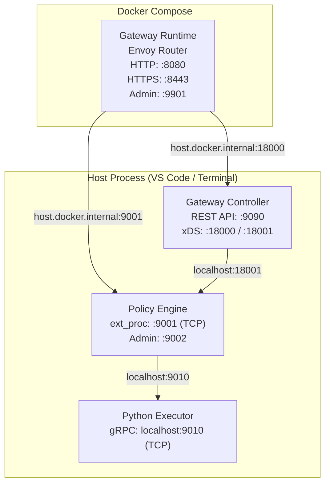

# Python Executor Debug Guide

Debug and develop Python policies by running the Python Executor as a standalone process on your host machine while the rest of the gateway runs normally.

> **When to use this:** You are developing or debugging a Python policy and need to set breakpoints, add print statements, or iterate rapidly without rebuilding Docker images.

---

## Architecture



> [!NOTE]
> Only the Envoy Router runs in Docker. All other components — Gateway Controller, Policy Engine, and **Python Executor** — run as host processes. This gives you full debugger access to the Python runtime.

> [!WARNING]
> Processes run directly on the host, so Go resolves modules via `go.work`. Local versions of `sdk` and other workspace modules are used instead of the published Go module versions — including any uncommitted or untagged changes. Behavior may differ from a production build.

---

## Prerequisites

- Python 3.10+ with `venv`
- VS Code with Go and Python extensions installed
- Docker and Docker Compose
- Control plane host and registration token (optional, for gateway registration)

---

## Step-by-Step Setup

### Step 1: Enable TCP Mode in config.toml

Add the following block to `configs/config.toml`:

```toml
[python_executor.server]
mode = "tcp"
port = 9010
host = "localhost"
```

This tells the Policy Engine to connect to the Python Executor over TCP instead of the default Unix domain socket.

> [!WARNING]
> **Remove this block when you are done debugging.** The `config.toml` is also mounted into the Docker container (`docker-compose.yaml`), where the Python Executor runs in UDS mode. If this TCP block is left in, the containerized Policy Engine will try to dial `localhost:9010` while the embedded Python Executor is listening on a UDS socket — causing silent connection failures.

### Step 2: Build the Gateway (one-time)

```bash
cd gateway

go run ./gateway-builder/cmd/builder \
  -build-file ./build.yaml \
  -system-build-lock ./system-policies/system-build-lock.yaml \
  -policy-engine-src ./gateway-runtime/policy-engine \
  -out-dir ./gateway-builder/target/output \
  -log-level debug
```

This generates:
- The Policy Engine binary (compiled with all Go + Python bridge code)
- `python_policy_registry.py` (maps policy names to Python modules)
- Merged `requirements.txt` (all Python policy dependencies)

> **Note:** Wait for the builder to complete successfully before starting the other components.

### Step 3: Prepare the Python Environment

```bash
# Create or activate the venv
python3 -m venv gateway-runtime/python-executor/.venv
source gateway-runtime/python-executor/.venv/bin/activate

# Install dependencies (includes policy packages from the build)
pip install -r gateway-builder/target/output/python-executor/requirements.txt

# Copy the generated registry into the executor source
cp gateway-builder/target/output/python-executor/python_policy_registry.py \
   gateway-runtime/python-executor/python_policy_registry.py
```

> [!IMPORTANT]
> Re-run the `pip install` and `cp` steps after every builder run if policies change.

### Step 4: Update Docker Compose Configuration

In `gateway/docker-compose.yaml`, make two changes to the `gateway-runtime` service:

1. Set `GATEWAY_CONTROLLER_HOST` to `host.docker.internal` so the runtime reaches the locally-running controller:

```yaml
services:
  gateway-runtime:
    environment:
      - GATEWAY_CONTROLLER_HOST=host.docker.internal
```

2. Comment out the **Policy Engine** port block:

```yaml
services:
  gateway-runtime:
    ports:
      # Router (Envoy) - keep these
      - "8080:8080"   # HTTP ingress
      - "8443:8443"   # HTTPS ingress
      - "8081:8081"   # xDS-managed API listener
      - "8082:8082"   # WebSub Hub dynamic forward proxy
      - "8083:8083"   # WebSub Hub internal listener
      - "9901:9901"   # Envoy admin
      # Policy Engine - comment these out
      # - "9002:9002"   # Admin API
      # - "9003:9003"   # Metrics
```

> [!NOTE]
> **Rancher Desktop (Lima) users:** `host.docker.internal` may not resolve correctly. Export your actual host IP once at the start of the debug session:
> ```bash
> export HOST_IP=$(ifconfig en0 | grep "inet " | awk '{print $2}')
> ```
> Then apply it to the affected steps:
> - **Step 4:** Set `GATEWAY_CONTROLLER_HOST=$HOST_IP` instead of `host.docker.internal`
> - **Step 5:** Add `APIP_GW_ROUTER_POLICY__ENGINE_HOST=$HOST_IP` to the controller env vars
> - **Step 8:** Start the router with `GATEWAY_CONTROLLER_HOST=$HOST_IP docker compose up gateway-runtime sample-backend -d`

### Step 5: Start the Gateway Controller

Run the **Gateway Controller** debug configuration from VS Code, or start it from the terminal:

```bash
APIP_GW_CONTROLLER_STORAGE_TYPE=sqlite \
APIP_GW_CONTROLLER_STORAGE_SQLITE_PATH=./gateway-controller/data/gateway.db \
APIP_GW_CONTROLLER_LOGGING_LEVEL=debug \
APIP_GW_DEVELOPMENT_MODE=true \
APIP_GW_CONTROLPLANE_HOST="" \
APIP_GW_GATEWAY_REGISTRATION_TOKEN="" \
APIP_GW_CONTROLLER_POLICIES_DEFINITIONS__PATH=./gateway-controller/default-policies \
APIP_GW_CONTROLLER_LLM_TEMPLATE__DEFINITIONS__PATH=./gateway-controller/default-llm-provider-templates \
APIP_GW_ROUTER_DOWNSTREAM__TLS_CERT__PATH=./gateway-controller/listener-certs/default-listener.crt \
APIP_GW_ROUTER_DOWNSTREAM__TLS_KEY__PATH=./gateway-controller/listener-certs/default-listener.key \
APIP_GW_ROUTER_LUA_REQUEST__TRANSFORMATION_SCRIPT__PATH=./gateway-controller/lua/request_transformation.lua \
APIP_GW_ROUTER_POLICY__ENGINE_MODE=tcp \
APIP_GW_ANALYTICS_GRPC__EVENT__SERVER_MODE=tcp \
  go run ./gateway-controller/cmd/controller \
    -config ./configs/config.toml
```

> **Note:** Leave `APIP_GW_CONTROLPLANE_HOST` and `APIP_GW_GATEWAY_REGISTRATION_TOKEN` empty (`""`) if you want to run in standalone mode without control plane connection.

### Step 6: Start the Python Executor

```bash
gateway-runtime/python-executor/.venv/bin/python3 \
  gateway-runtime/python-executor/main.py \
  --listen localhost:9010 \
  --log-level debug
```

The executor binds to `localhost:9010` over TCP.

You should see:

```
Python Executor starting (listen=localhost:9010, workers=4, ...)
Starting Python Executor on localhost:9010 (mode=tcp)
Loaded policy registry with 1 entries
Loaded policy factory: prompt-compressor:v0 from prompt_compressor_v0.policy
Python Executor ready on localhost:9010
```

#### Debugging with VS Code

To use the VS Code Python debugger instead of the terminal, add this to `.vscode/launch.json`:

```json
{
    "name": "Python Executor",
    "type": "debugpy",
    "request": "launch",
    "module": "main",
    "cwd": "${workspaceFolder}/gateway/gateway-runtime/python-executor",
    "python": "${workspaceFolder}/gateway/gateway-runtime/python-executor/.venv/bin/python3",
    "args": [
        "--listen", "localhost:9010",
        "--log-level", "debug"
    ],
    "env": {
        "PYTHONPATH": "${workspaceFolder}/gateway/gateway-runtime/python-executor"
    },
    "justMyCode": false
}
```

Set breakpoints in:
- `executor/server.py` — gRPC servicer logic (InitPolicy, ExecuteStream)
- `executor/translator.py` — protobuf ↔ SDK type translation
- Any installed policy module (e.g., `.venv/lib/python3.*/site-packages/prompt_compressor_v0/policy.py`)

#### Debugging with pdb

For quick terminal-based debugging, add breakpoints directly in policy code:

```python
# In your policy's on_request_body():
import pdb; pdb.set_trace()
```

### Step 7: Start the Policy Engine

Run the **Policy Engine - xDS** debug configuration from VS Code, or start it from the terminal:

```bash
APIP_GW_POLICY__ENGINE_SERVER_MODE=tcp \
APIP_GW_ANALYTICS_ACCESS__LOGS__SERVICE_MODE=tcp \
  go run ./gateway-runtime/policy-engine/cmd/policy-engine \
    -config ./configs/config.toml \
    -xds-server localhost:18001
```

The Policy Engine will connect to the Python Executor over TCP when the first Python policy is triggered. You should see:

```
Python executor bridge initialized  address=localhost:9010  mode=tcp  timeout=30s
```

### Step 8: Start the Gateway Runtime (Router)

Run the router in Docker Compose:

```bash
cd gateway
docker compose up gateway-runtime sample-backend -d
docker compose logs -ft gateway-runtime sample-backend
```

### Step 9: Deploy and Test

```bash
# Deploy an API with a Python policy (e.g., prompt-compressor)
curl -X POST http://localhost:9090/api/management/v0.9/rest-apis \
  -u admin:admin \
  -H "Content-Type: application/yaml" \
  --data-binary @path/to/api.yaml

# Send a request that triggers the policy
curl -X POST http://localhost:8080/your-api/chat \
  -H "Content-Type: application/json" \
  -d '{"messages": [{"role": "user", "content": "Your test prompt here"}]}'
```

### Step 10: Clean Up

When you are done debugging:

1. **Remove the TCP block** from `configs/config.toml`:

```diff
-[python_executor.server]
-mode = "tcp"
-port = 9010
-host = "localhost"
```

2. **Revert the Docker Compose changes** from Step 4 (restore `GATEWAY_CONTROLLER_HOST` and uncomment Policy Engine ports).

This ensures `docker compose up` continues to work correctly with UDS mode.

---

## Quick Reference

### Ports

| Port | Component | Protocol |
|------|-----------|----------|
| 9090 | Gateway Controller REST API | HTTP |
| 18000 | Gateway Controller xDS (Router) | gRPC |
| 18001 | Gateway Controller xDS (Policy Engine) | gRPC |
| 9001 | Policy Engine ext_proc | gRPC (TCP) |
| 9010 | Python Executor | gRPC (TCP) |
| 8080 | Router HTTP ingress | HTTP |
| 8443 | Router HTTPS ingress | HTTPS |
| 9901 | Router (Envoy) Admin | HTTP |
| 15000 | Sample Backend | HTTP |

### Environment Variables for the Python Executor

| Variable | Default | Description |
|----------|---------|-------------|
| `PYTHON_EXECUTOR_LISTEN` | UDS socket path | Listen address — UDS path or `host:port` for TCP |
| `PYTHON_POLICY_WORKERS` | 4 | gRPC worker thread count |
| `PYTHON_POLICY_MAX_CONCURRENT` | 100 | Max concurrent policy executions |
| `PYTHON_POLICY_TIMEOUT` | 30 | Execution timeout in seconds |
| `LOG_LEVEL` | info | Log level (debug, info, warn, error) |

### Common Issues

**"Policy factory not found: prompt-compressor:v0.9.0"**
→ The Python Executor uses **major-version keys** (e.g., `prompt-compressor:v0`). This error means the `python_policy_registry.py` file was not regenerated after the builder ran. Re-copy it:
```bash
cp gateway-builder/target/output/python-executor/python_policy_registry.py \
   gateway-runtime/python-executor/python_policy_registry.py
```

**"context deadline exceeded" when calling a Python policy**
→ The Policy Engine is trying to connect to the Python Executor but failing. Check:
1. Is the Python Executor actually running? (`ps aux | grep main.py`)
2. Is it listening on the right address? (should show `localhost:9010`)
3. Does your `config.toml` have the `[python_executor.server]` block with `mode = "tcp"`?

**"bind: address already in use" on port 9010**
→ Kill stale Python Executor processes: `pkill -f "python.*main.py"`

**Container mode broken after debugging**
→ You likely left `[python_executor.server] mode = "tcp"` in `configs/config.toml`. Remove it — see [Step 10](#step-10-clean-up).
