# Policy Engine Builder Design Document

**Version:** 1.0
**Date:** 2025-11-18
**Author:** Senior Software Engineer

---

## 1. Overview

This document describes the architecture for building custom Policy Engine binaries with user-provided policy implementations. The design uses a **builder pattern** where:

1. **Builder Docker Image**: Contains policy engine source code + Go toolchain
2. **User Policies**: Separate Go modules mounted into the builder
3. **Build Process**: Auto-discovers, validates, imports, and compiles policies into final binary
4. **Final Image**: Optimized runtime image with compiled binary

---

## 2. Directory Structure

### 2.1 Builder Image Internal Structure

```
/opt/policy-engine/
├── src/                              # Policy engine source code
│   ├── main.go                       # Entry point (imports plugin_registry.go)
│   ├── kernel/
│   │   ├── extproc.go               # gRPC ext_proc server
│   │   ├── xds.go                   # xDS Policy Discovery Service
│   │   ├── mapper.go                # Route-to-policy mapping
│   │   └── translator.go            # Action translator
│   ├── worker/
│   │   ├── core/
│   │   │   ├── executor.go          # Policy chain executor
│   │   │   ├── registry.go          # Policy registry
│   │   │   ├── loader.go            # YAML schema loader
│   │   │   └── action.go            # Action types
│   │   └── policies/
│   │       └── interface.go         # Policy interface definitions
│   ├── pkg/
│   │   ├── xds/
│   │   ├── validation/
│   │   └── cel/
│   ├── go.mod                        # Policy engine dependencies
│   └── go.sum
├── build/
│   ├── build.sh                      # Main build orchestrator script
│   ├── discover.sh                   # Policy discovery script
│   ├── validate.sh                   # Policy validation script
│   ├── generate.sh                   # Code generation script
│   └── utils.sh                      # Common utilities
├── templates/
│   ├── plugin_registry.go.tmpl       # Template for generated imports
│   ├── Dockerfile.policy-engine.tmpl       # Template for final image
│   └── build_info.go.tmpl            # Template for build metadata
└── tools/
    ├── policy-validator                # Binary to validate policy.yaml
    └── schema-checker                  # Binary to check Go module structure
```

### 2.2 User Policies Directory Structure (Mounted)

```
/policies/                             # User mounts this directory
├── jwt-validation/
│   ├── v1.0.0/
│   │   ├── policy.yaml               # Policy definition (REQUIRED)
│   │   ├── jwt.go                    # Implementation (REQUIRED)
│   │   ├── go.mod                    # Go module definition (REQUIRED)
│   │   ├── go.sum
│   │   ├── README.md                 # Documentation (optional)
│   │   └── examples/                 # Example configs (optional)
│   └── v2.0.0/
│       ├── policy.yaml
│       ├── jwt.go
│       └── go.mod
├── rate-limiting/
│   └── v1.0.0/
│       ├── policy.yaml
│       ├── ratelimit.go
│       └── go.mod
└── custom-auth/
    └── v1.0.0/
        ├── policy.yaml
        ├── auth.go
        └── go.mod
```

**Requirements for User Policies:**

1. Each policy version MUST have:
   - `policy.yaml` - Policy definition with schema
   - `*.go` files - Policy implementation
   - `go.mod` - Go module definition

2. Go module MUST:
   - Import `github.com/yourorg/policy-engine/worker/policies` (policy interface)
   - Implement `RequestPolicy` and/or `ResponsePolicy` interface
   - Register via `init()` function or exported constructor

3. `policy.yaml` MUST:
   - Match the schema defined in Spec.md section 2.1.1
   - Have valid `name`, `version`, and `parameters` fields

---

## 3. Build Process Flow

### 3.1 High-Level Build Sequence

```mermaid
sequenceDiagram
    participant User
    participant Builder as Builder Container
    participant Discover as Discovery Phase
    participant Validate as Validation Phase
    participant Generate as Generation Phase
    participant Compile as Compilation Phase
    participant Package as Packaging Phase

    User->>Builder: docker run -v /my-policies:/policies builder:v1.0.0
    Builder->>Builder: Start build.sh

    Builder->>Discover: Scan /policies directory
    Discover->>Discover: Find all policy.yaml files
    Discover->>Discover: Extract metadata (name, version, path)
    Discover-->>Builder: policies.json (manifest)

    Builder->>Validate: Validate each policy
    Validate->>Validate: Check policy.yaml schema
    Validate->>Validate: Verify go.mod exists
    Validate->>Validate: Check for Go implementation files
    Validate->>Validate: Validate Go module can be parsed
    Validate-->>Builder: validation_report.json

    alt Validation Failed
        Builder-->>User: ❌ Build failed with errors
    end

    Builder->>Generate: Generate code
    Generate->>Generate: Create plugin_registry.go with imports
    Generate->>Generate: Create build_info.go with metadata
    Generate->>Generate: Update go.mod with policy dependencies
    Generate-->>Builder: Generated Go files

    Builder->>Compile: Build final binary
    Compile->>Compile: go mod download
    Compile->>Compile: go build -o policy-engine
    Compile-->>Builder: policy-engine binary

    Builder->>Package: Generate runtime Dockerfile
    Package->>Package: Use Dockerfile.policy-engine.tmpl
    Package->>Package: Embed build info and policies list
    Package-->>Builder: Dockerfile.runtime

    Builder-->>User: ✅ Build complete<br/>Artifacts: /output/policy-engine<br/>          /output/Dockerfile.runtime
```



### 3.2 Phase 1: Discovery

**Script:** `/opt/policy-engine/build/discover.sh`

**Purpose:** Find all policy implementations in the mounted `/policies` directory

**Algorithm:**
```bash
#!/bin/bash
# discover.sh - Policy discovery script

POLICIES_DIR=${POLICIES_DIR:-/policies}
OUTPUT_FILE=${OUTPUT_FILE:-/tmp/policies.json}

echo "🔍 Discovering policies in $POLICIES_DIR..."

# Find all policy.yaml files
policies=$(find "$POLICIES_DIR" -name "policy.yaml" -type f)

# Build JSON manifest
echo "[" > "$OUTPUT_FILE"
first=true

for policy_file in $policies; do
    # Extract directory structure: /policies/policy-name/version/policy.yaml
    policy_dir=$(dirname "$policy_file")
    version=$(basename "$policy_dir")
    policy_name=$(basename "$(dirname "$policy_dir")")

    # Parse policy.yaml to extract name and version fields
    name_from_yaml=$(yq eval '.name' "$policy_file")
    version_from_yaml=$(yq eval '.version' "$policy_file")

    # Validate directory structure matches YAML
    if [[ "$version" != "$version_from_yaml" ]]; then
        echo "⚠️  Warning: Directory version ($version) != YAML version ($version_from_yaml) for $policy_file"
    fi

    # Add to manifest
    if [ "$first" = true ]; then
        first=false
    else
        echo "," >> "$OUTPUT_FILE"
    fi

    cat >> "$OUTPUT_FILE" <<EOF
  {
    "name": "$name_from_yaml",
    "version": "$version_from_yaml",
    "path": "$policy_dir",
    "yaml_file": "$policy_file",
    "go_module": "$policy_dir/go.mod"
  }
EOF
done

echo "" >> "$OUTPUT_FILE"
echo "]" >> "$OUTPUT_FILE"

policy_count=$(jq length "$OUTPUT_FILE")
echo "✅ Discovered $policy_count policies"
jq . "$OUTPUT_FILE"
```

**Output:** `/tmp/policies.json`
```json
[
  {
    "name": "jwtValidation",
    "version": "v1.0.0",
    "path": "/policies/jwt-validation/v1.0.0",
    "yaml_file": "/policies/jwt-validation/v1.0.0/policy.yaml",
    "go_module": "/policies/jwt-validation/v1.0.0/go.mod"
  },
  {
    "name": "rateLimiting",
    "version": "v1.0.0",
    "path": "/policies/rate-limiting/v1.0.0",
    "yaml_file": "/policies/rate-limiting/v1.0.0/policy.yaml",
    "go_module": "/policies/rate-limiting/v1.0.0/go.mod"
  }
]
```

### 3.3 Phase 2: Validation

**Script:** `/opt/policy-engine/build/validate.sh`

**Purpose:** Validate each discovered policy for correctness

**Checks:**
1. ✅ `policy.yaml` conforms to schema (name, version, parameters, etc.)
2. ✅ `go.mod` exists and is valid
3. ✅ At least one `.go` file exists in the directory
4. ✅ Go code can be parsed (no syntax errors)
5. ✅ Policy implements required interfaces (RequestPolicy/ResponsePolicy)
6. ✅ No conflicting policy names/versions

**Algorithm:**
```bash
#!/bin/bash
# validate.sh - Policy validation script

POLICIES_MANIFEST=${POLICIES_MANIFEST:-/tmp/policies.json}
VALIDATION_REPORT=${VALIDATION_REPORT:-/tmp/validation_report.json}

echo "🔍 Validating policies..."

# Initialize report
echo '{"valid": true, "policies": []}' > "$VALIDATION_REPORT"

policy_count=$(jq length "$POLICIES_MANIFEST")

for i in $(seq 0 $((policy_count - 1))); do
    policy=$(jq -r ".[$i]" "$POLICIES_MANIFEST")
    name=$(echo "$policy" | jq -r '.name')
    version=$(echo "$policy" | jq -r '.version')
    path=$(echo "$policy" | jq -r '.path')
    yaml_file=$(echo "$policy" | jq -r '.yaml_file')
    go_module=$(echo "$policy" | jq -r '.go_module')

    echo "  Validating $name:$version..."

    errors=[]

    # 1. Validate policy.yaml schema
    if ! /opt/policy-engine/tools/policy-validator "$yaml_file"; then
        errors+=("Invalid policy.yaml schema")
    fi

    # 2. Check go.mod exists
    if [[ ! -f "$go_module" ]]; then
        errors+=("Missing go.mod file")
    fi

    # 3. Check for .go files
    go_files=$(find "$path" -maxdepth 1 -name "*.go" -type f)
    if [[ -z "$go_files" ]]; then
        errors+=("No Go implementation files found")
    fi

    # 4. Validate Go module
    if ! /opt/policy-engine/tools/schema-checker "$path"; then
        errors+=("Go module validation failed")
    fi

    # 5. Check for interface implementation (using go/parser)
    if ! go run /opt/policy-engine/build/check_interface.go "$path"; then
        errors+=("Policy does not implement required interfaces")
    fi

    # Add to report
    if [[ ${#errors[@]} -eq 0 ]]; then
        echo "    ✅ Valid"
        status="valid"
    else
        echo "    ❌ Invalid: ${errors[@]}"
        status="invalid"
        jq '.valid = false' "$VALIDATION_REPORT" > /tmp/tmp_report.json
        mv /tmp/tmp_report.json "$VALIDATION_REPORT"
    fi

    # Append to report
    jq ".policies += [{\"name\": \"$name\", \"version\": \"$version\", \"status\": \"$status\", \"errors\": $(printf '%s\n' "${errors[@]}" | jq -R . | jq -s .)}]" \
        "$VALIDATION_REPORT" > /tmp/tmp_report.json
    mv /tmp/tmp_report.json "$VALIDATION_REPORT"
done

# Check if validation passed
if jq -e '.valid' "$VALIDATION_REPORT" > /dev/null; then
    echo "✅ All policies validated successfully"
    exit 0
else
    echo "❌ Validation failed. See report:"
    jq . "$VALIDATION_REPORT"
    exit 1
fi
```

**Output:** `/tmp/validation_report.json`
```json
{
  "valid": true,
  "policies": [
    {
      "name": "jwtValidation",
      "version": "v1.0.0",
      "status": "valid",
      "errors": []
    },
    {
      "name": "rateLimiting",
      "version": "v1.0.0",
      "status": "valid",
      "errors": []
    }
  ]
}
```

### 3.4 Phase 3: Code Generation

**Script:** `/opt/policy-engine/build/generate.sh`

**Purpose:** Generate Go code to import and register all discovered policies

**Generated Files:**
1. `src/plugin_registry.go` - Imports all policy modules
2. `src/build_info.go` - Build metadata
3. Updated `src/go.mod` - Add policy dependencies

#### 3.4.1 Template: `plugin_registry.go.tmpl`

```go
// Code generated by policy-engine builder. DO NOT EDIT.
// Generated at: {{.Timestamp}}
// Builder version: {{.BuilderVersion}}

package main

import (
    "github.com/yourorg/policy-engine/worker/core"

    // Import all discovered policies
    {{- range .Policies}}
    {{.ImportAlias}} "{{.ImportPath}}"
    {{- end}}
)

func init() {
    // Register all policies with the registry
    registry := core.GetGlobalRegistry()

    {{- range .Policies}}
    // Register {{.Name}}:{{.Version}}
    if err := registry.Register({{.ImportAlias}}.GetPolicy()); err != nil {
        panic("Failed to register policy {{.Name}}:{{.Version}}: " + err.Error())
    }
    {{- end}}

    log.Info("Loaded {{.PolicyCount}} policy versions",
        "policies", []string{ {{- range $i, $p := .Policies}}{{if $i}}, {{end}}"{{$p.Name}}:{{$p.Version}}"{{end}} })
}
```

#### 3.4.2 Generation Algorithm

```bash
#!/bin/bash
# generate.sh - Code generation script

POLICIES_MANIFEST=${POLICIES_MANIFEST:-/tmp/policies.json}
SRC_DIR=${SRC_DIR:-/opt/policy-engine/src}
TEMPLATE_DIR=${TEMPLATE_DIR:-/opt/policy-engine/templates}

echo "🔧 Generating code..."

# 1. Generate plugin_registry.go
echo "  Generating plugin_registry.go..."

# Build import list
policy_count=$(jq length "$POLICIES_MANIFEST")
imports=""
registrations=""

for i in $(seq 0 $((policy_count - 1))); do
    policy=$(jq -r ".[$i]" "$POLICIES_MANIFEST")
    name=$(echo "$policy" | jq -r '.name')
    version=$(echo "$policy" | jq -r '.version')
    path=$(echo "$policy" | jq -r '.path')

    # Determine Go module path from go.mod
    module_path=$(grep "^module " "$path/go.mod" | awk '{print $2}')

    # Create import alias (sanitize name + version)
    import_alias=$(echo "${name}_${version}" | sed 's/[^a-zA-Z0-9_]/_/g')

    imports+="    $import_alias \"$module_path\"\n"
    registrations+="    registry.Register($import_alias.GetPolicy())\n"

    # Add to go.mod replace directives (for local development)
    echo "replace $module_path => $path" >> "$SRC_DIR/go.mod"
done

# Use template to generate plugin_registry.go
cat > "$SRC_DIR/plugin_registry.go" <<EOF
// Code generated by policy-engine builder. DO NOT EDIT.
// Generated at: $(date -u +%Y-%m-%dT%H:%M:%SZ)

package main

import (
    "github.com/yourorg/policy-engine/worker/core"

    // Import all discovered policies
$(echo -e "$imports")
)

func init() {
    // Register all policies with the registry
    registry := core.GetGlobalRegistry()

$(echo -e "$registrations")

    log.Info("Loaded $policy_count policy versions")
}
EOF

echo "  ✅ Generated plugin_registry.go"

# 2. Generate build_info.go
echo "  Generating build_info.go..."

cat > "$SRC_DIR/build_info.go" <<EOF
// Code generated by policy-engine builder. DO NOT EDIT.

package main

const (
    BuildTime    = "$(date -u +%Y-%m-%dT%H:%M:%SZ)"
    BuildVersion = "${BUILD_VERSION:-unknown}"
    GitCommit    = "${GIT_COMMIT:-unknown}"
)

var LoadedPolicies = []string{
$(for i in $(seq 0 $((policy_count - 1))); do
    policy=$(jq -r ".[$i]" "$POLICIES_MANIFEST")
    name=$(echo "$policy" | jq -r '.name')
    version=$(echo "$policy" | jq -r '.version')
    echo "    \"$name:$version\","
done)
}
EOF

echo "  ✅ Generated build_info.go"

echo "✅ Code generation complete"
```

### 3.5 Phase 4: Compilation

**Script:** `/opt/policy-engine/build/compile.sh`

**Purpose:** Compile the final policy engine binary with all policies

```bash
#!/bin/bash
# compile.sh - Binary compilation script

SRC_DIR=${SRC_DIR:-/opt/policy-engine/src}
OUTPUT_DIR=${OUTPUT_DIR:-/output}
BINARY_NAME=${BINARY_NAME:-policy-engine}

echo "🔨 Compiling policy engine..."

cd "$SRC_DIR"

# 1. Download dependencies
echo "  Downloading dependencies..."
go mod download
go mod tidy

# 2. Build binary (optimized)
echo "  Building binary..."
CGO_ENABLED=0 GOOS=linux GOARCH=amd64 go build \
    -ldflags="-w -s -X main.BuildTime=$(date -u +%Y-%m-%dT%H:%M:%SZ) -X main.BuildVersion=${BUILD_VERSION:-dev}" \
    -o "$OUTPUT_DIR/$BINARY_NAME" \
    .

if [[ $? -eq 0 ]]; then
    echo "  ✅ Binary compiled successfully"
    ls -lh "$OUTPUT_DIR/$BINARY_NAME"
else
    echo "  ❌ Compilation failed"
    exit 1
fi

# 3. Optionally strip and compress
if command -v upx &> /dev/null; then
    echo "  Compressing binary with UPX..."
    upx --best --lzma "$OUTPUT_DIR/$BINARY_NAME"
fi

echo "✅ Compilation complete"
```

### 3.6 Phase 5: Packaging

**Script:** `/opt/policy-engine/build/package.sh`

**Purpose:** Generate runtime Dockerfile for the final image

**Template:** `templates/Dockerfile.policy-engine.tmpl`

```dockerfile
# Multi-stage build for final runtime image
# Generated by policy-engine builder at {{.Timestamp}}

FROM alpine:3.22.2 AS certs
RUN apk --no-cache add ca-certificates

# Final runtime image (distroless)
FROM gcr.io/distroless/static-debian12:nonroot

# Copy CA certificates
COPY --from=certs /etc/ssl/certs/ca-certificates.crt /etc/ssl/certs/

# Copy binary
COPY policy-engine /app/policy-engine

# Metadata
LABEL org.opencontainers.image.title="Policy Engine"
LABEL org.opencontainers.image.description="Custom Policy Engine with embedded policies"
LABEL org.opencontainers.image.version="{{.BuildVersion}}"
LABEL org.opencontainers.image.created="{{.Timestamp}}"
LABEL policy-engine.loaded-policies="{{.LoadedPolicies}}"

# Run as non-root
USER nonroot:nonroot

EXPOSE 9001 9002

ENTRYPOINT ["/app/policy-engine"]
CMD ["--config", "/etc/policy-engine/config.yaml"]
```

**Generation Script:**

```bash
#!/bin/bash
# package.sh - Package final image

POLICIES_MANIFEST=${POLICIES_MANIFEST:-/tmp/policies.json}
OUTPUT_DIR=${OUTPUT_DIR:-/output}
TEMPLATE_DIR=${TEMPLATE_DIR:-/opt/policy-engine/templates}

echo "📦 Packaging runtime image..."

# Extract policy list
policy_list=$(jq -r '[.[] | "\(.name):\(.version)"] | join(", ")' "$POLICIES_MANIFEST")

# Generate Dockerfile
cat > "$OUTPUT_DIR/Dockerfile" <<EOF
# Multi-stage build for final runtime image
# Generated at: $(date -u +%Y-%m-%dT%H:%M:%SZ)

FROM alpine:3.22.2 AS certs
RUN apk --no-cache add ca-certificates

FROM gcr.io/distroless/static-debian12:nonroot

COPY --from=certs /etc/ssl/certs/ca-certificates.crt /etc/ssl/certs/
COPY policy-engine /app/policy-engine

LABEL org.opencontainers.image.title="Policy Engine"
LABEL org.opencontainers.image.version="${BUILD_VERSION:-dev}"
LABEL org.opencontainers.image.created="$(date -u +%Y-%m-%dT%H:%M:%SZ)"
LABEL policy-engine.loaded-policies="$policy_list"

USER nonroot:nonroot
EXPOSE 9001 9002
ENTRYPOINT ["/app/policy-engine"]
CMD ["--config", "/etc/policy-engine/config.yaml"]
EOF

echo "✅ Generated Dockerfile"
cat "$OUTPUT_DIR/Dockerfile"
```

---

## 4. Builder Dockerfile

**File:** `gateway-builder/Dockerfile`

```dockerfile
# Policy Engine Builder Image
# This image contains the policy engine source code and build tools

FROM golang:1.23-alpine AS builder-base

# Install build dependencies
RUN apk add --no-cache \
    git \
    bash \
    jq \
    yq \
    make \
    upx

# Install Go tools
RUN go install github.com/google/go-licenses@latest

# Set up workspace
WORKDIR /opt/policy-engine

# Copy policy engine source code
COPY src/ ./src/
COPY build/ ./build/
COPY templates/ ./templates/
COPY tools/ ./tools/

# Make scripts executable
RUN chmod +x ./build/*.sh

# Pre-download policy engine dependencies
WORKDIR /opt/policy-engine/src
RUN go mod download

# Create output directory
RUN mkdir -p /output

# Set environment variables
ENV POLICIES_DIR=/policies
ENV OUTPUT_DIR=/output
ENV SRC_DIR=/opt/policy-engine/src

# Default command
WORKDIR /opt/policy-engine
ENTRYPOINT ["/opt/policy-engine/build/build.sh"]
```

---

## 5. Main Build Orchestrator

**File:** `build/build.sh`

```bash
#!/bin/bash
set -euo pipefail

# Policy Engine Build Orchestrator
# This script coordinates the entire build process

SCRIPT_DIR="$(cd "$(dirname "${BASH_SOURCE[0]}")" && pwd)"
PROJECT_ROOT="$(dirname "$SCRIPT_DIR")"

# Load utilities
source "$SCRIPT_DIR/utils.sh"

# Configuration
POLICIES_DIR=${POLICIES_DIR:-/policies}
OUTPUT_DIR=${OUTPUT_DIR:-/output}
SRC_DIR=${SRC_DIR:-/opt/policy-engine/src}
BUILD_VERSION=${BUILD_VERSION:-$(git describe --tags --always 2>/dev/null || echo "dev")}
GIT_COMMIT=${GIT_COMMIT:-$(git rev-parse HEAD 2>/dev/null || echo "unknown")}

# Temporary files
POLICIES_MANIFEST="/tmp/policies.json"
VALIDATION_REPORT="/tmp/validation_report.json"

# Colors
RED='\033[0;31m'
GREEN='\033[0;32m'
YELLOW='\033[1;33m'
BLUE='\033[0;34m'
NC='\033[0m' # No Color

log() {
    echo -e "${BLUE}[$(date +'%Y-%m-%d %H:%M:%S')]${NC} $*"
}

error() {
    echo -e "${RED}[ERROR]${NC} $*" >&2
}

success() {
    echo -e "${GREEN}[SUCCESS]${NC} $*"
}

warn() {
    echo -e "${YELLOW}[WARNING]${NC} $*"
}

# Print banner
cat << "EOF"
╔═══════════════════════════════════════════════════════════╗
║                                                           ║
║   Policy Engine Builder                                  ║
║   Building custom policy engine with user policies       ║
║                                                           ║
╚═══════════════════════════════════════════════════════════╝
EOF

log "Build Version: $BUILD_VERSION"
log "Git Commit: $GIT_COMMIT"
log "Policies Directory: $POLICIES_DIR"
log "Output Directory: $OUTPUT_DIR"
echo ""

# Phase 1: Discovery
log "📋 Phase 1: Policy Discovery"
if ! "$SCRIPT_DIR/discover.sh"; then
    error "Policy discovery failed"
    exit 1
fi
success "Policy discovery complete"
echo ""

# Phase 2: Validation
log "🔍 Phase 2: Policy Validation"
if ! "$SCRIPT_DIR/validate.sh"; then
    error "Policy validation failed"
    cat "$VALIDATION_REPORT"
    exit 1
fi
success "Policy validation complete"
echo ""

# Phase 3: Code Generation
log "🔧 Phase 3: Code Generation"
if ! "$SCRIPT_DIR/generate.sh"; then
    error "Code generation failed"
    exit 1
fi
success "Code generation complete"
echo ""

# Phase 4: Compilation
log "🔨 Phase 4: Binary Compilation"
if ! "$SCRIPT_DIR/compile.sh"; then
    error "Binary compilation failed"
    exit 1
fi
success "Binary compilation complete"
echo ""

# Phase 5: Packaging
log "📦 Phase 5: Packaging"
if ! "$SCRIPT_DIR/package.sh"; then
    error "Packaging failed"
    exit 1
fi
success "Packaging complete"
echo ""

# Summary
cat << "EOF"
╔═══════════════════════════════════════════════════════════╗
║                                                           ║
║   ✅ Build Complete!                                      ║
║                                                           ║
╚═══════════════════════════════════════════════════════════╝
EOF

echo ""
log "Build artifacts:"
log "  📦 Binary: $OUTPUT_DIR/policy-engine"
log "  🐳 Dockerfile: $OUTPUT_DIR/Dockerfile"
echo ""

policy_count=$(jq length "$POLICIES_MANIFEST")
log "Loaded policies: $policy_count"
jq -r '.[] | "  • \(.name):\(.version)"' "$POLICIES_MANIFEST"
echo ""

log "Next steps:"
log "  1. Build final Docker image:"
log "     cd $OUTPUT_DIR && docker build -t policy-engine:custom ."
log ""
log "  2. Run the policy engine:"
log "     docker run -p 9001:9001 -p 9002:9002 policy-engine:custom"
echo ""

success "Build completed successfully!"
```

---

## 6. Usage Instructions

### 6.1 Build the Builder Image

```bash
# Clone policy engine repository
git clone https://github.com/yourorg/policy-engine.git
cd policy-engine

# Build the builder image
docker build -f gateway-builder/Dockerfile -t policy-engine-builder:v1.0.0 .
```

### 6.2 Prepare User Policies

```bash
# Create policies directory
mkdir -p my-policies

# Example: JWT validation policy
mkdir -p my-policies/jwt-validation/v1.0.0
cd my-policies/jwt-validation/v1.0.0

# Create policy.yaml
cat > policy.yaml <<EOF
name: jwtValidation
version: v1.0.0
description: Validates JWT tokens using JWKS
supportsRequestPhase: true
supportsResponsePhase: false

parameters:
  - name: jwksUrl
    type: uri
    description: URL to fetch JSON Web Key Set
    required: true
EOF

# Create go.mod
cat > go.mod <<EOF
module github.com/myorg/policies/jwt-validation/v1.0.0

go 1.23

require (
    github.com/yourorg/policy-engine v1.0.0
    github.com/golang-jwt/jwt/v5 v5.2.0
)
EOF

# Create jwt.go
cat > jwt.go <<EOF
package jwt_validation

import (
    "github.com/yourorg/policy-engine/worker/policies"
)

type JWTPolicy struct{}

func GetPolicy(metadata policies.PolicyMetadata, params map[string]interface{}) (policies.Policy, error) {
    return &JWTPolicy{}, nil
}

func (p *JWTPolicy) Name() string {
    return "jwtValidation"
}

func (p *JWTPolicy) ExecuteRequest(ctx *policies.RequestContext, config map[string]interface{}) *policies.RequestPolicyAction {
    // Implementation
    return nil
}

func (p *JWTPolicy) Validate(config map[string]interface{}) error {
    return nil
}
EOF
```

### 6.3 Build Custom Policy Engine

```bash
# Run builder with mounted policies directory
docker run --rm \
    -v $(pwd)/my-policies:/policies \
    -v $(pwd)/output:/output \
    -e BUILD_VERSION=v1.0.0-custom \
    policy-engine-builder:v1.0.0

# Output:
# ✅ Build complete!
# Artifacts: output/policy-engine, output/Dockerfile
```

### 6.4 Build Final Runtime Image

```bash
cd output

# Build final image
docker build -t policy-engine:v1.0.0-custom .

# Inspect loaded policies
docker inspect policy-engine:v1.0.0-custom | jq '.[0].Config.Labels["policy-engine.loaded-policies"]'
# Output: "jwtValidation:v1.0.0, rateLimiting:v1.0.0"
```

### 6.5 Run Policy Engine

```bash
docker run -d \
    --name policy-engine \
    -p 9001:9001 \
    -p 9002:9002 \
    -v $(pwd)/config.yaml:/etc/policy-engine/config.yaml \
    policy-engine:v1.0.0-custom

# Check logs
docker logs -f policy-engine
# Output:
# INFO Loaded 2 policy versions policies=[jwtValidation:v1.0.0, rateLimiting:v1.0.0]
# INFO Starting gRPC server on :9001
# INFO Starting xDS server on :9002
```

---

## 7. Policy Interface Contract

User policies MUST implement this interface:

```go
package policies

// Policy is the base interface all policies must implement
type Policy interface {
    // Name returns the unique identifier for this policy
    Name() string

    // Validate checks if the policy configuration is valid
    Validate(config map[string]interface{}) error
}

// RequestPolicy processes requests before they reach upstream
type RequestPolicy interface {
    Policy

    // ExecuteRequest runs during request processing
    ExecuteRequest(ctx *RequestContext, config map[string]interface{}) *RequestPolicyAction
}

// ResponsePolicy processes responses before they reach the client
type ResponsePolicy interface {
    Policy

    // ExecuteResponse runs during response processing
    ExecuteResponse(ctx *ResponseContext, config map[string]interface{}) *ResponsePolicyAction
}

// Factory function that builder expects
func GetPolicy(metadata PolicyMetadata, params map[string]interface{}) (Policy, error) {
    return &YourPolicyImplementation{}, nil
}
```

---

## 8. Build Configuration

Users can customize the build via environment variables:

```bash
docker run --rm \
    -v $(pwd)/my-policies:/policies \
    -v $(pwd)/output:/output \
    -e BUILD_VERSION=v2.0.0-prod \
    -e GIT_COMMIT=$(git rev-parse HEAD) \
    -e ENABLE_UPX_COMPRESSION=true \
    -e GO_BUILD_FLAGS="-race" \
    -e FINAL_IMAGE_BASE=alpine:3.22.2 \
    policy-engine-builder:v1.0.0
```

**Supported Variables:**
- `BUILD_VERSION` - Version tag for the binary
- `GIT_COMMIT` - Git commit hash
- `POLICIES_DIR` - Path to policies directory (default: `/policies`)
- `OUTPUT_DIR` - Output directory (default: `/output`)
- `ENABLE_UPX_COMPRESSION` - Compress binary with UPX (default: `false`)
- `GO_BUILD_FLAGS` - Additional Go build flags
- `FINAL_IMAGE_BASE` - Base image for final runtime (default: `distroless`)

---

## 9. Advanced Features

### 9.1 Policy Metadata Injection

Policies can access build-time metadata:

```go
// Generated in build_info.go
var PolicyMetadata = map[string]PolicyInfo{
    "jwtValidation:v1.0.0": {
        LoadedAt: "2025-11-18T10:30:00Z",
        SourcePath: "/policies/jwt-validation/v1.0.0",
        GoModule: "github.com/myorg/policies/jwt-validation/v1.0.0",
    },
}
```

### 9.2 Multi-Architecture Support

```bash
# Build for multiple architectures
docker buildx build \
    --platform linux/amd64,linux/arm64 \
    -t policy-engine:v1.0.0-custom \
    -f output/Dockerfile \
    output/
```

### 9.3 Policy Versioning Strategy

Support multiple versions of the same policy:

```
my-policies/
├── jwt-validation/
│   ├── v1.0.0/     # Legacy version
│   ├── v1.1.0/     # Patch update
│   └── v2.0.0/     # Major update (breaking changes)
```

Users can specify which version to use in xDS configuration:

```yaml
policies:
  - name: jwtValidation
    version: v2.0.0  # Use latest version
    enabled: true
```

---

## 10. Error Handling

### 10.1 Build Failures

If the build fails, the builder outputs detailed error reports:

```json
{
  "phase": "validation",
  "error": "Policy validation failed",
  "details": {
    "policy": "jwtValidation:v1.0.0",
    "errors": [
      "Missing required field 'jwksUrl' in policy.yaml",
      "Go module does not implement RequestPolicy interface"
    ]
  }
}
```

### 10.2 Validation Errors

```bash
❌ Validation failed for jwtValidation:v1.0.0
  • policy.yaml: Missing required field 'parameters'
  • go.mod: Module path mismatch
  • jwt.go: Does not implement RequestPolicy interface

Fix these errors and rebuild.
```

---

## 11. CI/CD Integration

### 11.1 GitHub Actions Example

```yaml
name: Build Custom Policy Engine

on:
  push:
    branches: [main]
    paths:
      - 'policies/**'

jobs:
  build:
    runs-on: ubuntu-latest
    steps:
      - uses: actions/checkout@v4

      - name: Build custom policy engine
        run: |
          docker run --rm \
            -v $PWD/policies:/policies \
            -v $PWD/output:/output \
            -e BUILD_VERSION=${{ github.sha }} \
            policy-engine-builder:v1.0.0

      - name: Build runtime image
        run: |
          cd output
          docker build -t myorg/policy-engine:${{ github.sha }} .

      - name: Push to registry
        run: |
          docker push myorg/policy-engine:${{ github.sha }}
```

---

## 12. Design Benefits

✅ **Separation of Concerns**: Policy logic completely separate from engine core
✅ **Type Safety**: Policies compiled with engine, no runtime linking issues
✅ **Version Management**: Multiple policy versions can coexist
✅ **Build Reproducibility**: Same inputs = same binary
✅ **Security**: No dynamic plugin loading, all code vetted at build time
✅ **Performance**: Zero overhead from plugin system
✅ **Developer Experience**: Simple workflow, clear error messages
✅ **Deployment**: Single binary, no runtime dependencies
✅ **Observability**: Build metadata embedded in binary

---

**End of Design Document**
