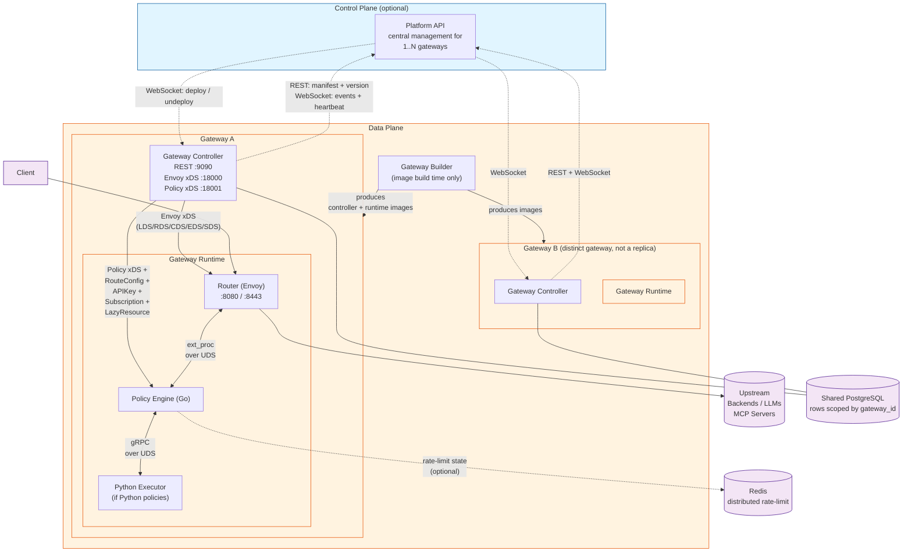
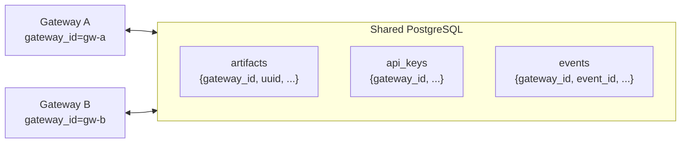
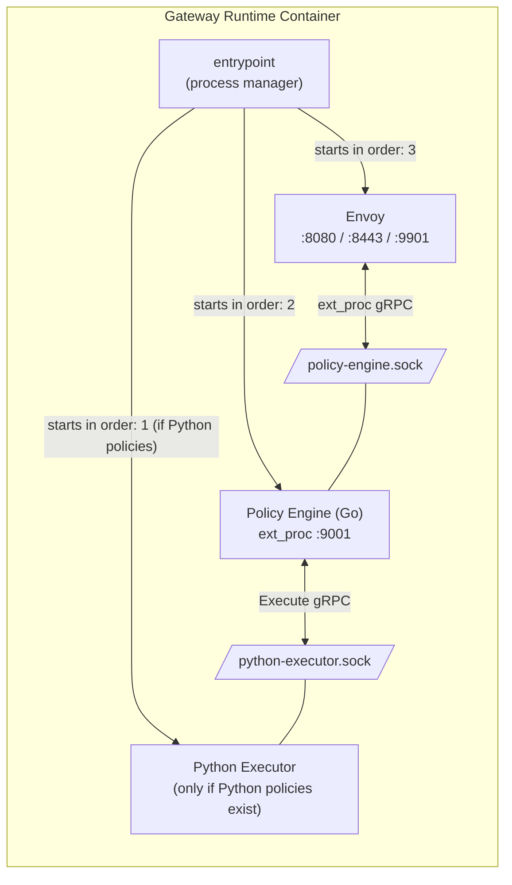
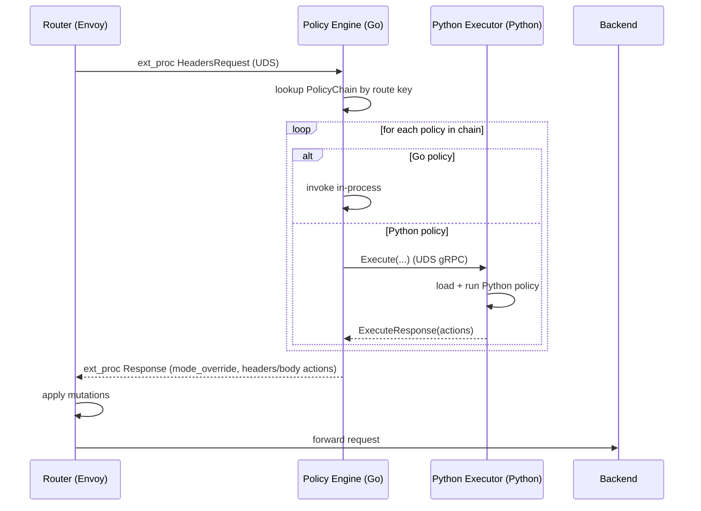
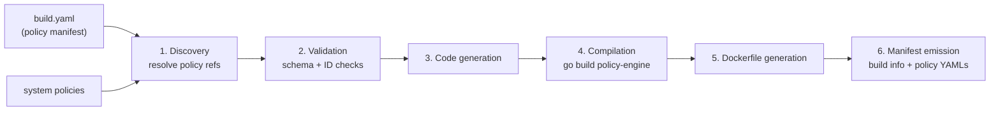
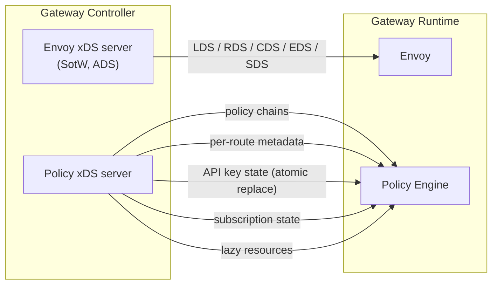
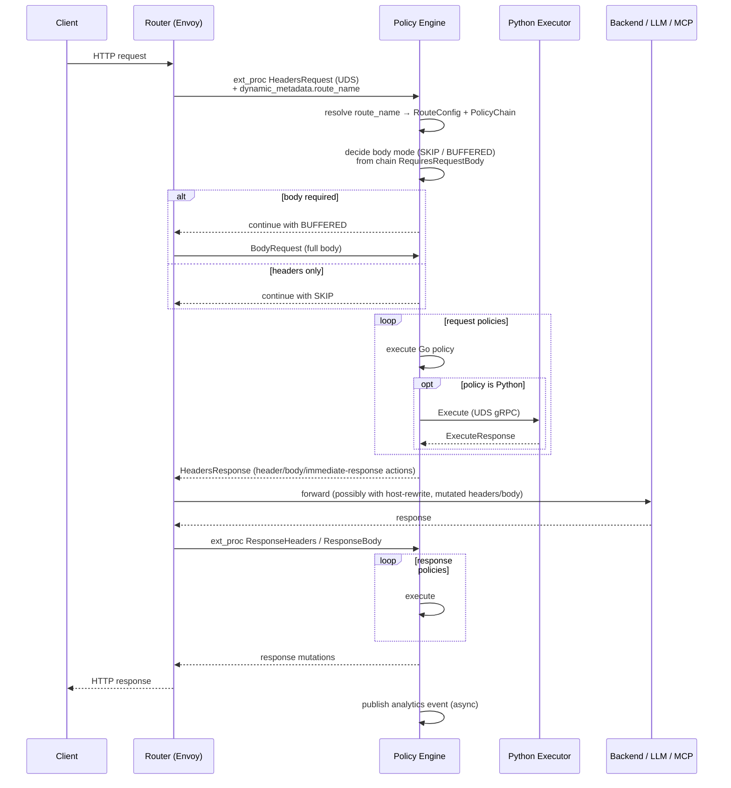
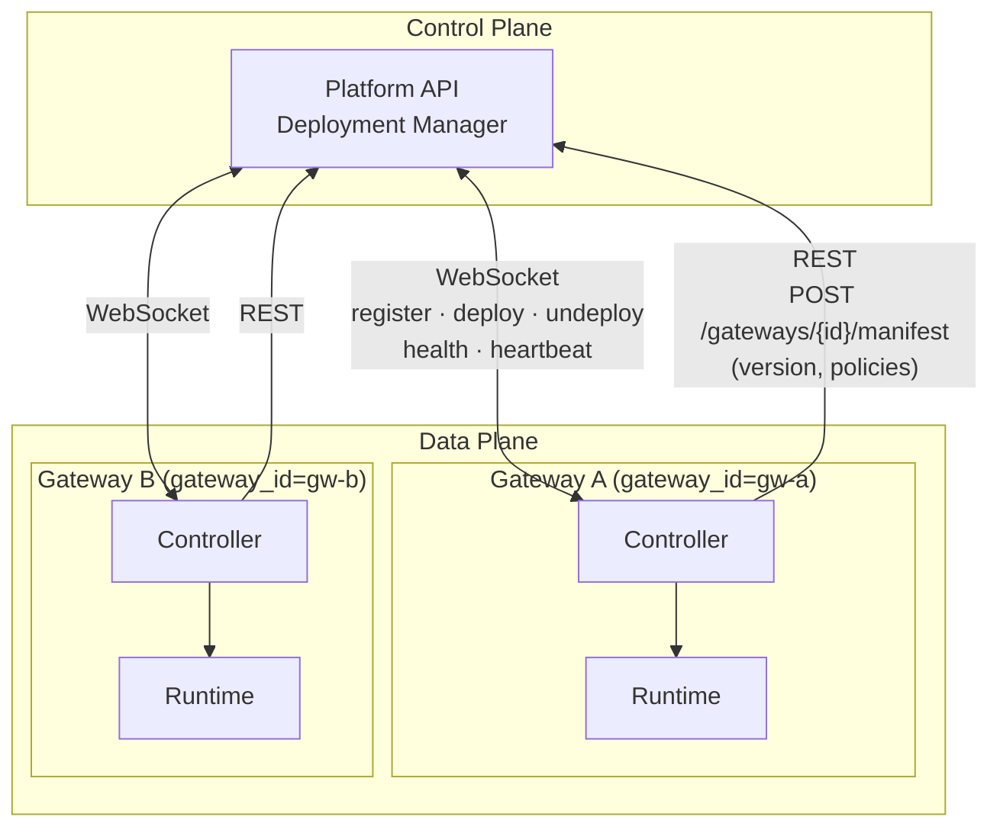
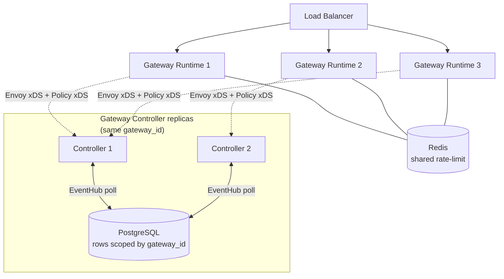

# Gateway Architecture

## Overview

The API Platform Gateway is an Envoy-based, AI-ready API gateway with a Go xDS control plane. Everything beyond basic routing — authentication, rate limiting, transformation, AI guardrails, MCP handling — is implemented as composable, versioned **policies**.

Policies are not built into the runtime. They are compiled (Go) or installed (Python) into a Gateway Runtime image at build time by the **Gateway Builder**, and pushed to the runtime at deploy time over xDS. This means a Gateway Runtime image is always a self-contained, reproducible artifact: a fixed Envoy version, a fixed policy set, a fixed SDK version.

### Control Plane vs Data Plane

There are two layers in the wider API Platform. The Gateway as a whole is a **Data Plane** product — it terminates client traffic and forwards it to upstream services. The **Control Plane** is the WSO2 **Platform API**, which is a separate, optional central management surface that one or more independent Gateways can register with.

Inside a single Gateway, the **Gateway Controller** acts as an internal control plane for its own **Gateway Runtime** instances (it pushes xDS to them) — but the Controller itself is part of the Data Plane deployment. A Gateway can run with or without a Platform API in front of it.

## Top-Level Architecture



A single Gateway is composed of two deployable units, released as a matched version pair — the controller's policy YAMLs and the runtime's compiled policy-engine binary come from the same builder run:

| Unit                    | Contains                                                                                |
| ----------------------- | --------------------------------------------------------------------------------------- |
| **Gateway Controller**  | REST API, Envoy xDS server, Policy xDS server, policy definitions, persistence          |
| **Gateway Runtime**     | Envoy + Policy Engine binary (with policies linked in) + Python Executor + Python deps  |

The **Gateway Builder** is a build-time tool that produces both images. End users do not run the builder unless they want to ship a custom policy set; the default WSO2-published images are pre-built. When custom images are needed, the **CLI** is the primary user-facing entry point — it wraps the builder in a Docker container, supplies the policy manifest, and produces both images locally.

### Multi-Gateway Database Sharing

Each Gateway is identified by a unique `gateway_id`. Multiple **distinct Gateways** (not just replicas of one Gateway) can point at the **same shared database** — every persistent row is scoped by `gateway_id`, so two gateways sharing a PostgreSQL instance see only their own APIs, subscriptions, API keys, and events. This is independent of the multi-replica EventHub sync described later (which is for replicas of the *same* gateway_id).



---

## Components

### 1. Gateway Controller

The Gateway's internal control plane — it manages and pushes configuration to its own Gateway Runtime(s). A single Go binary that:

- Serves the **Management REST API** for create/read/update/delete of all gateway resources.
- Serves an **Admin/debug API** — config dump, health, xDS sync status.
- Runs an **Envoy xDS server** implementing the State-of-the-World v3 protocol (LDS, RDS, CDS, EDS, SDS).
- Runs a separate **Policy xDS server** that pushes policy chains, route configs, API keys, subscriptions, and lazy resources to the Policy Engine.
- Persists all state in **SQLite** (default, WAL mode) or **PostgreSQL** (HA deployments).
- Optionally connects to the **Platform API** (REST for the manifest/version push, WebSocket for the live event channel) for centralized multi-gateway management.

#### Resource Kinds

The controller manages a typed set of API and policy resources, each with its own validator:

| Kind                  | Purpose                                                                |
| --------------------- | ---------------------------------------------------------------------- |
| `RestApi`             | HTTP/REST API definition (operations, upstream, policies)              |
| `WebSubApi`           | Event-driven WebSub API (Kafka-backed, async; served by event-gateway) |
| `LlmProviderTemplate` | Reusable template for an LLM vendor (OpenAI, Anthropic, Bedrock, …)    |
| `LlmProvider`         | A configured LLM provider instance                                     |
| `LlmProxy`            | A multi-provider AI gateway endpoint with model routing & guardrails   |
| `Mcp`                 | Model Context Protocol proxy                                           |
| `Certificate`         | Trusted-cert and listener-cert management for upstream/downstream TLS  |
| `SubscriptionPlan`    | Quota/rate plan definition                                             |
| `Subscription`        | Plan binding to an Application; carries billing IDs for analytics      |
| `ApiKey`              | Per-API key issuance; stored and pushed to runtime as SHA-256 hashes only |
| `Application`         | Logical consumer that owns API keys and subscriptions (synced from Platform API) |
| `Secret`              | Secret storage with AES-GCM encryption at rest                         |
| `Policy`              | Installed policy definitions compiled into the runtime image (read-only) |

Each resource has its **own database table** keyed by an immutable **UUID** primary identifier. All cross-references (subscription → plan, API key → API, events, analytics) carry the UUID, so renames and re-deployments stay valid. Resources additionally carry a URL-friendly `handle` and a human-readable `displayName`, both unique per gateway and kind.

Resource versions for `RestApi`, `WebSubApi`, `Mcp`, `LlmProvider`, and `LlmProxy` use a `vMAJOR.MINOR` form. Patch versions are intentionally not exposed — a backend bug fix should never force consumers to migrate. Policies follow a different scheme: their patch versions are visible to operators so security and bug fixes can be pinned at deploy time.

Operations on these kinds are converted at handler time to a kind-agnostic **`RuntimeDeployConfig`** before being snapshotted into xDS. This keeps the xDS translators and Policy Engine free of per-kind branching: a `RestApi`, an `LlmProvider`, and a `WebSubApi` all reach the runtime as the same intermediate shape.

A REST/LLM API may declare a **main** upstream and an optional **sandbox** upstream, selected per request via header or path convention — both upstreams share the same policy chain. Resources may also carry arbitrary `metadata.labels` (string→string map) for analytics, routing, and operational metadata; labels are propagated into the runtime context and into emitted analytics events.

#### Multi-Replica Sync (EventHub)

A single Gateway can run multiple Controller replicas (same `gateway_id`, same DB) for HA. Replicas stay in sync through a DB-backed **event hub**: each mutation writes a row to an events table; every replica polls the table on a short interval and applies events to its in-memory caches and xDS snapshots. This avoids the need for a separate message broker.

Events are also scoped by `gateway_id`, so a replica only consumes events for its own gateway — a different gateway sharing the same database is invisible to it.

### 2. Gateway Runtime

A single OCI image that bundles three processes managed by a shared entrypoint:



The entrypoint starts the **Python Executor** (only if any Python policies are present), waits for the **Policy Engine** to come up, then starts **Envoy**. If any one process exits, the entrypoint terminates the rest and the container restarts.

#### Router (Envoy)

A standard upstream Envoy build. The bootstrap is minimal — an admin listener, ADS pointing at the controller's xDS port, and a placeholder cluster. All listeners, routes, clusters, endpoints, and TLS secrets are pushed dynamically by the controller. The Router speaks `ext_proc` to the Policy Engine over a UDS for every request/response on configured routes.

Body-processing mode is decided **per request, per chain**: the Policy Engine sends back a `mode_override` that puts Envoy in `SKIP` mode when no policy in the chain needs the body, and in `BUFFERED` mode only when one does. This keeps headers-only policies (auth, header rewrite, routing) on the fast path while still allowing body-aware policies (transformation, guardrails) to opt into buffering.

#### Policy Engine (Go)

The Policy Engine is the heart of the data plane. It:

- Receives Envoy `ext_proc` streams on a UDS.
- Maintains an in-memory map of **PolicyChains** keyed by route, kept in sync via xDS streams (`PolicyChainConfig`, `RouteConfig`, `APIKeyConfig`, `SubscriptionConfig`, `LazyResourceConfig`) from the controller.
- For each request, looks up the chain (route key resolution is pluggable via `PolicyChainResolver`), builds an execution context, runs the **request** policies, then on the response path runs the **response** policies.
- Translates per-policy `Action`s (header set/remove, immediate response, dynamic metadata, body replacement, host rewrite, …) into Envoy ext_proc responses.
- Exposes Prometheus metrics on `:9003` and an admin/debug API on `:9002` (config dump with secret redaction, health).

Policies are **compiled in** at image build time — the engine has zero built-in policies; the gateway-builder generates a `plugin_registry.go` that wires them into the binary. From the engine's runtime perspective, all policies (request-phase, response-phase, body-requiring or not) are uniform plugins implementing the SDK policy interfaces.

#### Python Executor

Optional gRPC sidecar process for Python policies. It is a Python 3 process that:

- Listens on a Unix Domain Socket — or on TCP for local debugging.
- Loads all installed Python policies from a builder-generated registry.
- Serves `Execute` RPCs from the Go Policy Engine; the Go side translates each policy invocation into a gRPC request/response.
- Uses a single event loop with bounded worker concurrency, configurable from the entrypoint.



Python dependencies are installed into the runtime image at build time from a **locked requirements file** produced by the builder. The SDK ships from PyPI by default, or can be installed from the monorepo for local development.

### 3. Gateway Builder

A build-time Go tool that produces both the gateway-runtime and gateway-controller images. It is invoked from the gateway-runtime `Dockerfile` and runs a six-phase pipeline:



The two output images use an **extend base image** pattern: the gateway-runtime image is built on an Envoy base plus the freshly compiled `policy-engine` binary plus Python dependencies; the gateway-controller image is the controller base plus the policy-definition YAMLs extracted from the builder output.

The canonical policy set for the current gateway version is declared in [`gateway/build.yaml`](../../build.yaml), covering auth, rate limiting, AI guardrails, AI traffic management, MCP, mediation, and subscription policies. Refer to that file for the authoritative list and pinned versions.

---

## xDS Streams Between Controller and Runtime

The controller drives the runtime through several independent xDS channels. Envoy and the Policy Engine connect to different gRPC ports on the controller:



Notable properties of these streams:

- **Envoy xDS** uses State-of-the-World: a full LDS/RDS/CDS/EDS/SDS snapshot is published per change. Each route carries only a stable `route_name` in metadata.
- **Per-route metadata** (api name, version, kind, …) is delivered to the Policy Engine at deploy time as a separate stream, not parsed per request — this avoids per-request protobuf metadata unmarshaling in the data path.
- **API keys** are indexed by **SHA-256 hash** of the raw key — the runtime never sees plaintext. Keys are swapped atomically per snapshot so auth never gaps during rotation.
- **Subscriptions** carry active plan limits and billing IDs needed by analytics.
- **Lazy resources** is a generic channel for resources that should be loaded on first use rather than at startup.

The Policy Engine exposes its current xDS resource versions on the controller's admin API, so integration tests and operators can gate readiness on a known sync version.

---

## Request Lifecycle



Short-circuits are honoured at every step: an auth policy may emit an `ImmediateResponse` action and the chain ends without ever touching the upstream.

---

## Configuration Management

### Layered Configuration

All three runtime processes (controller, policy engine, python executor) share the same configuration model:

```
CLI flags  >  env vars  >  TOML config file  >  built-in defaults
```

A single TOML file covers every section needed across the three processes.

### Artifact Templating

Resource YAMLs (RestApi, LlmProvider, etc.) are rendered through **Go templates** before validation. The available helpers cover the things artifacts actually need: resolving a value from the gateway secret store, reading an environment variable, supplying a default, requiring a value to be present, and marking a value as sensitive so admin endpoints redact it.

Example:

```yaml
spec:
  upstream:
    main:
      url: '{{ env "BACKEND_URL" | default "https://api.example.com" }}'
      auth:
        type: bearer
        token: '{{ secret "BACKEND_TOKEN" | redact }}'
```

Rendering errors are typed and surfaced as HTTP 400s by the management API.

### Secrets

Secrets are stored encrypted at rest in the controller database using **AES-GCM**. The `secret` template function resolves to the decrypted value at render time. Values marked sensitive are masked in downstream admin config-dump endpoints.

---

## Deployment Modes

### Mutable Mode (default)

Configurations are managed at runtime through the Management REST API or through the Platform API (control-plane push). The gateway's database is the source of truth; changes are persisted, replicated to peer controllers via EventHub, and pushed to runtimes via xDS.

### Immutable Mode

For GitOps-style and Kubernetes-native deployments, the controller can run in **immutable mode**. When enabled:

- On startup, the controller walks an artifacts directory and applies all YAML resources via the same service layer the REST handlers use, in dependency order. Any failure aborts startup.
- The SQLite database file is **deleted on startup** to guarantee a fresh, reproducible state. Postgres is rejected — immutable mode is SQLite-only.
- All write methods on the management API return `405 Method Not Allowed`; read endpoints remain available.

This mode is the recommended path for Kubernetes ConfigMap-based deployments and for baking a fully-formed gateway into a custom container image.

### Standalone Distribution

A `make` target produces a standalone zip containing the controller binary, the runtime image references, and a self-contained Docker Compose file for installation outside the monorepo.

### Platform-API Control Plane Mode

The Gateway can run standalone (configurations submitted directly to the Controller REST API) or it can register with a central **Platform API** — the system's actual Control Plane — using a combination of REST and WebSocket. The Platform API can manage **multiple, independent gateways** at once.

#### Authentication

Both channels authenticate with the same **gateway registration token**, sent as an HTTP header on:

1. The WebSocket upgrade request — this also serves as the registration handshake (the WebSocket dial *is* the register call).
2. Every REST request the gateway makes to the Platform API.

A `401 Unauthorized` from either channel is treated as a **permanent failure** — the gateway exits rather than reconnecting. Other permanent statuses (forbidden, not-found, conflict, unprocessable) cause the same exit-on-failure behaviour so a misconfigured gateway doesn't loop forever against a control plane that will never accept it.

#### Channels

| Channel        | Direction            | Used for                                                                                       |
| -------------- | -------------------- | ---------------------------------------------------------------------------------------------- |
| **REST** (HTTPS) | Gateway → Platform API | Well-known discovery; **manifest + version push** on every connect, carrying gateway version, functionality type, and the list of installed policy definitions |
| **WebSocket**  | bidirectional        | Long-lived event channel — deploy / undeploy / API key / subscription events pushed down; heartbeat |

The platform may reject the manifest if version or policy set is incompatible — also treated as a permanent failure.

#### Custom Policy Sync

The manifest push carries every policy installed in the gateway, each entry tagged with a `managedBy` field — `"wso2"` for built-in policies and `"customer"` for policies added via `ap gateway image build`. System policies (those whose name is prefixed `wso2_apip_sys_`) are filtered out at the gateway before the manifest is sent; they are an internal concern of the data plane and the Platform API has no need to know about them. Customer-managed entries include the policy's full `parameters` and `systemParameters` JSON-Schema blocks; for WSO2-managed entries those are dropped on the platform side because the schema is already known centrally.

The Platform API persists the manifest into a `gateways.manifest` column on receipt, but does **not** automatically promote customer-managed policies into the catalogue the Console uses for attachment. That step is **Console-triggered** — the Console calls `POST /api/v1/gateway-custom-policies/sync` with the gateway, policy name, and version. The service looks up the stored manifest, verifies the entry's `managedBy == "customer"`, and writes the extracted definition into the org-scoped `gateway_custom_policies` table. Only after this Console sync is a custom policy attachable to APIs through the Console UI.

#### Deployment Acknowledgement

Deployments pushed from the Platform API are not fire-and-forget. After the gateway applies (or fails to apply) a deployment or undeployment, it sends an acknowledgement back over the same WebSocket carrying the originating deployment ID, the action, and a terminal status (`success`/`failed` with an optional error code). Acknowledgements are sent for every WebSocket-pushed resource type — REST APIs, LLM providers, LLM proxies, MCP proxies, and WebSub APIs.

The Platform API drives its own internal in-flight state machine off these acks — that intermediate state is platform-side; the gateway only reports the terminal outcome.

#### Startup Sync

Because WebSocket events can be missed while a gateway is down, every gateway runs a **background reconciliation** with the Platform API on startup:

1. The gateway fetches the platform's expected deployment set for its `gateway_id` over REST.
2. It diffs that set against its own local state.
3. Missing or stale deployments are pulled and applied; orphaned local deployments are removed.

The diff is computed **gateway-side** — gateways scale out far more than the Platform API, so doing it server-side would create a fan-out bottleneck. The sync is **asynchronous**: the gateway begins serving traffic immediately and reconciles in the background. Any WebSocket event arriving mid-sync naturally wins via deployment-ID ordering — operations are idempotent.



### Event Gateway

For event-driven (`WebSubApi`) traffic the same Gateway Controller drives a separate **event-gateway runtime** instead of the Envoy-based runtime. The controller's REST API, persistence, xDS streams, and `RuntimeDeployConfig` translator are reused unchanged; only the data-plane runtime differs.

> **TODO**: A dedicated architecture document for the event-gateway runtime does not yet exist. Add `event-gateway/spec/architecture/architecture.md` covering the WebSub subscription flow, Kafka delivery model, and runtime/controller interaction.

### CLI

The `ap` CLI is the local-user equivalent of the Platform API — it talks to the Gateway Controller's **management REST API** directly to deploy, list, update, and undeploy artifacts. There is no separate channel: every CLI operation maps 1:1 to a REST call against the management API, just like the Platform API and the Gateway Operator. It also offers a `kubectl apply`-style bulk apply of a directory of artifact YAMLs, and a wrapper that runs the gateway-builder in Docker to produce custom runtime + controller images locally.

The CLI is therefore the same kind of REST-API client as the Platform API and the Gateway Operator — just driven interactively from a developer's machine.

### Kubernetes Integration

On Kubernetes the gateway is deployed and managed by the **Gateway Operator**. The operator is a *client* of the Gateway Controller's REST API — it does not bypass the controller — and supports two reconciliation flows side by side:

| Flow                    | CRDs                                                                                                  | Behavior                                                                                       |
| ----------------------- | ----------------------------------------------------------------------------------------------------- | ----------------------------------------------------------------------------------------------- |
| **WSO2 CRD flow**       | `ApiGateway`, `RestApi`, `LlmProvider`, `LlmProxy`, `Mcp`, `WebSubApi`, `ApiKey`, `Subscription`, `SubscriptionPlan`, `Certificate`, `Secret` | Operator deploys the gateway via Helm and POSTs each CR's spec to the controller's management REST API. CRs mirror controller resource kinds 1:1. |
| **Kubernetes Gateway API flow** | `Gateway`, `HTTPRoute`, `APIPolicy`                                  | Operator deploys the gateway from a `Gateway` CR and translates `HTTPRoute` + `APIPolicy` into the controller's `RestApi` shape via the same REST API. |

Both flows converge on the same REST API of the same Gateway Controller — the Kubernetes layer is just another producer alongside CLI users, Platform API, and immutable-mode file artifacts.

---

## High Availability

HA is configured **per gateway** (per `gateway_id`). Two HA gateways can still share the same physical PostgreSQL because every row is scoped by `gateway_id`.



- **Controller replicas** of one gateway share a PostgreSQL database and a `gateway_id`. They use the DB-backed EventHub to keep their in-memory caches and xDS snapshots in sync — no separate broker required.
- **Runtime replicas** are stateless. Each connects to one controller's xDS streams. Configuration is reconstructed entirely from xDS — restart is safe.
- **Other gateways** with a different `gateway_id` can share the same PostgreSQL instance without interfering — their data, events, and xDS state are isolated by ID.
- **Distributed rate limiting** uses Redis as the shared counter store for the `advanced-ratelimit` policy. Without Redis, rate limiting is per-replica.
- **Certificate rotation** is hot-reloaded by the controller (no restart required) and republished via SDS.

---

## Observability

- **Metrics**: All three processes expose Prometheus metrics. The policy engine emits per-request, per-policy, and per-chain metrics — request count, latency histograms, action counts, chain length, xDS connection state, snapshot version, body mode distribution.

- **Tracing**: OpenTelemetry tracing in both Envoy and the Policy Engine. The default exporter points at an `otel-collector` sidecar that fans out to Jaeger or any OTLP backend. The Policy Engine creates a child span per policy execution and links across the ext_proc boundary using a propagated request ID.

- **Logging**: Structured logs from both Go and Python processes, with consistent per-process prefixes so a single `docker logs` stream stays readable.

- **Analytics**: Per-request events are published to configurable sinks (Moesif, gRPC ALS) asynchronously.

---

## Key Architectural Decisions

| Decision                                                         | Why                                                                            |
| ---------------------------------------------------------------- | ------------------------------------------------------------------------------ |
| Policy Engine has **zero built-in policies**; all linked at build time | Reproducibility, security review surface, custom-policy support without a plugin loader |
| **Go templates** for artifact field interpolation                | Composable, gives typed render errors with clear messages                      |
| **`RuntimeDeployConfig`** as kind-agnostic intermediate          | Frees xDS translator and Policy Engine from per-kind branching                 |
| **RouteConfig delivered via xDS** (not extracted from request metadata) | Avoids per-request protobuf metadata unmarshal in the data path         |
| **Per-chain body mode** with `mode_override`                     | Headers-only chains skip body buffering entirely                               |
| **Atomic API-key replacement** on every xDS snapshot             | No auth gap during xDS key rotation                                            |
| **UDS** between Router ↔ Policy Engine ↔ Python Executor         | Lowest-latency local IPC; no port management; security via filesystem perms   |
| **Optional Python Executor**, started only if Python policies exist | Zero overhead for Go-only deployments                                          |
| **Single Dockerfile** for all three runtime processes            | One artifact to scan, sign, and ship; matching Python versions guarantee C-ext compatibility |
| **EventHub via DB polling** for controller multi-replica sync    | Avoids adding Kafka/Redis/etc. as a hard dependency                            |
| **`gateway_id` scoping on every persistent row**                 | Lets multiple distinct gateways share one PostgreSQL without interference      |
| **Immutable mode wipes SQLite on boot**                          | Guarantees the file artifacts are the single source of truth                   |
| **Extend-base-image** custom builds via `gateway-builder`        | Custom policy sets compose cleanly on top of WSO2-published base images        |

---

## Versioning and Compatibility

- The gateway and its Management/Admin REST APIs follow independent version tracks.
- The Envoy version is pinned in the runtime Dockerfile.
- Policies are pinned by minor-version in the build manifest and resolved against the Go-module / pip-package references in the policy manifest. The Policy Engine and Controller key on the policy **major** version to allow forward-compatible minor upgrades without re-deployment.
- The runtime reports its version on the Platform API connection; the platform can enforce a manifest version match or verification flag before accepting a deployment.

---

## Document Status

- **Document Version**: 2.0
- **Last Updated**: 2026-05-20
- **Applies To**: Gateway `1.2.0-SNAPSHOT`
- **Status**: Active
