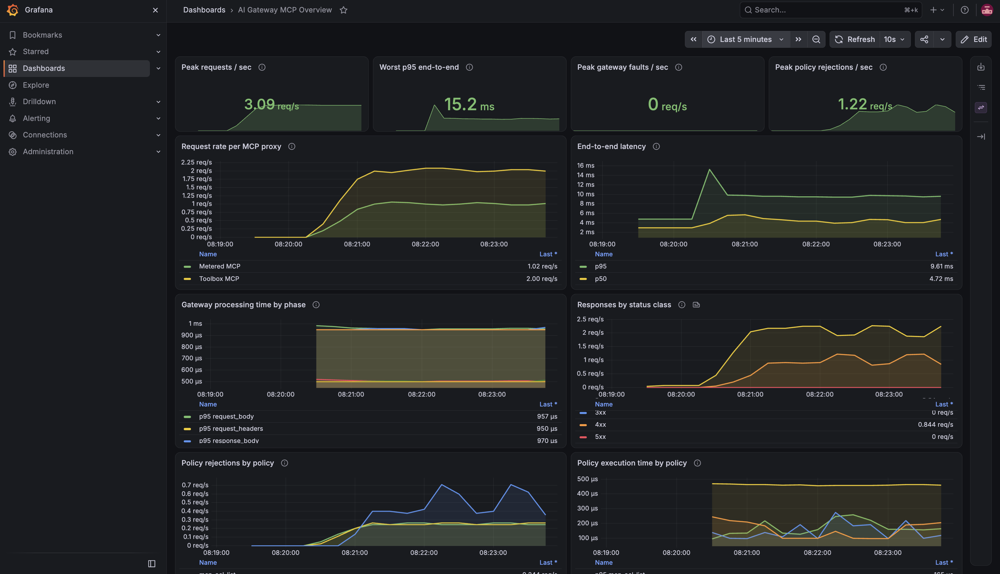
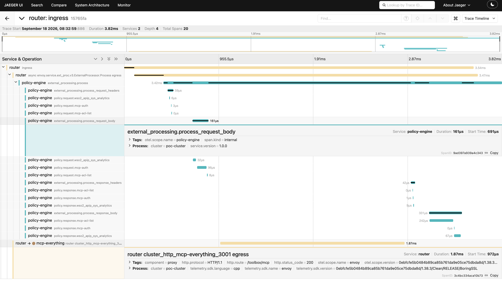

# AI Gateway: Observing MCP Traffic with a Ready-Made Dashboard

This sample runs the WSO2 AI Gateway with its full observability stack switched on
(Prometheus, Grafana, an OpenTelemetry collector and Jaeger), in front of two MCP
proxies backed by the MCP reference server. Generate a minute of traffic, and you get
a live dashboard showing request rate, latency and rejections per proxy, plus a
complete trace of any single tool call through the gateway. No cloud account, no
API key, nothing to configure by hand.

It is the MCP counterpart of [`ai-gateway-observability`](../ai-gateway-observability),
which does the same for LLM traffic.

## Prerequisites

- Docker with the Compose plugin
- `curl` (or `wget`), `unzip`, `jq` and `openssl`

On Windows, run these from a WSL2 shell with Docker Desktop's WSL integration enabled.

## Getting started

```bash
./setup.sh
```

1. Downloads and extracts the AI Gateway distribution.
2. Enables the gateway's metrics and tracing, and provisions the Grafana dashboard.
3. Generates the key used to sign access tokens, and tells the gateway to trust it.
4. Starts the MCP reference server as the backend.
5. Starts the gateway together with Prometheus, Grafana, Jaeger and the OTel collector.
6. Registers the two MCP proxies and waits until both answer.

Credentials, certificates and the environment file the stack needs are generated along
the way, so there is nothing to configure beforehand. The endpoints and the UI URLs are
printed when it finishes.

```bash
./load.sh
```

1. Mints access tokens and opens three MCP sessions, one per client.
2. Sends about a minute of mixed traffic through both proxies: ordinary tool calls, a
   tool given a bad argument, a tool that is not on the allowlist, and a call with no
   token. Run it for longer with `./load.sh <seconds>`.
3. Keeps the mix the same on every run, so the dashboard tells the same story each time.
4. Counts every response and prints the totals.

Then open the two URLs the scripts print:

| URL | What you see |
|-----|--------------|
| <http://localhost:3000> | **Grafana**: the AI Gateway MCP Overview dashboard, live (admin / admin) |
| <http://localhost:16686> | **Jaeger**: pick the `router` service, open any trace |

## What to look for

**In Grafana**, the dashboard opens on the AI Gateway MCP Overview: four tiles showing
peak values, and six charts.

- *Request rate per MCP proxy*: how much traffic each proxy is handling.
- *End-to-end latency*: how long the whole call takes, including the tool run.
- *Gateway processing time by phase*: how long the gateway itself takes, split by the
  phase of the request it is working on.
- *Responses by status class*: how many calls succeeded against how many were rejected.
- *Policy rejections by policy*: calls the gateway stopped, and which rule stopped them.
  Missing tokens and blocked tools throughout, rate limiting from part-way through the
  run.
- *Policy execution time by policy*: what each policy costs per call.



**In Jaeger**, open a trace to see one call broken into its steps: the router taking the
request, each policy running in turn with its own timing, and the hop out to the MCP
server. The charts tell you that calls were rejected; a trace tells you where a single
call spent its time, and which policy stopped it.



## Reading an MCP call

Three things behave differently from plain HTTP traffic, and the dashboard is built
around them.

**One route carries every tool.** Both proxies serve a single path, `<context>/mcp`,
and the tool being called is named in the request body rather than in the URL. So the
charts and the traces both work at the level of the proxy and the policies, not the
individual tool.

**A session is several requests.** A client opens with `initialize`, the gateway and
server hand back a session id in the `mcp-session-id` header, and every later call
sends that id back. Each of those is one request on the charts, so the request count
is higher than the number of tool calls.

**A failed tool is a successful request.** When a tool runs and fails, the MCP server
answers HTTP 200 with the error inside the JSON-RPC body. Those calls sit in the 2xx
line. The 4xx line is the gateway's own work: 401 for a missing token, a 4xx for a tool
that is not on the allowlist, 429 for a tool over its rate limit.

## Verify from the terminal

`test.sh` checks the pipeline end to end: the metrics endpoints respond, Prometheus is
scraping all three of them, both proxies report per-proxy metrics, the MCP policies
recorded the calls they stopped, Grafana loaded the dashboard, and Jaeger stored traces.

```bash
./test.sh
```

Expected output:

```
══════════════════════════════════════════════════
 Pre-flight checks
══════════════════════════════════════════════════
[INFO] Checking gateway health at http://localhost:9094/health ...
[PASS] Gateway is healthy.

══════════════════════════════════════════════════
 Test 1: Metrics endpoints respond
══════════════════════════════════════════════════
[PASS] Gateway controller: HTTP 200 (http://localhost:9011/metrics)
[PASS] Policy engine: HTTP 200 (http://localhost:9003/metrics)
[PASS] Envoy router: HTTP 200 (http://localhost:9901/stats/prometheus)
...
[PASS]  Observability pipeline is working end to end.
```

## How it works

```
  ./load.sh ──► Gateway :8080 ──► MCP server (server-everything)
                     │
        ┌────────────┴────────────┐
        │                         │
   Prometheus scrapes        gateway pushes
   metrics every 15s         traces (OpenTelemetry)
        │                         │
        ▼                         ▼
   Grafana :3000             Jaeger :16686
```

- **Metrics** answer how much traffic, how fast, and how much of it the gateway
  stopped.
- **Traces** answer where a single call spent its time, and which policy stopped it.

## What's running

| Container | Role | Port |
|-----------|------|------|
| `gateway-controller` | Control plane, where proxies are registered | 9090 (API), 9011 (metrics) |
| `gateway-runtime` | Envoy router + policy engine, where traffic flows | 8080 (HTTP), 9901 (Envoy admin), 9003 (metrics) |
| `mcp-everything` | The MCP reference server, standing in for a real one | 3001 |
| `prometheus` | Scrapes and stores the metrics | 9092 |
| `grafana` | Charts them | 3000 |
| `otel-collector` | Receives spans from the gateway | 4317 / 4318 |
| `jaeger` | Stores and displays traces | 16686 |

## The two proxies

| Proxy | Endpoint | Tools it allows | Extra |
|-------|----------|-----------------|-------|
| Toolbox MCP | `/toolbox/mcp` | `echo`, `get-sum`, `get-structured-content`, `get-resource-reference` | — |
| Metered MCP | `/metered/mcp` | `echo`, `get-sum` | 15 calls per tool per minute |

Both sit in front of the same MCP server and both require an access token. The
difference in policies is what gives the per-proxy panels two lines that behave
differently.

## Send your own call

```bash
TOKEN=$(./token.sh alice@example.com)

curl -X POST http://localhost:8080/toolbox/mcp \
  -H "Content-Type: application/json" \
  -H "Accept: application/json, text/event-stream" \
  -H "Authorization: Bearer ${TOKEN}" \
  -d '{"jsonrpc":"2.0","id":1,"method":"initialize","params":{"protocolVersion":"2025-06-18","capabilities":{},"clientInfo":{"name":"curl","version":"1.0.0"}}}' \
  -D -
```

The response headers carry an `mcp-session-id`. Send it back on the next call:

```bash
curl -X POST http://localhost:8080/toolbox/mcp \
  -H "Content-Type: application/json" \
  -H "Accept: application/json, text/event-stream" \
  -H "Authorization: Bearer ${TOKEN}" \
  -H "mcp-session-id: <the id from above>" \
  -d '{"jsonrpc":"2.0","id":2,"method":"tools/call","params":{"name":"echo","arguments":{"message":"hello"}}}'
```

Watch the call land on the dashboard, then find its trace in Jaeger. Ask for a tool
that is not on the allowlist, such as `get-env`, and watch the rejection appear under
`mcp-acl-list`.

Ports, token subjects and traffic duration are all environment variables at the top of
`setup.sh`, `token.sh` and `load.sh`. Override any of them before running.

## Teardown

```bash
./teardown.sh            # delete the proxies, stop the containers, drop the volumes
./teardown.sh --clean    # also remove the extracted distribution, the zip and keys/
```

`--clean` makes the next `./setup.sh` download and set up the gateway from scratch,
instead of reusing the copy already on disk.
