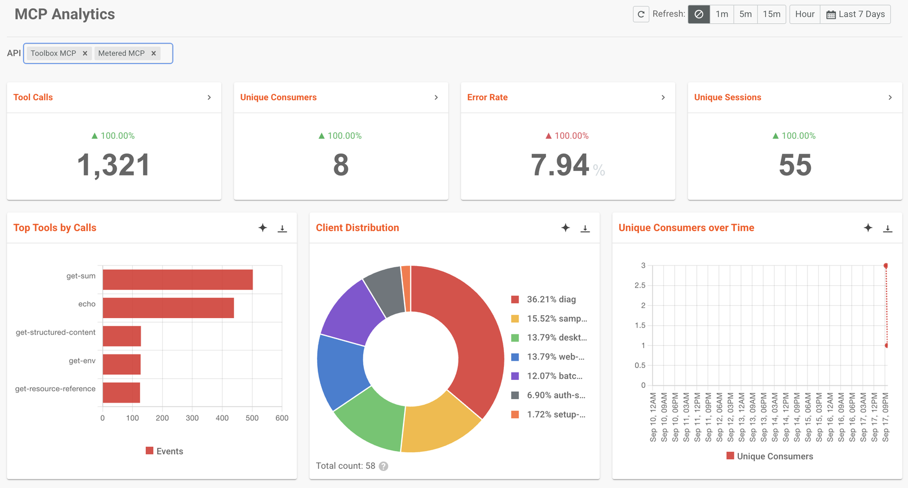

# AI Gateway: MCP Tool Usage in Moesif

This sample runs the WSO2 AI Gateway in front of an MCP server, with analytics
published to [Moesif](https://www.moesif.com). Every MCP call that passes through
the gateway appears there with the JSON-RPC method, the tool that was asked for,
the session it belonged to, and the client that made it.

Two MCP proxies share one backend. Both require an access token, they allow
different sets of tools, and one of them is rate limited. So the dashboard shows
not just which tools are popular, but who called them and which calls the gateway
refused and why.

> If you are looking for LLM token usage and cost instead, see
> [`ai-gateway-moesif-analytics`](../ai-gateway-moesif-analytics), which publishes
> the same way but reports on llm traffic.

## Prerequisites

- Docker with the Compose plugin
- `curl` (or `wget`), `unzip`, `jq` and `openssl`
- A Moesif account (the free tier is sufficient)

On Windows, run the sample from a WSL2 shell with Docker Desktop's WSL integration
enabled.

## Configure your Application ID

1. Sign up or sign in at [Moesif](https://www.moesif.com/).
2. Get your **Collector Application ID**:
   - On a new account, the onboarding wizard shows it while you set up your first
     application. Copy it then.
   - On an existing account, select the account icon, then **Installation** or
     **API Keys**, and copy the **Collector Application ID** field.
3. Provide it to the sample:

   ```bash
   cp .env.example .env
   # add the ID to .env
   ```

   Or export it: `export MOESIF_APPLICATION_ID='<your-application-id>'`

This is the only Moesif credential the sample needs. `.env` is git-ignored, so the
ID you paste in is not committed. For other configuration options, see the
[Moesif documentation](https://www.moesif.com/docs).

## Run

```bash
./setup.sh
```

1. Downloads and extracts the AI Gateway distribution.
2. Confirms analytics is enabled with Moesif as the publisher.
3. Switches on request and response body capture, which MCP analytics needs.
4. Generates a token signing key and tells the gateway to trust it.
5. Builds and starts the MCP server container.
6. Starts the gateway with your Application ID.
7. Registers the two MCP proxies.

It finishes by printing the two endpoints it registered:

| Proxy | Endpoint | Tools allowed | Extra policy |
|-------|----------|---------------|--------------|
| Toolbox | `/toolbox/mcp` | `echo`, `get-sum`, `get-structured-content`, `get-resource-reference` | none |
| Metered | `/metered/mcp` | `echo`, `get-sum` | 15 calls per tool per minute |

Both point at the same MCP server. The only difference is the policies in front
of them, which is what makes the comparison on the dashboard worth looking at.

## Access tokens

Both proxies require a bearer access token, and the subject inside the token
becomes the consumer name in analytics. That is how the dashboard can report who
is calling, not just what they called.

A real deployment trusts an identity provider's signatures. To keep the sample to
one command, `setup.sh` generates a key pair in `keys/` and `auth-config.toml`
tells the gateway to trust it. Nothing else is needed, and `keys/` is git-ignored.

Mint a token whenever you need one:

```bash
./token.sh alice@example.com
```

Any subject works. `load.sh` uses three of them, two people and a service
account, so the consumer panel has a realistic mix.

```bash
./load.sh
```

Opens three MCP sessions, then repeats a fixed twelve-step cycle for 60 seconds,
so the mix is identical on every run:

| Calls | Proxy | Client, as consumer | Outcome |
|-------|-------|---------------------|---------|
| 4 | Toolbox | `desktop-client`, alice | tool calls that succeed |
| 1 | Toolbox | `web-console`, bob | a tool call that succeeds |
| 1 | Toolbox | `desktop-client`, alice | a valid tool given an invalid argument, so the call fails at the server |
| 1 | Toolbox | `web-console`, bob | `get-env`, refused by the allowlist before the server sees it |
| 4 | Metered | `batch-agent` | tool calls, with the ones over the per-minute limit turned away |
| 1 | Toolbox | `web-console` | `tools/list`, to see the allowlist filtering |
| 1 | Toolbox | no token | refused at the door, before anything else runs |

Pass a duration in seconds to change the run length: `./load.sh <seconds>`.

It prints the outcome counts when it finishes. Moesif should report the same
shape. Open <https://www.moesif.com> and pick **Analytics > MCP** to compare.

## What to look for in Moesif

Moesif groups analytics into four dashboards in the left sidebar: Overview, APIs,
LLM and MCP. This sample publishes MCP traffic, so open **MCP**, then set the time
range.



Note `get-env` in Top Tools by Calls. Those are the calls the allowlist refused,
counted and attributed like any other, which is the point: a refused call is still
something you want to see.

The page is prebuilt, so there is nothing to configure. What each panel holds
after a run:

| Panel | What this sample puts in it |
|-------|-----------------------------|
| Tool Calls | every `tools/call` from the run |
| Unique Sessions | three, one per client that ran the handshake |
| Client Distribution | `desktop-client`, `web-console` and `batch-agent` |
| Unique Consumers, Unique Consumers over Time | the three token subjects, two people and a service account |
| Top Tools by Calls | the allowed tools, plus the refused `get-env` attempts |
| Server Distribution | the MCP server's own name, taken from its `initialize` reply |
| MCP Application Details | one row for the calling application, with its event count and error rate |
| Error Rate, Error Rate Trend | the refused, failed and rate limited calls together |
| Error Type Breakdown | the error codes behind those failures |
| Tool Call Execution Errors | the tool that was called with an invalid argument |
| Error Type Breakdown, auth errors | the calls sent with no token |
| Traffic Volume per API over Time | the two proxies side by side |

The split worth looking at is in **Top Tools by Calls** against **Error Type
Breakdown**. The toolbox proxy allows four tools and the metered proxy allows two,
so the same MCP server produces very different tool mixes depending on which
proxy a client goes through, and the errors are not the server's fault: most of
them are the gateway refusing a call.

## Verify locally

```bash
./test.sh
```

Checks that:

1. Analytics is enabled with Moesif as a publisher.
2. The Application ID reached the gateway, and is not the placeholder the config
   falls back to. Without this the gateway reports healthy while publishing nothing.
3. Body capture is live inside the running container, not just present in the file
   on disk. This is the check that catches an edited config with no restart.
4. The key in the gateway config is the one `token.sh` signs with. If those drift
   apart every token is rejected for no obvious reason.
5. A call with no token is refused.
6. The MCP handshake completes through both proxies with a token, and returns a
   session id.
7. An allowed tool returns a result, and `tools/list` is filtered to the allowlist.
8. A tool outside the allowlist is refused before it reaches the server.

This covers everything up to the point where events leave the gateway. Open the
MCP dashboard in Moesif to confirm they arrived.

## Troubleshooting

The gateway writes its startup and error messages to the container log. Nothing
extra is configured for this; the logs are there by default:

```bash
cd wso2apip-ai-gateway-1.2.0
docker compose logs gateway-runtime        # router and policy engine
docker compose logs gateway-controller     # resource registration
cd ..
docker logs mcp-everything                 # the MCP server
```

Add `-f` to follow a log as requests arrive, or `--tail 100` to see only the most
recent lines. The policy engine reports each policy it loads at startup, which is
the first place to look if MCP fields are missing from the events.

If the MCP dashboard is empty but the APIs dashboard has traffic, body capture is
almost certainly off. `./test.sh` reports that directly.

## How it works

```
  ./load.sh ──► AI Gateway :8080 ──► MCP server :3001/mcp
                      │
                      │  reads the JSON-RPC method and the tool name
                      │  from the request and response bodies,
                      │  builds the analytics event
                      ▼
                   Moesif
```

The backend is the MCP reference server,
[`@modelcontextprotocol/server-everything`](https://www.npmjs.com/package/@modelcontextprotocol/server-everything),
pinned to one version in `mcp-server/Dockerfile`. It is a real MCP server that
implements the whole protocol, so the traffic on the dashboard is traffic a real
MCP client could have produced. It needs no credentials and costs nothing to run.

Three things about MCP are worth knowing before you read the code.

**A single tool call is three requests.** The client sends `initialize`, the
server answers with a session id in the `mcp-session-id` response header, the
client confirms with a `notifications/initialized` notification, and only then can
it call a tool. Every call after the first has to send that session id back, or
the server rejects it. `load.sh` does this in its `open_session` function, and it
is why the dashboard can count sessions at all.

**Replies come back as server-sent events.** The response content type is
`text/event-stream`, and the JSON payload is the part of the body that follows
`data: `. Both `load.sh` and `test.sh` have a one-line helper that unwraps it. The
gateway understands this format too, which is how the allowlist can filter a
`tools/list` reply.

**Body capture has to be switched on.** The interesting MCP fields, the method
name and the tool name, live in the JSON-RPC bodies rather than in headers or a
URL path. The collector does not capture bodies by default, so `setup.sh` appends
`collector-config.toml` to the gateway configuration. Without that step the events
still reach Moesif, but they carry no MCP detail and the MCP dashboard stays at
zero.

**Callers are identified by a token, not a header.** `load.sh` sends an
`x-wso2-application-name` header, and Moesif groups by it in MCP Application
Details, but that is only a label: nothing checks it. The consumer name is
different. It comes from the `sub` claim inside a signed token, so it cannot be
claimed, only proven. That is why the `mcp-auth` policy has to be in front of the
proxies for the consumer panels to report anything.

Two smaller details, both visible in the resource definitions:

- The upstream URL includes the MCP endpoint path: `http://mcp-everything:3001/mcp`,
  not just the host and port.
- `mcp-acl-list` in `deny` mode with exceptions is an allowlist. It applies to
  calls and to list responses, so a tool that is not on the list is both
  unreachable and invisible.

## Containers

| Container | Role | Port |
|-----------|------|------|
| `gateway-controller` | control plane, where resources are registered | 9090 |
| `gateway-runtime` | router and policy engine, where traffic flows | 8080, 9901 |
| `mcp-everything` | the MCP server | none |

Analytics are stored in Moesif, so the sample runs no local database or dashboard.

## Send a single request

Worth doing once by hand, because the handshake is the part that surprises people.

First, mint a token and keep it in a variable:

```bash
TOKEN=$(./token.sh alice@example.com)
```

Step one, introduce yourself and keep the session id. `-D -` prints the response
headers, which is where the id arrives:

```bash
curl -s -D - -X POST http://localhost:8080/toolbox/mcp \
  -H "Content-Type: application/json" \
  -H "Accept: application/json, text/event-stream" \
  -H "Authorization: Bearer ${TOKEN}" \
  -d '{"jsonrpc":"2.0","id":1,"method":"initialize","params":{
        "protocolVersion":"2025-06-18","capabilities":{},
        "clientInfo":{"name":"my-client","version":"1.0.0"}}}'
```

Copy the `mcp-session-id` value from the output into a variable:

```bash
SESSION="<the id from the header>"
```

Step two, confirm the handshake:

```bash
curl -s -X POST http://localhost:8080/toolbox/mcp \
  -H "Content-Type: application/json" \
  -H "Accept: application/json, text/event-stream" \
  -H "Authorization: Bearer ${TOKEN}" \
  -H "mcp-session-id: ${SESSION}" \
  -d '{"jsonrpc":"2.0","method":"notifications/initialized"}'
```

Step three, call a tool:

```bash
curl -s -X POST http://localhost:8080/toolbox/mcp \
  -H "Content-Type: application/json" \
  -H "Accept: application/json, text/event-stream" \
  -H "Authorization: Bearer ${TOKEN}" \
  -H "mcp-session-id: ${SESSION}" \
  -d '{"jsonrpc":"2.0","id":2,"method":"tools/call","params":{
        "name":"get-sum","arguments":{"a":2,"b":3}}}'
```

Three variations worth trying:

- `tools/list` with an empty `params`, to see the filtered list.
- `get-env` instead of `get-sum`, to see the allowlist refuse it.
- drop the `Authorization` header, to see the 401.

Ports, application names and traffic duration are environment variables declared
at the top of `setup.sh` and `load.sh`.

## Try other policies

The proxies carry `mcp-auth` and `mcp-acl-list`, and the metered proxy adds
`mcp-ratelimit`. Adding another one is an edit to the proxy definition plus a
redeploy:

1. Add it under `policies` in `mcp-proxy-toolbox.yaml`.
2. Apply the change:

   ```bash
   curl -X PUT http://localhost:9090/api/management/v1/mcp-proxies/toolbox-mcp \
     -u admin:admin \
     -H "Content-Type: application/yaml" \
     --data-binary @mcp-proxy-toolbox.yaml
   ```

3. Run `./load.sh` again and compare the events in Moesif.

`build.yaml` in the extracted distribution lists every policy this gateway ships
with. The MCP ones are `mcp-acl-list`, `mcp-auth`, `mcp-authz`, `mcp-ratelimit`
and `mcp-rewrite`.

To point `mcp-auth` at a real identity provider rather than the sample's own key,
replace the key manager in `auth-config.toml` with a JWKS endpoint:

```toml
[[policy_configurations.jwtauth_v1.keymanagers]]
name = "sample-key-manager"
issuer = "https://your-idp.example.com"

[policy_configurations.jwtauth_v1.keymanagers.jwks.remote]
uri = "https://your-idp.example.com/.well-known/jwks.json"
```

Nothing else changes. The proxies keep naming `sample-key-manager`, the consumer
name still comes from the `sub` claim, and `token.sh` is no longer needed because
your provider issues the tokens.

## Using your own MCP server

Replace the `upstream.url` in both proxy definitions with your server's address,
including its MCP endpoint path, and remove the `mcp-everything` container from
`setup.sh`. Then update the tool names in the `mcp-acl-list` exceptions and in
`load.sh` to tools your server actually offers.

The analytics configuration is unchanged. The gateway reads the method and tool
name from whatever JSON-RPC passes through it.

## Teardown

```bash
./teardown.sh            # remove the resources, containers and volumes
./teardown.sh --clean    # also remove the distribution, the image and the key
```

Events already delivered to Moesif are stored in your Moesif account and are not
removed by teardown.
